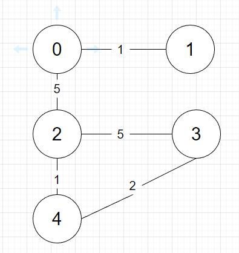

알고리즘 문제에서 다양하게 나올 수 있는 알고리즘입니다. <br>
가중치 그래프에서 비용이 제일 작게 나올 수 있는 그래프를 구할 때 사용할 수 있죠!! <br>
따라서 이번 포스팅은 MST 입니다.

# Spanning Tree (신장 트리)

최소 신장 트리를 알기 전에 신장 트리가 뭔지 알아야 합니다. <br>

신장 트리는 그래프 내의 모든 정점을 포함하는 그래프의 부분집합입니다. <br>
따라서 하나의 그래프에 여러개의 신장트리가 있는 형태입니다. <br>
<br>
 <br>
출처 : [https://www.tutorialspoint.com/data_structures_algorithms/spanning_tree.htm](https://www.tutorialspoint.com/data_structures_algorithms/spanning_tree.htm)

신장 트리의 특징은 다음과 같습니다.
1. 모든 정점을 포함한다.
2. 하나의 그래프에 복수개의 신장 트리가 존재할 수 있다. 
3. cycle이 생기지 않는다.
<br><br><br>

# Minimum Spanning Tree (최소 신장 트리)

신장 트리를 알았으니 최소 신장 트리는 이름 그대로 무언가 제일 최소인 신장 트리겠죠. <br>
무언가 작다 크다를 판별할 수 있는건 가중치 그래프의 비용(가중치)입니다. <br>

즉 어떤 그래프의 여러 신장 트리중 비용(가중치)이 제일 작은 트리를 최소 신장 트리 입니다. <br>

최소 신장 트리를 구하는 데에는 2가지 알고리즘이 있습니다. <br>
1. kruskal algorithm
2. prim algorithm
<br><br>

## Kruskal Algorithm

Kruskal 알고리즘은 대표적인 greedy algorithm으로 비용이 제일 적은 간선부터 확인하면서 그래프를 연결합니다. <br>
연결하면서 cycle이 생긴다면 연결을 하지 않고 진행합니다. <br>
모든 간선을 다 확인할 때까지 반복을 하면 됩니다. <br>

```
1. 간선들을 비용 오름차순으로 정렬한다.
2. 정렬된 모든 간선들을 하나씩 반복한다.
    cycle이 생기지 않으면 두 정점을 연결한다.
```

cycle을 확인하는 방법은 각 정점마다 부모 노드를 확인하여 <br>
연결할려는 두 정점의 부모가 같으면 cycle이 생긴것으로 판단하고 연결을 무시합니다. <br>
예제로 알아봅시다. <br>

 <br>
이런 그래프가 있다고 합시다.

그래프를 연결하기 전인 처음에는 각 노드들의 부모를 자기 자신으로 초기화를 합니다. <br>
정점 0 1 2 3 4 <br>
부모 0 1 2 3 4 <br>


{시작 정점, 연결된 정점, 비용}의 형태를 가지는 간선들을 비용순으로 정렬하면 다음과 같습니다.<br>
[[0, 1, 1], [2, 4, 1], [3, 4, 2], [0, 2, 5], [2, 3, 5]] <br>
간선 순서대로 진행해봅시다.


1. {0, 1, 1} 

0과 1의 부모가 같지 않으므로(cycle이 생기지 않으므로) 연결해줍니다. 
 <br>
연결하면 부모는 다음과 같습니다. <br>
정점 0 1 2 3 4 <br>
부모 0 0 2 3 4 <br>


2. {2, 4, 1}
2와 4의 부모가 같지 않으므로(cycle이 생기지 않으므로) 연결해줍니다.
 <br>
연결하면 부모는 다음과 같습니다. <br>
정점 0 1 2 3 4 <br>
부모 0 0 2 3 2 <br>

3. {3, 4, 2}
3과 4의 부모가 같지 않으므로(cycle이 생기지 않으므로) 연결해줍니다.
 <br>
연결하면 부모는 다음과 같습니다. <br>
정점 0 1 2 3 4 <br>
부모 0 0 2 2 2 <br>

4. {0, 2, 5}
0과 2의 부모가 같지 않으므로(cycle이 생기지 않으므로) 연결해줍니다.
 <br>
연결하면 부모는 다음과 같습니다. <br>
정점 0 1 2 3 4 <br>
부모 0 0 0 0 0 <br>

5. {2, 3, 5}
2와 3의 부모가 같으므로 연결하지 않습니다.
 <br>


그럼 <br>
 <br>
이런 최소 신장 트리가 완성됩니다. <br>
총 길이는 연결해줄 때마다 더해주는 등 구할 수 있는 방법은 여럿 있습니다. <br><br>


코드로 나타내면 다음과 같습니다.
``` c++
#include<iostream>
#include <string>
#include <vector>
#include <algorithm>

using namespace std;

vector<int> parent;

bool comp(vector<int> a, vector<int> b)
{
    return a[2] < b[2];
}

int findParent(int idx)
{
    if (parent[idx] == idx)
        return idx;
    return parent[idx] = findParent(parent[idx]);
}

// 정점의 개수와 간선의 정보를 받습니다.
int Kruskal(int n, vector<vector<int>> edges)
{
    int answer = 0;
    sort(edges.begin(), edges.end(), comp);
    for (int i = 0; i < n; i++)
        parent.push_back(i);

    for (int i = 0; i < edges.size(); i++)
    {
        int start = findParent(edges[i][0]);
        int end = findParent(edges[i][1]);
        int cost = edges[i][2];

        if (start != end)
        {
            answer += cost;
            parent[end] = start;
        }
    }
    return answer;
}
```
<br><br>

## Prim Algorithm

Prim 알고리즘도 역시 greedy 알고리즘입니다. <br>
다만 간선 비용의 최소를 무작정 찾는 Kruskal 알고리즘과 다른 방식의 greedy 알고리즘이죠 <br>

그래프의 임의의 정점을 선택하고 그 정점의 최소 간선을 구하여 트리로 만듭니다. <br>
트리에 있는 모든 정점들의 최소 간선을 구하여 또 트리로 뻗어나갑니다. <br>
이런 식으로 진행하여 모든 정점이 트리에 포함된다면 최소신장트리가 완성됩니다. <br>

Prim 알고리즘도 그림으로 설명하겠습니다. <br>

 <br>
kruskal 알고리즘과 똑같은 그래프입니다. <br>
이 그래프를 prim 알고리즘으로 최소신장트리를 만들어봅시다. <br>
시작은 어느 곳에서 해도 됩니다. 저는 0에서 출발하겠습니다. <br>

0에서 출발하기에 현재 트리는 정점 0 하나 입니다. <br>
 <br>

정점 0의 간선 중 최소는 정점 1과 이어지는 1입니다. 이어줍니다. <br>
 <br>

현재 트리의 정점 중 간선은 0과 2 사이의 5 뿐입니다. 이어줍니다. <br>
 <br>

현재 트리의 간선들 중 최소는 2와 4 사이 1입니다. 이어줍시다. <br>
 <br>

현재 트리의 간선들 중 최소는 3과 4 사이 2입니다. 이어줍시다. <br>
 <br>

만든 트리에 모든 정점이 포함되었으니 최소신장트리가 완성됩니다. <br>
 <br>


현재 트리의 정점들의 간선중 최소를 구하는것은 최소힙을 사용하면 O(logn)으로 최솟값을 구할 수 있습니다. <br>

코드로 나타내면 다음과 같습니다.
``` c++
#include<iostream>
#include <vector>
#include <algorithm>
#include <queue>

using namespace std;

vector<pair<int, int>> graph[100];
bool visited[100];

struct cmp {
    bool operator()(pair<int, int> a, pair<int, int> b)
    {
        return a.second > b.second;
    }
};

int solution(int n, vector<vector<int>> costs) 
{
    int answer = 0;

    for (int i = 0; i < costs.size(); i++)
    {
        graph[costs[i][0]].push_back({ costs[i][1] , costs[i][2] });
        graph[costs[i][1]].push_back({ costs[i][0] , costs[i][2] });
    }

    priority_queue<pair<int, int>, vector<pair<int, int>>, cmp> pq;

    for (int i = 0; i < graph[0].size(); i++)
        pq.push(graph[0][i]);
    visited[0] = true;
    int cnt = 0;

    while (cnt < n - 1)
    {
        pair<int, int> cur = pq.top();
        pq.pop();

        int node = cur.first;
        int cost = cur.second;

        if (visited[node]) continue;

        answer += cost;
        visited[node] = true;
        cnt++;

        for (int i = 0; i < graph[node].size(); i++)
        {
            int next = graph[node][i].first;
            if (!visited[next])
                pq.push(graph[node][i]);
        }
    }
    return answer;
}
```

# 시간복잡도
정점 개수 : V,  간선 개수 : E   <br>

kruskal알고리즘은 정렬하는 부분이 다 합니다. <br>
O(ElogE) 입니다. <br>

prim 알고리즘은 각 노드마다 우선순위 큐를 뽑으니 O(VlogV) 입니다. <br>
또 현재 노드의 간선을 돌면서(O(E)) 방문하지 않았다면 우선순위 큐에 집어넣는 동작(O(logV))을 합니다. 즉 O(ElogV) <br>
그럼 O(VlogV) + O(ElogV)이고 대부분 정점보다 간선이 많으므로 <br>
O(ElogV) 입니다. <br>

big-O notation이기 때문에 자세하게는 대강 계산된 시간복잡도입니다. <br>
입력이 어마무시하게 많지 않은 이상 두 알고리즘 다 비슷비슷할겁니다. <br>