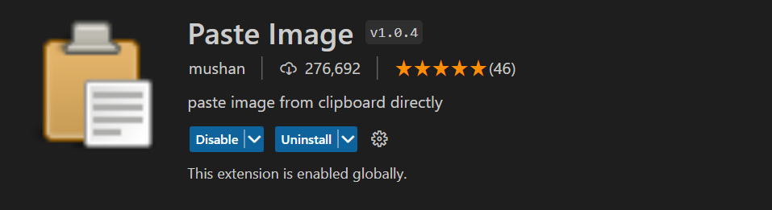
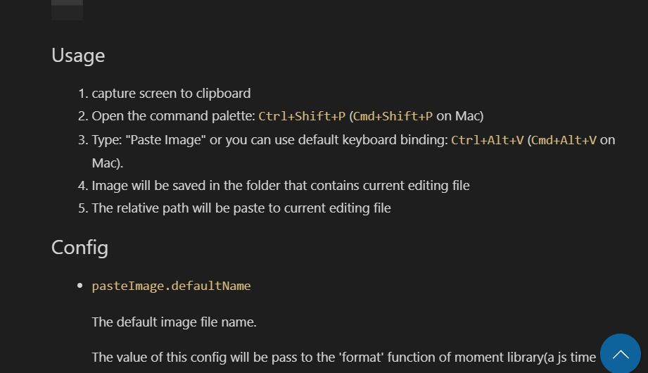
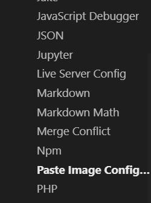
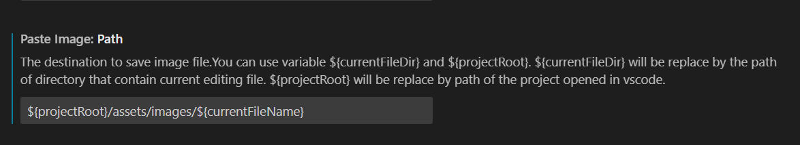
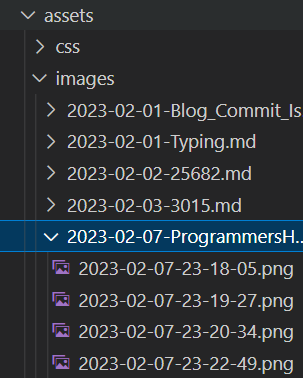
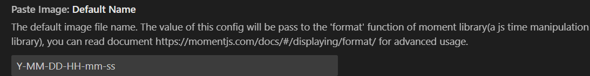

블로그를 포스팅하면서 이미지를 올리는 일이 많다는걸 느꼈습니다.  
하나하나 캡쳐하고 파일로 저장하고 폴더에 놓고 또 사용할 땐 그 폴더 위치를 적어야하고 너무 번거롭습니다.  
하지만 번거로운 작업은 대개 똑똑한 사람들이 이미 해결했다는 것!!  

이 번거로움을 해결할 vscode의 짱 좋은 Extension이 있습니다.  

   

# Paste Image 소개!!

클립보드에 저장되어 있는 캡쳐들을 vscode에 자동으로 올려주는 참한 Extension입니다!!  
캡쳐들이 저장될 위치도 설정할 수 있고 그 폴더 위치를 알 필요없이 키만 누르면 알아서 해줍니다!!  

윈도우뿐만 아니라 mac, linux까지 다 지원된다고 하네요!!    

# Paste Image 작동!!

## 설치 방법 
vscode > Extensions > Paste Image > install  
간단합니다.  

## 사용 방법
가져오고 싶은 이미지를 캡쳐해서 클립보드에 저장합니다.  
그 상태로 vscode에 삽입하고 싶은 곳에서  
Ctrl + Alt + v   
를 누르면 됩니다.  

자세한 방법은 Paste Image 설치하는데 밑에 다 있습니다.  

## 경로 설정
근데 막 사용하면 캡쳐된 이미지들이 막 이곳저곳에 널브러져 있을겁니다.  
이걸 깔끔하게 정리하고 싶으시면 설정할 수 있는 방법이 다 있습니다.  

vscode 왼쪽 아래 톱니바퀴 모양 누르고 Setting 으로 들어갑니다.  

  
그리고 Extensions에서 Paste Image Configuration을 들어갑니다.  
설정은 여기서 할 수 있습니다.  

  
밑으로 내려가면 Path 설정하는데 있는데  
너같은 경우는 프로젝트에서 assets 폴더 > images 폴더 안에 정리하고 있습니다.  

  
현재 파일 이름을 경로에 설정해두면 현재 파일 이름의 폴더들이 생겨나서 그 안에 저장되게 됩니다.  

  
파일 이름도 설정할 수 있는데 저는 딱히 건드리지 않았습니다. 현재 시간도 좋으니까요!!  