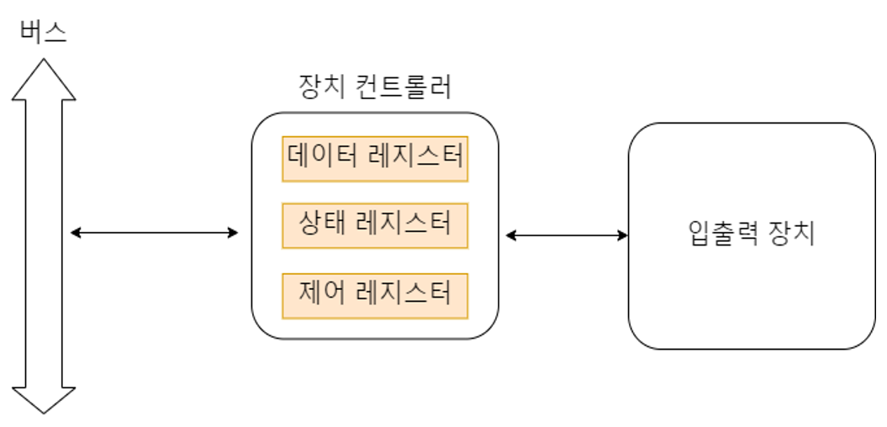
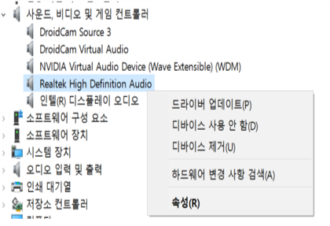
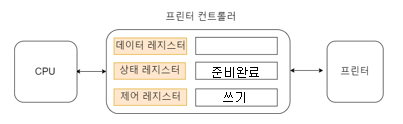
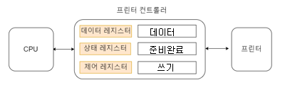
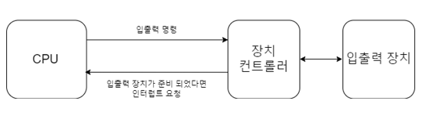
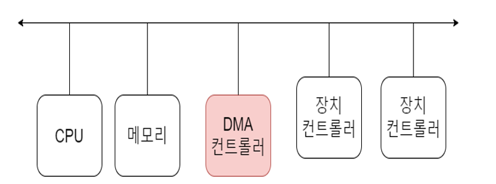
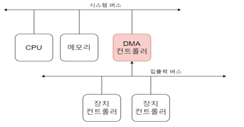

추후 면접에서 CS관련 질문이 나올 수 있으니 지금이라도 CS관련 공부를 하고 정리를 해야겠습니다.  
컴공과가 아니기에 제대로된 지식을 배울 순 없었으나 유튜브나 구글이 가르쳐줄테니까 열심히 해보겠습니다.  

오늘 포스팅은 CS에서 컴퓨터의 구조, 그리고 그 중에서 입출력장치를 먼저 알아보겠습니다.  

# 입출력 장치 정의

입출력장치는 컴퓨터 외부에 연결되어 컴퓨터 내부와 사용자 사이의 정보를 교환할 수 있는 장치의 집합을 말합니다.

대표적으로 키보드, 모니터, 마우스가 있습니다.  
근데 여기서 정의한대로라면 HDD나 USB도 외부에서 연결되어 정보를 교환할 수 있으니 보조기억장치가 아니라 입출력장치인가? 할 수 있는데 맞습니다.  
보조기억장치는 관점에 따라 입출력장치의 일종으로 볼 수 있습니다. 실제로 보조기억장치와 입출력장치를 '컴퓨터 주변에 붙어있는 장치' 라는 의미에서 주변장치라 통칭하기도 합니다.  
다만 보조기억장치는 일반적인 입출력장치에 비해 메모리를 보조한다는 특별한 기능을 수행하는 입출력장치입니다.  

# 장치 컨트롤러

입출력장치는 그 종류가 엄청나게 많고 계속해서 새로운게 나오고 있습니다.  
그에 따라 저마다 속도도 다르고, 데이터 전송 형식도 다양해 정보를 주고받는 방식을 규격화하기 어렵습니다.  
또한 CPU나 메모리의 데이터 전송률에 비해 입출력장치의 데이터 전송률이 일반적으로 낮기 때문에 입출력장치만으로 컴퓨터 내부와 데이터를 교환하는 것은 까다롭습니다.  

이런 이유로 나온게 <b>장치컨트롤러</b> 입니다. 

장치 컨트롤러의 역할로는
1. CPU와 입출력장치 간의 통신을 중개하여 다양한 입출력장치들로부터 오는 정보를 규격화하기 어렵다는 문제를 어느정도 해결
2. 장치컨트롤러의 연결된 입출력장치에 문제가 있는지 오류를 검출
3. 데이터를 버퍼라는 임시저장공간에 저장하여 CPU와 입출력장치 사이의 전송률 차이 감소
가 있습니다.

장치 컨트롤러에는 3가지 레지스터가 있습니다.
1. 데이터 레지스터 : CPU와 입출력장치 사이에 주고받을 데이터가 담기는 곳, 버퍼역할도 가능
2. 상태 레지스터 : 입출력장치가 작업할 준비가 되었는지, 작업이 완료되었는지, 오류가 있는지 등등의 상태 정보를 저장하는 곳
3. 제어 레지스터 : 입출력장치가 수행할 내용에 대한 제어 정보가 담기는 곳

# 장치 드라이버

이런 장치컨트롤러가 있어도 CPU가 이 장치컨트롤러를 어떻게 동작시키는지 모르기에 데이터를 주고받을 수 없습니다.

그럴때 <b>장치 드라이버</b> 를 사용합니다.  

장치드라이버 또는 디바이스 드라이버라고 하는데 특정 하드웨어나 장치를 제어하기위한 프로그램입니다.  

실제로 컴퓨터 장치관리자 보시면 다음과 같이 여러 드라이브가 있는 것을 확인할 수 있습니다.  

# 입출력 방식

장치 컨트롤러와 장치 드라이버는 이 부분을 설명하기 위한 밑걸음일 뿐이였습니다. 이 부분이 핵심입니다.  

입출력 방식으로는 3가지가 있습니다.(사실 더 있긴 합니다...)
1. 프로그램 입출력
2. 인터럽트 기반 입출력
3. DMA 입출력

## 프로그램 입출력
프로그램 입출력은 프로그램 속 명령어로 입출력 장치를 제어하는 방법입니다.  
입출력장치가 준비되었는지 CPU가 계속 장치컨트롤러의 상태레지스터를 조사하고 준비가 완료되었다면 CPU에서 처리하는 방식으로
확인하는 동안 다른 작업을 못하기에 비효율적인 방법입니다.  
하지만 그만큼 간단하죠!  

예시를 들어보겠습니다.  
메모리에 저장된 정보를 프린터로 보내는 예시입니다.  
프린터로 정보를 보낸다는 것은 정보를 쓴다는 의미와  같습니다.  

1. CPU는 프린터의 장치 컨트롤러에 접근하여 제어 레지스터의 쓰기 명령을 내림.  

2. 프린터의 장치컨트롤러는 제어명령을 받았기에 프린터의 상태를 확인하고 프린터의 준비가 완료되면 상태 레지스터에 준비완료라고 표시  

3. CPU는 상태레지스터를 주기적으로 읽어보고 준비완료라면 데이터 레지스터에 정보를 씀
만약 준비완료되지 않았다면 CPU는 계속 준비되었는지 확인할것임  

## 인터럽트 기반 입출력

우선 인터럽트부터 설명하겠습니다.  
장치에 예외상황이 발생하여 처리가 필요할 경우에 프로세서에 알려 처리할 수 있도록 하는 것을 말합니다.  
간단히 말해 신호라고 생각합니다.  

인터럽트 기반 입출력을 설명하자면 
입출력장치가 작업을 완료한 후에 인터럽트를 발생시켜 프로세스에 알리는 방식입니다.  

과정으로 설명하면
1. CPU가 장치컨트롤러로 명령 전송
2. 장치컨트롤러는 연결된 장치와 작업
3. 작업이 완료되면 CPU로 인터럽트 신호 전송
4. 신호를 받았기에 CPU에서 입출력 작업(연산) 수행

주기적으로 확인하는 방식보다는 효율적입니다!!

## DMA 입출력

앞선 두 방식은 입출력장치와 메모리간의 데이터 이동이 CPU가 주도하고 데이터도 반드시 CPU를 거칩니다.  
이런 방식은 CPU의 부담을 늘리게 됩니다.  

그래서 등장한 방식이 <b>DMA방식</b>입니다.  
Direct Memory Access 즉 데이터를 CPU에 거치지 않고 바로 메모리에 직접적으로 접근하는 기능을 가진 방식입니다.  

  
이러한 기능을 위해 DMA 컨트롤러 라는 장치가 필요합니다.

DMA 입출력의 과정은 다음과 같습니다.  
1. CPU는 DMA 컨트롤러에 입출력 작업을 명령
2. DMA 컨트롤러는 CPU대신 장치컨트롤러와 상호작용하며 입출력 작업을 수행
수행 중 필요한 경우 메모리에 직접 접근이 가능
3. 입출력 작업이 끝나면 DMA컨트롤러는 인터럽트를 통해 CPU에 작업을 끝났음을 알림

결과적으로 CPU는 입출력 작업의 시작과 끝만 관여를 함으로 CPU는 훨씬 더 시간을 효율적으로 쓸 수 있게 됩니다.  

위 사진에 모든 장치들이 하나의 시스템 버스(가로 화살표)에 연결되어 있습니다.  
그리고 시스템 버스는 공용자원이기 때문에 한쪽이 사용하고 있을 때 다른 한쪽은 사용할 수 없습니다.  

그래서 DMA컨트롤러는 CPU가 사용하지 않을 때 사용하거나
CPU에게 요청을 하고 승낙하면 사용하는 방식으로 시스템버스를 이용합니다.  

CPU와 DMA컨트롤러가 시스템 버스를 이용해야 할 때 속도가 빠른 CPU보다 속도가 느린 DMA컨트롤러에 우선순위를 높게 두어 사용하는 방식을 <b>사이클 스틸링(cycle stealing)</b> 이라고 합니다.  

 

또 위 사진에 장치컨트롤러들이 직접적으로 시스템 버스와 연결되어 DMA컨트롤러와 이어지는데 이 역시 시스템 버스를 사용하기에 좋지 않습니다.  

이를 해결하기 위해 시스템버스와는 다른 별도의 버스를 두어 DMA컨트롤러와 연결되는 방법이 있습니다.  
