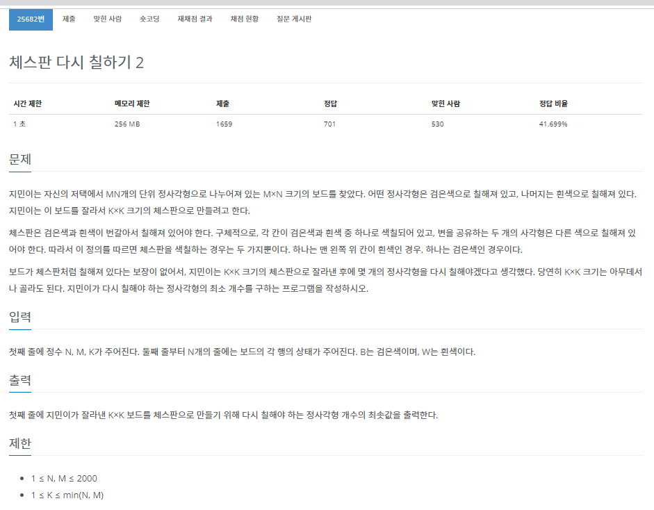
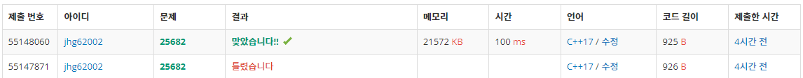

작년 6월 까지만 해도 백준알고리즘, 프로그래머스에서 알고리즘 문제를 꾸준히 풀었습니다. <br>
하지만 문제가 어려워지고 한 문제당 시간이 너무 많이 걸려서 한동안 문제보다는 개발을 중점으로 공부했었는데 다시 알고리즘 문제를 풀어야 할 것 같아 요즘 살짝살짝 해보고 있습니다. <br>
반년정도 손을 떼고 있던지라 c++ 이 어색하고 사용하던 알고리즘도 많이 까먹었지만 열심히 해보겠습니다.<br>

# 문제 설명



누적 합을 사용하는 문제입니다.<br>
풀기 전만해도 이게 왜 누적 합으로 분류되었는지 일단 누적 합으로 문제를 끼워맞추니까 풀렸었습니다... ㅎㅎ

# 시간 복잡도
N과 M의 크기가 최대 2000이고 K도 최대를 생각하면 2000입니다.<br>
[백준알고리즘 1018번 : 체스판 다시 칠하기]에서는 단순히 완전탐색으로 하면 O(MN)이였습니다(K는 8로 고정이였음).<br>
이 문제를 완전탐색으로 푼다면 시간 복잡도는  O(MNK^2)으로 1초만에 절대 못 풉니다. <br>
따라서 다른 방법을 찾아야 합니다. <br>

# 풀이

그 방법이 구간합인데 무엇을 구간합으로 정하느냐가 중요합니다. <br>
저는 단순히 W나 B로 시작하는 체스판에서 틀린 블록의 개수로 생각했습니다.<br>

예제 입력 1을 예로 들면 

```
(문제)　　　=>　　　(올바른 체스판)
BBBB　　　　　　　   BWBW
BBBB　　　　　　　   WBWB
BBBW　　　　　　　   BWBW
BBWB　　　　　　　   WBWB
```
이므로 
틀린 블록이 있으면 1을 아니면 0으로 하여 나타내면

```
0 1 0 1
1 0 1 0
0 1 0 0
1 0 0 0 
```
입니다.<br>
이를 구간합으로 만듭니다. (처음 항부터 해당 항 까지 틀린 블록의 개수)<br>
위의 배열을 dp라고 한다면 2차원 배열에서 각 구간의 구간합을 만드는 공식은<br>
```
dp[i][j] = dp[i][j] + dp[i-1][j] + dp[i][j-1] - dp[i-1][j-1]
```
입니다.

그럼 구간합은

```
0 1 1 2
1 2 3 4
1 3 4 5
2 4 5 6
```
으로 나타낼 수 있습니다. 여기서 3 * 3 (예제 입력 1의 K값) 보드의 체스판을 만들는 경우의 수는

```
0 1 1      1 1 2      1 2 3      2 3 4
1 2 3      2 3 4      1 3 4      3 4 5
1 3 4      3 4 5      2 4 5      4 5 6    
```
입니다.

코드로 표현하자면
```c++
for (int i = K; i <= N; i++)
	{
		for (int j = K; j <= M; j++)
		{
			...
		}
	}
```
가 되겠네요!!

이제 체스판의 시작점에서 체스판의 끝점의 누적합 값을 계산해줘서 최솟값을 구하면 정답이 됩니다!!<br>
위에서 나온 3 * 3 보드의 체스판은 처음부터 해당 부분까지의 누적합입니다. <br>
따라서 각 체스판의 시작점에서 끝점까지의 누적합을 구해야 합니다.<br>
보드의 길이는 K라고 정해졌으므로 끝점이 (i, j)라고 한다면 시작점은 (i - k + 1, j - k + 1)이 됩니다.<br>
이제 다왔습니다. <br>
각 체스판에서 틀린 블록의 개수는 이렇게 구할 수 있습니다.<br>
``` c++
int result = dp[i][j] - dp[i-k][j] - dp[i][j-k] + dp[i-k][j-k];
```

그럼 만들 수 있는 모든 체스판의 최솟값을 구하면 됩니다. 최솟값은 min함수를 쓰면 됩니다.<br>

<b>다만 주의할 점이 체스판의 시작점이 'W'인지 'B'인지 생각해줘야 합니다.<br>
저희는 처음이 무조건 'B'라고 생각하면서 지금까지 달려왔습니다.<b> 

그럼 이 과정을 한 번 더 하느냐?? 그건 아닙니다. <br>
체스판의 블록은 무조건 'W'아니면 'B'입니다. <br>
또 체스판의 모든 블록의 개수는 K X K개 이죠. <br>
그럼 제일 처음이 'W'인 K X K 크기의 체스판의 틀린부분의 개수는 
``` c++
K * K - result
```
가 되겠죠!!

이런 방식으로 코드를 처음부터 끝까지 써보면 다음과 같습니다.

``` c++
#include<iostream>
#include<algorithm>

using namespace std;

char chess[2001][2001];
int dp[2001][2001];

int main()
{
	ios::sync_with_stdio(false); cin.tie(NULL);

	int N, M, K;
	int result = 5000000;
	cin >> N >> M >> K;

	for (int i = 1; i <= N; i++)
	{
		for (int j = 1; j <= M; j++)
		{
			cin >> chess[i][j];
		}
	}

	// 가장 처음 값(1, 1)의 값을 B라고 생각했을 때 해당 블록이 틀렸는지 맞았는지 결정하는 부분
	for (int i = 1; i <= N; i++)
	{
		for (int j = 1; j <= M; j++)
		{
			int distance = i + j;

			if (distance % 2 == 0 && chess[i][j] == 'W')
				dp[i][j] = 1;
			else if (distance % 2 == 1 && chess[i][j] == 'B')
				dp[i][j] = 1;
		}
	}

	// 만들어진 dp로 전체적인 구간합 계산
	for (int i = 1; i <= N; i++)
		for (int j = 1; j <= M; j++)
			dp[i][j] = dp[i][j] + dp[i - 1][j] + dp[i][j - 1] - dp[i - 1][j - 1];

	// 모든 K * K 사이즈의 체스판의 구간합을 구해서 최솟값을 result에 저장
	for (int i = K; i <= N; i++)
	{
		for (int j = K; j <= M; j++)
		{
			int val = dp[i][j] - dp[i - K][j] - dp[i][j - K] + dp[i - K][j - K];
			result = min({ result, val, K * K - val });
		}
	}
	cout << result;
}
```


정답입니당.

# 결론
해당 풀이면 시간복잡도는 O(NM)이 되겠네요 완전탐색과 비교하면 엄청난 발전입니다.<br>

오랜만에 백준알고리즘 문제를 풀기도 해서 감 다 죽었어요.<br>
카테고리가 누적합이란걸 몰랐다면 훨씬 오래 걸렸을 겁니다...<br>
solved.ac에서 보니까 골드5 문제였네요...<br>
꾸준히 알고리즘 문제를 풀어봐야겠습니다.<br>
화이팅!!<br>