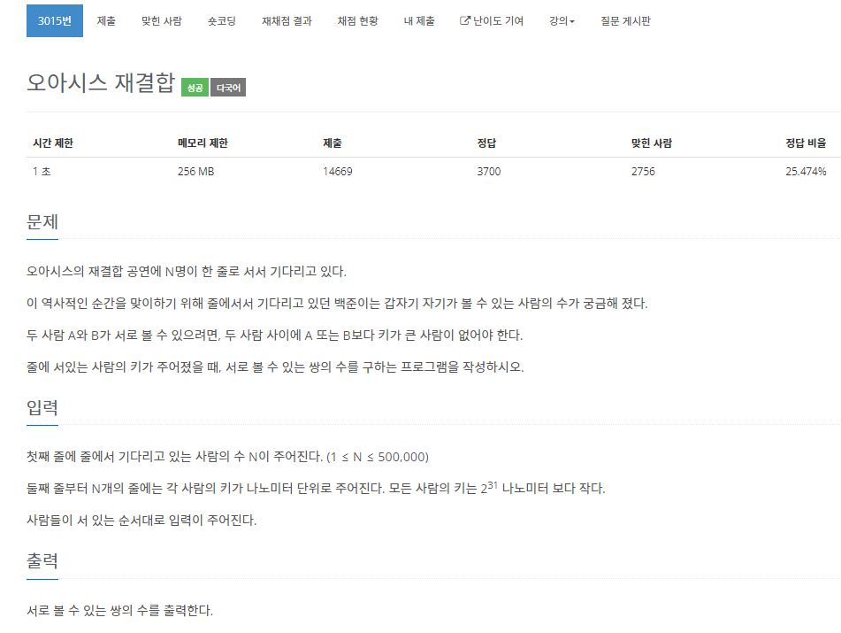

# 문제 설명



스택 자료구조를 사용하는 문제입니다.<br>


# 시간 복잡도
단순하게 생각하면 O(N^2)으로 풀 수 있습니다. <br>
하지만 데이터의 범위가 1 <= N <= 500,000이므로 1초의 시간제한으론 풀 수 없습니다. <br>
같은 스택 2 1725번 문제와 비슷하게 stack을 적절히 사용하면 O(N)으로 풀 수 있습니다. <br>


# 풀이

먼저 이전 사람보다 키가 큰 사람이 온다면 그 다음 사람부터는 이전 사람을 어떤 짓을 하더라도 못보게 됩니다. <br>
따라서 <b>이전 사람보다 키가 큰 사람이 왔을 때</b> 스택을 확인하면서 키가 작은 사람은 없애주면서 한 쌍으로 추가해주면 됩니다. <br>
이런식으로 반복하면 스택에는 내림차순으로 정렬이 되겠네요. 아니면 텅 비어버리게 되거나!! <br>

그럼 <b>이전 사람보다 작은 사람이 온다면</b> 이전 사람의 전 사람들은 다 가려져서 못보게 되겠네요. <br>
바로 옆 사람이니까 한 쌍 추가해주가 단순히 스택에 추가해주면 됩니다. <br>

이 문제의 경우 키가 같은 사람은 앞이나 뒤에 사람을 가리지 않는다고 합니다. 결국 같을 때도 생각해야 하죠. <br>
계속 같은 키를 가진 사람이 올 경우 모든 사람이 쌍이 될 수 있습니다. <br>

그나마 쉽게 생각하면(쉽지 않아...) 스택에 값만 놓기보다는 pair를 사용해서 값과 그 스택에서 같은 값을 가진 사람의 수를 저장하면 됩니다. (하나로 합치는 느낌으로...) <br>

그래서 쌍을 추가할 때 pair의 second값을 더해주도록 하면 됩니다. <br>

```c++
#include<iostream>
#include<stack>
#include<vector>

using namespace std;

int main()
{
	int N, num;

	cin >> N;
	vector<int> v;
	stack<pair<int, int>> s;

	for (int i = 0; i < N; i++)
	{
		cin >> num;
		v.push_back(num);
	}

	long long result = 0;

	for (int i = 0; i < N; i++)
	{
		int sameCount = 1;
        // 새로운 사람이 스택의 top보다 크거나 같으면 실행
		while (!s.empty() && s.top().first <= v[i])
		{
            // 만약 top과 같으면 top의 second + 1을 저장하고 나중에 스택에 넣을 때 같이 넣어줌
			if (s.top().first == v[i])
				sameCount = s.top().second + 1;
            // 무조건 한 쌍을 더해주는 것이 아닌 그 스택에서 같은 키를 가진 사람의 수만큼 더해줌
			result += s.top().second;
			s.pop();
		}

        // 가리든 말든 바로 옆에 사람은 무조건 쌍이 될 수 있음
		if (!s.empty()) result++;

		s.push({v[i], sameCount});
	}

	cout << result;
}

```


여기서 주의할 점은 N은 최대 500,000입니다. 여기서 최대 쌍의 수는 대충 생각하면 500,000^2입니다. <br>
쌍의 개수는 long long을 사용해야 해요!!


# 결론
막상 코드는 짧습니다. 되게 시간 많이 들였는데 말이죠.. <br>
stack을 사용하는 문제는 대체로 문제는 어려워도 구성은 거의 비슷한것 같습니다. <br>
stack관련해서 많은 문제를 풀어봐야겠습니다. <br>