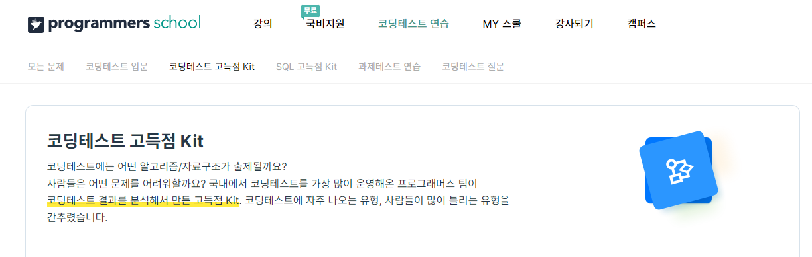
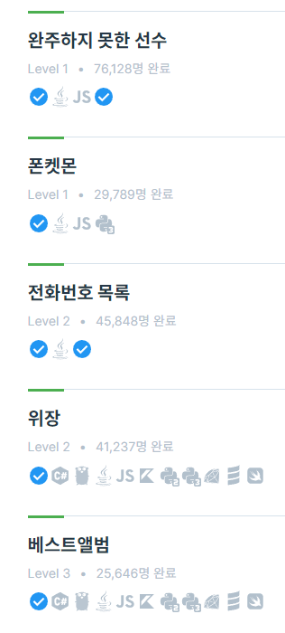
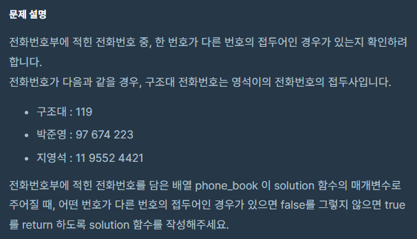
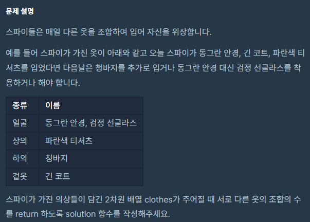
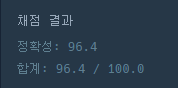
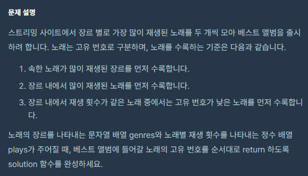

백준알고리즘을 풀기전 다시한번 기초부터 잡기 위해 프로그래머스에서 문제를 새로 풀어볼려고 합니다. <br>
일단은 프로그래머스의 코딩테스트 고득점 Kit문제를 다 풀어봐야 겠습니다. <br>
 <br>

 <br>
이번 포스팅은 해시문제입니다. <br>

 <br>
총 5문제 다 풀어본 결과 Level 1은 진짜 쉬운 문제이기에 Level 2부터 알아보겠습니다. <br><br><br>

# 전화번호 목록
 <br>

전화번호부에 있는 번호 중, 한 번호가 다른 번호의 접두어인 경우 false, 아니면 true를 반환하면 됩니다. <br>

전화번호부에 길이는 최대 1,000,000이므로 완전탐색으로 풀다간 시간초과가 발생합니다. <br>

## 정렬로 풀기
일단 저는 이 문제를 해시말고 정렬로 풀었습니다. <br>
string은 정렬하면 사전순으로 정렬됩니다. <br>
정렬 후 0번째 인덱스부터 마지막-1 까지 반복문을 돌면서 i번째 번호가 i+1번째 번호에 포함되어 있으면
그 즉시 false를 반환하고 반복문끝까지 돌면 접두어가 없는 경우이기에 true를 반환하게 했습니다. <br>

```c++
#include <string>
#include <vector>
#include <algorithm>

using namespace std;

bool solution(vector<string> phone_book) {
    bool answer = true;

    sort(phone_book.begin(), phone_book.end());

    for (int i = 0; i < phone_book.size() - 1; i++)
        if (phone_book[i] == phone_book[i + 1].substr(0, phone_book[i].size()))
            return false;

    return true;
}
```
전화번호부의 길이가 최대 n이고 전화번호의 길이가 최대 m이면 <br>
시간복잡도는 O(nm)입니다.<br>
문제에서 n은 최대 1,000,000이고 m은 최대 20이므로 시간내에 풀 수 있습니다. <br>

## 해시로 풀기

다른사람들의 풀이를 보고 알게된 방법입니다. 확실이 해시문제인 만큼 해시로 푸는게 맞았겠죠!! <br>
전화번호를 key로 해시에 일단 다 넣습니다 <br>

그 다음 해시를 돌면서 각 전화번호를 한 글자씩 더해가며 해시에 key가 있는지 확인합니다. <br>
이때 중요한건 자기자신은 제외해야 합니다. 자신은 무조건 자신과 같으니까요! <br>

```c++
#include <string>
#include <vector>
#include <unordered_map>

using namespace std;

bool solution(vector<string> phone_book) {
    unordered_map<string, bool> map;

    for(int i = 0; i < phone_book.size(); i++)
        map[phone_book[i]] = true;

    for (int i = 0; i < phone_book.size(); i++)
    {
        string phone_number = "";
        for(int j = 0; j < phone_book[i].size(); j++)
        {
            phone_number += phone_book[i][j];
            if(map[phone_number] && phone_number != phone_book[i])
                return false;
        }
    }

    return true;
}
```

시간복잡도는 마찬가지로 O(nm)이 되겠네요!! <br><br><br>

# 위장
 <br>
이 문제에서 제 눈에 가장 보인점은 의상의 개수가 최대 30개라는 겁니다. <br>
여기서 든 생각이 그냥 모든 경우의 수를 확인하면 되지않을까? 라는 생각이였습니다. <br>
일단 의상의 종류를 key로 하는 해시를 만들고 의상의 이름을 vector로 계속 추가했습니다. <br>
그리고 스파이는 최소 1개의 의상은 입기에 1부터 의상의 종류개수까지 반복해서 모든 경우의 수를 dfs로 탐색했습니다.<br>

그렇게 나온 코드가 <br>
``` c++
#include<iostream>
#include <string>
#include <set>
#include<vector>
#include <unordered_map>
#include <cmath>

using namespace std;

vector<string> clothType;
unordered_map<string, int> clothsMap;

int answer = 0;

void dfs(int count, int startIndex = 0, vector<string> comb = {})
{
    if (comb.size() == count)
    {
        int temp = 1;
        for (string s : comb)
            temp *= clothsMap[s];
        answer += temp;
        return;
    }

    for (int i = startIndex; i < clothType.size(); i++)
    {
        comb.push_back(clothType[i]);
        dfs(count, i + 1, comb);
        for (int index = 0; index < comb.size(); index++)
            if (comb[index] == clothType[i])
            {
                comb.erase(comb.begin() + index);
                break;
            }
    }
}

int solution(vector<vector<string>> clothes) {
    int result = 0;
    set<string> s;
    for (vector<string> v : clothes)
    {
        s.insert(v[1]);
        clothsMap[v[1]]++;
    }
    for (auto iter = s.begin(); iter != s.end(); iter++)
        clothType.push_back(*iter);
    for (int i = 1; i <= clothType.size(); i++)
    {
        answer = 0;
        dfs(i);
        result += answer;
    }
    return result;
}
```

입니다.... <br>
일단 코드가 길고 생각나는대로 코드를 적은거라 이뻐보이지 않습니다. <br>

그리고 결과는...<br>

입니다. <br>
테스트 케이스 1번만 시간초과를 당했습니다. <br>
1번은 모든 종류의 옷이 각각 하나만 있는 케이스입니다. <br> 
생각해보면 이 알고리즘을 사용한 1번 케이스의 시간복잡도는 어림잡아 O(N^N)인듯합니다...<br>

``` c++
if (clothType.size() == clothes.size())
        return pow(2, clothes.size()) - 1;
```

그래서 일단은 이 케이스만 해결해볼까 하고 if를 두어 모든 종류의 옷이 각각 하나만 있는 경우에는 <br>
적절한 값을 반환하게 하여 풀긴 풀었습니다. <br>
일단 여기서 pow(2, clothes.size()) - 1 이 값에 어떻게 도달했냐면 <br>
일단 모든 종류의 옷이 한 벌만 있으면 스파이는 그 옷을 입을지 안 입을지 선택할 수 있습니다. <br>
이를 모든 종류만큼 서로 곱해주면 답이 나올거라 생각했습니다. <br>
여기서 -1은 모두 벗는 경우가 있으므로 빼줘야 했습니다. <br>

근데 이렇게 해결하면 시원하지 않습니다. <br>
모든 경우를 이렇게 풀 수 있으면 좋을 것 같다는 생각으로 다시 한번 풀어봤습니다. <br>
만약 하의라는 종류의 옷이 5개가 있다면 스파이는 한 종류마다 하나씩 입을 수 있으므로 5가지 입니다. <br>
여기서 상의라는 종류의 옷이 3개가 더 있다면 하의도 생각해서 풀어야 합니다. <br>
따라서 한 종류의 옷이 n개가 있다면 n중 하나를 선택하거나 아무것도 선택하지 않거나 해서 n + 1의 경우를 가집니다. <br>
이렇게 각 종류의 경우의 수를 서로 곱하면 모든 경우의 수가 나오게 됩니다. <br>
하지만 스파이는 최소 한 벌의 옷은 입어야 하므로 모두 벗는 경우를 제거해야 하므로 -1을 해야 합니다. <br>
따라서 공식은 <br>
```
(a1 + 1)(a2 + 1)(a3 + 1)...(an + 1) - 1
``` 
입니다. <br>

``` c++
#include <string>
#include<vector>
#include <unordered_map>

using namespace std;

int solution(vector<vector<string>> clothes) {
    int result = 1;

    unordered_map<string, int> map;
    for (vector<string> v : clothes)
        map[v[1]]++;

    for (auto iter = map.begin(); iter != map.end(); iter++)
        result *= iter->second + 1;
    result -= 1;

    return result;
}
```
여기서 재밌는 점은 unordered_map을 iterator로 순회할 수 있고 값은 pair라는 점입니다. <br>
이런식이면 시간복잡도는 O(N)으로 가볍게 문제를 풀 수 있습니다!! <br><br><br>

# 베스트앨범
 <br>
Level 3 문제라 쫄아있었는데 의외로 쉬웠던 문제였습니다. <br>

이 문제 역시 키로 장르를 가지는 해시로 만드는 것으로 시작됩니다. <br>
그리고 값은 재생수가 있고 나중에 답을 적기 위해 인덱스도 필요하기에 pair<인덱스, 재생수>로 하고 <br>
장르마다 여러 노래가 있으니 이를 vector로 관리해야 합니다. <br>
``` c++
unordered_map<string, vector<pair<int, int>>> map;
```

그 다음은 조회수가 높은 순서로 장르를 정렬하고 <br>
높은 순부터 장르를 순회하여 장르안에 노래중 재생횟수를 내림차순으로 정렬하여 각 장르마다 2개의 노래를 꺼내오면 됩니다. <br>

정렬을 하는 기준은 사용자 정의 함수를 sort함수에 마지막 인자값으로 넣으면 쉽게 하실 수 있습니다. <br>

그러므로 전체 코드는 <br>
``` c++
#include <string>
#include <vector>
#include <unordered_map>
#include <algorithm>

using namespace std;

bool comp(pair<int, int> a, pair<int, int> b)
{
    if (a.second == b.second)
        return a.first < b.first;
    return a.second > b.second;
}

bool comp2(pair<string, vector<pair<int, int>>> a, pair<string, vector<pair<int, int>>> b)
{
    int sumA = 0, sumB = 0;

    for (int i = 0; i < a.second.size(); i++)
        sumA += a.second[i].second;
    for (int i = 0; i < b.second.size(); i++)
        sumB += b.second[i].second;

    return sumA > sumB;
}

vector<int> solution(vector<string> genres, vector<int> plays) {
    vector<int> answer;

    // 키는 장르, 값은 인덱스와 재생수
    unordered_map<string, vector<pair<int, int>>> map;

    for (int i = 0; i < genres.size(); i++)
        map[genres[i]].push_back({ i, plays[i] });

    vector<pair<string, vector<pair<int, int>>>> v (map.begin(), map.end());

    sort(v.begin(), v.end(), comp2);

    for (int i = 0; i < v.size(); i++)
        sort(v[i].second.begin(), v[i].second.end(), comp);

    for (int i = 0; i < v.size(); i++)
    {
        answer.push_back(v[i].second[0].first);
        if (v[i].second.size() >= 2)
            answer.push_back(v[i].second[1].first);
    }

    return answer;
}
```

입니다. <br>

장르의 종류를 n, 노래의 개수를 m이라치면 <br>
장르를 정렬하는 시간복잡도는 어림잡아 O(mnlogn), 노래를 정렬하는 시간복잡도는 어림잡아 O(mlogm) 입니다.<br>
n은 최대 100, m은 최대 10,000이므로 시간초과는 일어나지 않습니다. <br>


# 느낀 점
의외로 문제들이 어렵지 않아서 놀랐습니다. 난이도는 백준으로 치면 실버와 골드 4 정도를 왔다갔다 하는것 같네요 <br>
아니면 hash문제가 쉬운거일 수도 있습니다. 문제를 더 풀어봐야 정신을 차리겠네요. <br>

그리고 포스팅을 하면서 제 풀이를 글로 정리한다는게 많이 어렵다는 것을 알았습니다... <br>
추후에 제가 봐도 이해를 하지 못할까봐 걱정입니다... <br>
