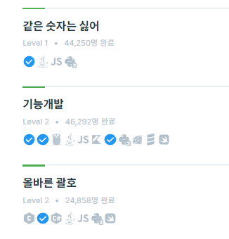
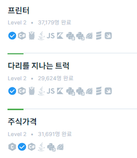
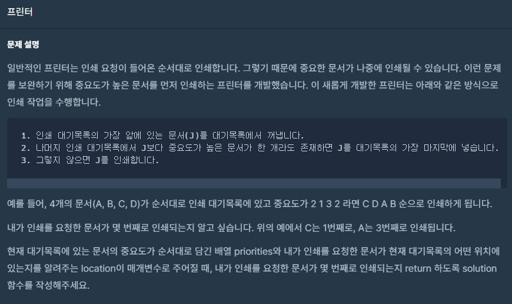
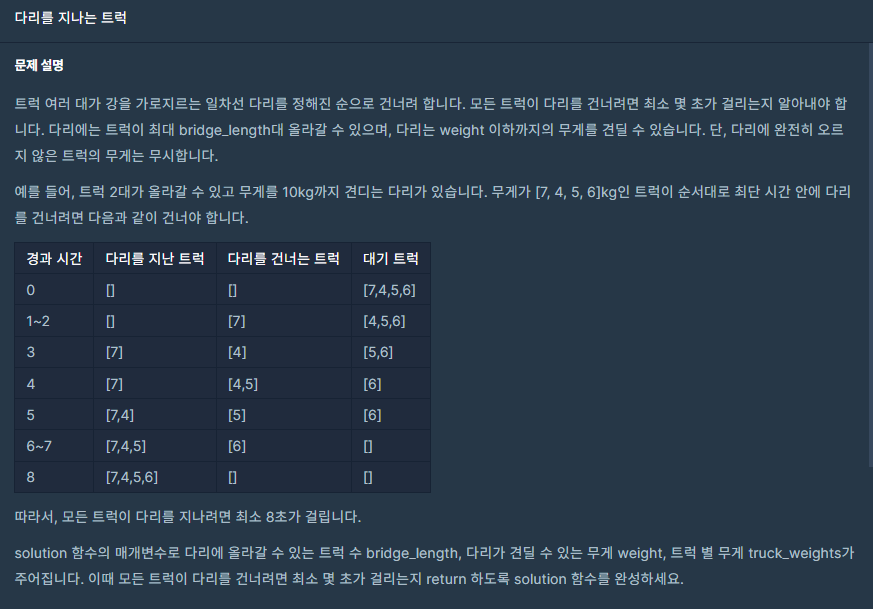
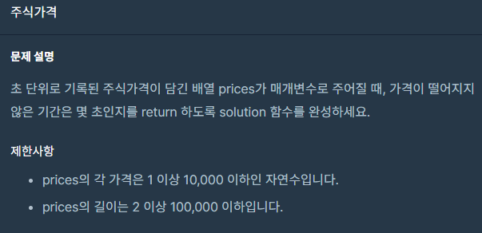

 <br>
이번 포스팅은 스택/큐 문제입니다. <br>


 <br>
풀어본 결과 <b>같은 숫자는 싫어</b>, <b>기능개발</b>, <b>올바른 괄호</b> 는 쉬워서 
<b>프린터</b>, <b>다리를 지나는 트럭</b>, <b>주식가격<b> 문제만 알아보겠습니다.  <br><br><br>

# 프린터
 <br>

중요도가 있는 문서에서 내가 요청한 문서는 몇번째로 나오는지 구하는 문제입니다. <br>
요청한 문서보다 중요도가 높은 문서가 있으면 대기목록의 가장 마지막에 넣는다. <br>
이 부분이 완전 queue를 사용하라 라고 말해주고 있습니다. <br>
그럼 문제에서 가르쳐준 방식으로 코드를 짜면 됩니다. <br>
다만 중요도가 같은 문서가 있는 경우도 있으니 구분해주기 위해 queue에는 중요도와 인덱스를 같이 넣어 <br>
내가 요청한 문서를 찾을 수 있게 하는것이 좋아보입니다. <br>
``` c++
    // 중요도, 인덱스
    queue<pair<int, int>> printer;
```

중요도가 큰 순서대로 문서를 뽑아야 하기에 일단 내림차순으로 정렬하여 해당 문서를 뽑을 때 최댓값을 쉽게 찾게 했습니다. <br>
그 다음 queue의 front가 최댓값이면 뽑아주고 현재 문서 인덱스를 올려줍니다. <br>
만약 front가 최댓값이 아니면 큐에서 빼서 그대로 넣어주면 되겠죠!! <br>
이렇게 반복하다가 front가 최댓값이고 현재값이 내가 요청한 문서면 반환해주면 됩니다. <br>

``` c++
#include <queue>
#include <vector>
#include <algorithm>

using namespace std;

bool comp(int a, int b) { return a > b; }

int solution(vector<int> priorities, int location) {
    int answer = 0;

    // 중요도, 인덱스
    queue<pair<int, int>> printer;

    for (int i = 0; i < priorities.size(); i++)
        printer.push({ priorities[i], i });

    sort(priorities.begin(), priorities.end(), comp);

    while (true)
    {
        int maxValue = priorities[answer];
        while (printer.front().first != maxValue)
        {
            printer.push(printer.front());
            printer.pop();
        }

        if (printer.front().first == maxValue)
        {
            answer++;
            if (printer.front().second == location)
                break;
            printer.pop();
        }
    }

    return answer;
}
```

이 문제는 그냥 큐만 사용한 단순한 문제였네요. 금방 풀었습니다.<br><br><br>

# 다리를 지나는 트럭

 <br>

weight 만큼의 무게를 견디는 다리에서 트럭을 다 지나가게 하는 최소 시간을 구하는 문제입니다. <br>
다리에서 트럭은 한 곳으로 들어가서 다른 한 쪽으로 나갑니다. 모습이 완전 queue 입니다!! <br>
그래서 이 문제도 걍 풀면 되겠네 했는데 오래걸렸어요... 5번 정도 다시 풀고 했습니다..(그래도 해냈죠!!) <br> <br> <br>

일단 차근차근 경우의 수부터 알아봅시다. <br><br>
```
1. 대기차량이 있을 때 
    1) 대기하고 있는 차가 들어올 수 있을 만큼 다리의 무게가 여유있을 때 
    2) 다리의 무게가 여유없을 때 
2. 대기차량이 없을 때 
```  
로 간단하게 정리할 수 있겠네요. <br>

이 방식을 다리에 트럭이 하나도 없을 때까지 반복하면 될겁니다. <br>

<b>모든 트럭이 다리 1길이당 1초가 걸리는 걸리는 것을 알아야 합니다.</b> <br><br>
1-1) 대기차량이 있을 때 대기하고 있는 차가 들어올 경우 <br>
모든 차량을 1만큼 이동시키고 대기 차량을 다리에 집어넣습니다. <br>
여기서 현재다리의 무게, 다리에 있는 차들의 위치, 대기하고 있는 트럭의 인덱스, 걸린 시간등 필요한 정보들을 갱신합니다.<br>
이 과정에서 만약 기존의 트럭 중 다리에서 나가는 일이 생긴다면 그것도 처리해줘야 하죠. <br><br>

1-2) 다리의 무게가 여유없을 경우 <br>
현재 다리에 가장 먼저 들어간 트럭을 빼내야겠죠!! 그 트럭을 빼내기 위해서는 <br>
(다리의 길이 - 가장 먼저 들어간 트럭의 위치 + 1) 만큼 움직여야 합니다. 다리를 완전히 빠져나가기 위해 +1을 해야합니다. <br>

똑같이 위치, 시간, 무게 갱신해주고 그 상태에서 여유가 생긴다면 대기하는 트럭을 넣어주면 됩니다. <br><br>

2- ) 대기차량이 없을 때 <br>
1의 방식을 계속 반복하면 대기 차량이 다 통과했거나 다리위에 있을 것입니다. <br>
그럼 마지막으로 다리위에 남겨진 트럭들을 다 보내줘야겠죠. <br>
어차피 속도는 같으니 도로의 맨 마지막으로 들어간 차만 계산하면 도로위에 차들을 다 처리할 수 있습니다. <br>
길이는 마찬가지로 (다리의 길이 - 가장 나중에 들어간 트럭의 위치 + 1) 입니다. <br><br>

이렇게 대기트럭도 없고, 도로에 트럭도 없으면 끝난겁니다. 이때까지 계산한 시간을 반환하면 됩니다. <br><br>

코드는 다음과 같습니다. <br>
``` c++
#include <queue>
#include <vector>
#include <algorithm>

using namespace std;

int solution(int bridge_length, int weight, vector<int> truck_weights) {
    int answer = 0;

    vector<int> truck_pos(truck_weights.size());

    int next_truck = 0;
    int weightInRoad = 0;
    queue<int> road;

    road.push(0);
    weightInRoad += truck_weights[0];
    answer++;
    next_truck++;
    truck_pos[0]++;

    while (!road.empty())
    {
        if (next_truck < truck_weights.size())
        {
            // 무게가 여유 있을 때
            if (weightInRoad + truck_weights[next_truck] <= weight)
            {
                answer++;
                road.push(next_truck);
                weightInRoad += truck_weights[next_truck];

                for (int i = road.front(); i <= road.back(); i++)
                    truck_pos[i]++;

                next_truck++;

                if (truck_pos[road.front()] > bridge_length)
                {
                    weightInRoad -= truck_weights[road.front()];
                    road.pop();
                }
            }
            // 무게가 여유 없을 때
            else
            {
                int distance = bridge_length - truck_pos[road.front()] + 1;

                answer += distance;
                weightInRoad -= truck_weights[road.front()];

                for (int i = road.front(); i <= road.back(); i++)
                    truck_pos[i] += distance;

                road.pop();

                if (weightInRoad + truck_weights[next_truck] <= weight)
                {
                    road.push(next_truck);
                    weightInRoad += truck_weights[next_truck];
                    truck_pos[next_truck]++;
                    next_truck++;
                }
            }
        }
        else
        {
            answer += bridge_length - truck_pos[road.back()] + 1;

            while (!road.empty())
                road.pop();
        }
    }

    return answer;
}
```

다른 사람 풀이보니까 다리의 길이마다 계속 0을 넣어주고 길이 1만큼 반복해서 진행하시는 코드가 있던데 <br>
그 방식보단 이 방식이 계산해서 한 번에 진행하기 때문에 더 빠를 겁니다. <br><br><br>

# 주식가격

 <br>

문제가 많이 짧습니다. 그래서 이해하는데 어려웠어요. 실제로 푸는것보다 이해하는데 더 오래걸렸어요. <br><br>

단순히 초 단위로 기록된 주식가격이 각각 떨어지지 않는 기간은 몇 초인지 계산하면 됩니다. <br>

입출력 예에서 <br>
3초 시점의 3원은 1초뒤에 가격이 떨어집니다. 따라서 4초가 되기 전까지 1초간 유지되는 것이죠..(3초 ~ 3.999999초) <br>
문제를 제대로 이해했다면 풀이는 되게 쉽습니다. <br>

스택을 사용해서 주식가격을 순서대로 처리합니다. <br>
현재 들어오는 값이 스택의 top보다 크거나 같으면 그대로 push합니다. <br>
만약 작다면 현재값보다 똑같거나 작은 가격이 나올때까지 pop을 해줍니다. 이 과정에서 가격이 떨어지지 않는 기간을 계산해야합니다. <br>
스택에 가격대신 인덱스를 넣고 현재 인덱스에서 해당 top의 인덱스를 빼주면 기간이 되겠죠. <br><br>

그렇게 반복하면 오름차순으로 스택이 정렬됩니다. 이 값들은 그 당시 시간부터 끝까지 가격이 떨어지지 않았습니다. <br>
그럼 주식 가격 배열의 size - 해당 인덱스 + 1을 해주면 됩니다. <br>

코드는 다음과 같습니다. <br>
``` c++
#include <string>
#include <vector>
#include <stack>

using namespace std;

vector<int> solution(vector<int> prices) {
    vector<int> answer(prices.size());

    stack<int> s;
    
    for (int i = 0; i < prices.size(); i++)
    {
        if (s.empty())
            s.push(i);
        else
        {
            while (prices[s.top()] > prices[i])
            {
                answer[s.top()] = i - s.top();
                s.pop();

                if (s.empty())
                    break;
            }
            s.push(i);
        }
    }
    while (!s.empty())
    {
        answer[s.top()] = prices.size() - s.top() - 1;
        s.pop();
    }
    return answer;
}

```

<br><br><br>

# 느낀 점
전에 포스팅한 해시보다는 재밌었습니다. 모든 코딩테스트 문제가 이런 수준이면 좋을 텐데... <br>
주식가격문제 풀때는 이해를 잘 못하고 삽질을 많이 했는데 지금와서는 왜 이해를 못했지?? 라는 생각이 드네요ㅎㅎ <br>
<br>
앞으로 프로그래머스 포스팅할 때는 진짜 어려웠거나 포스팅할만한 문제만 다뤄봐야 겠습니다. <br>
프린터 문제도 포스팅할 수준은 아니였네요...<br>
<br>
아무튼 화이팅!!<br>

