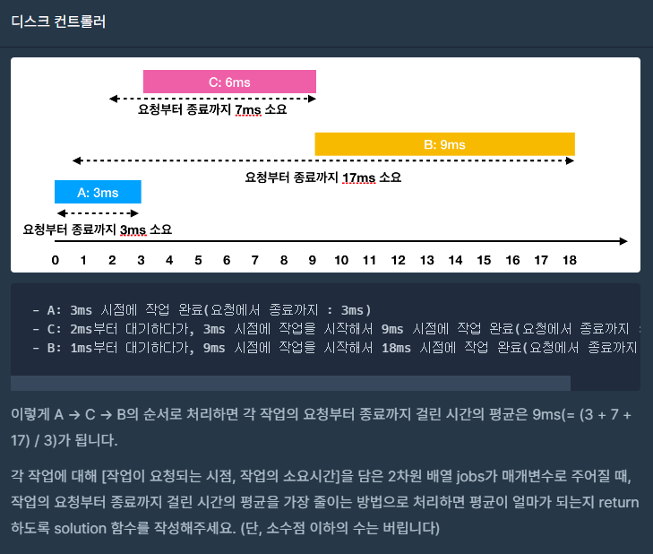

 <br>
이번 포스팅은 힙입니다! <br>

대부분 힙 문제는 c++에서는 queue라이브러리의 priorityQueue(우선순위 큐)를 사용합니다. <br>
예전에 c#으로 힙문제를 푼적이 있었는데 c#은 우선순위큐가 없어서 직접 구현해야 했습니다. <br>
하지만 지금은 c++로 풀거기 때문에 우선순위 큐 팍팍 쓸겁니다. <br>

 <br>

이번 문제는 총 3문제입니다. <br>
더 맵게는 우선순위 큐 사용할 수 있으면 쉽게 풀 수 있는 문제니 풀이는 생략하겠습니다. <br><br><br>

# 디스크 컨트롤러

문제 링크 : [https://school.programmers.co.kr/learn/courses/30/lessons/42627](https://school.programmers.co.kr/learn/courses/30/lessons/42627) <br><br>

 <br>

```
입력                                    출력
[[0, 3], [1, 9], [2, 6]]                9
```
입력으로는 작업들이 요청되는 시점, 작업의 소요시간의 배열입니다. <br>
출력으로는 이 작업들을 다 수행했을 때 걸린 시간의 평균의 최솟값을 return 하면 됩니다. <br><br>

푸는데 아이디어는 이렇습니다. <br>

A의 작업이 수행되는 동안 수행할 수 있는 작업들은 A의 작업이 끝날때까지 기다려야 합니다. <br>
그럼 대기시간을 가장 줄이는 방법은 <b>소요시간이 작은것부터 수행하면 되는것입니다.</b> <br><br>

그리고 문제의 제한사항중  하드디스크가 작업을 수행하고 있지 않을 때에는 먼저 요청이 들어온 작업부터 처리해야 합니다. <br>
그러면 들어온 입력을 요청 순서대로 정렬을 하면 편할 것 같네요!! <br>

``` c++
int solution(vector<vector<int>> jobs)
{
	sort(jobs.begin(), jobs.end());
}
```
<br>
알고리즘을 정리해봅시다. <br>
```
while(대기중인 작업이 없거나 큐가 비었을 경우 종료)
{
    1. 현재 시간에 수행할 수 있는 작업들을 소요시간이 작은 순으로 우선순위 큐에 넣는다.

    2. 작업들을 다 넣으면 우선순위 큐의 top()을 가져와 작업을 수행해준다.
        - 현재시간 계산, 모든 작업의 요청부터 종료까지 걸린 시간 계산.

    3. 만약 작업들을 다 넣었는데도 큐가 비어있다. 그러면 현재시간에 작업할 수 있는게 하나도 없다는 뜻
        - 대기중인 작업중 요청되는 시점이 가장 작은 작업을 가져와서 현재시간 갱신
        (요청되는 시점은 미리 정렬했기 때문에 편하게 가져올 수 있음)
}
```

종료조건은 대기중인 작업이 없거나 큐가 비었을 경우입니다. <br>
대기중인 작업이 하나도 없더라도 아직 큐에서 작업중일 수도 있습니다. <br>

이 알고리즘 동안 계산된 총 걸린 시간을 입력의 크기만큼 나눈값을 return 하면 문제는 해결됩니다. <br><br>

제 코드는 다음과 같습니다. <br>
``` c++
#include<string>
#include<vector>
#include<algorithm>
#include<queue>

using namespace std;

struct comp
{
	bool operator()(vector<int> a, vector<int> b)
	{
		// 소요시간 기준 오름차순 (특이한 건 b가 기준임)
        return a[1] > b[1];
		if (a[1] > b[1])
			return true;
		else if (a[1] == b[1])
			return a[0] > b[0];
		else
			return false;
	}
};

int solution(vector<vector<int>> jobs)
{
	int totalTime = 0;
	int currentTime = 0;
	int taskIndex = 0;
	sort(jobs.begin(), jobs.end());

	priority_queue<vector<int>, vector<vector<int>>, comp> pq;

	while (taskIndex < jobs.size() || !pq.empty())
	{
		if (taskIndex < jobs.size() && currentTime >= jobs[taskIndex][0])
		{
			pq.push(jobs[taskIndex]);
			taskIndex++;
			continue;
		}

		if (!pq.empty())
		{
			currentTime += pq.top()[1];
			totalTime += currentTime - pq.top()[0];
			pq.pop();
		}
		else
		{
			currentTime = jobs[taskIndex][0];
		}
	}

	totalTime /= jobs.size();
	return totalTime;
}
```
sort 함수의 3번째 인자를 정의할 때는 앞에 파라미터가 기준이었는데 <br>
우선순위 큐의 정렬 방식을 정의할 때는 뒤에 파라미터가 기준이라고 합니다. 게다가 함수가 아닌 구조체... <br><br>

시간 복잡도를 계산해봅시다. <br>
우선순위큐의 시간복잡도는 삽입, 삭제 시 O(logN)이 걸리는 좋은 녀석입니다. <br>
top()을 읽어오는 것은 O(1)이죠!! <br>
여기서 우리는 디스크의 모든 작업을 처리할 때까지 계속 우선순위 큐에 넣고 빼고 하고 있습니다. <br>
그럼 시간복잡도는 대략 O(NlogN)인 것 같습니다. big-O notation은 계수를 신경쓰지 않으니까요!! <br><br><br>

# 이중우선순위큐

문제 링크 : [https://school.programmers.co.kr/learn/courses/30/lessons/42628](https://school.programmers.co.kr/learn/courses/30/lessons/42628) <br><br>

 <br>
최댓값과 최솟값을 빠르게 가져올 수 있는 우선순위 큐를 구현하는 문제입니다. <br>

입력인 operation의 길이가 최대 1,000,000이므로 머리 나쁘게 풀었다간 O(N^2) 꼴이 나겠네요. <br>
머리를 써야 합니다. <br>

일단 저는 대충 우선순위 큐 2개를 사용하면 풀 수 있지 않을까?? 라면서 풀어봤습니다만 풀렸습니다. ㅎㅎ <br>

일단 입력을 우리가 써먹을 수 있게 처리해야 합니다. <br>
입력의 요소들은 전부 공백을 기준으로 명령어와 숫자로 나누어져 있습니다. <br>
우리는 공백을 기준으로 값을 나누어 처리해줘야 하죠. <br>
이럴 땐 다른 언어의 split함수가 그립네요. c++는 없는데 말이죠.. <br>
그래도 입력이 단순하니 단순하게 처리합시다. <br>

``` c++
for(string s : operations)
{
    char oper = s[0];
    int num = stoi(s.substr(2, s.size()));
}
```

명령어 부분은 무조건 한 글자이고 공백도 한 글자이니 숫자 부분은 인덱스가 2번째부터 끝까지라고 생각하면됩니다. <br>

그럼 아이디어를 정리해봅시다. <br><br>
우선 minHeap, maxHeap을 사용합니다. 최댓값을 구할 땐 maxHeap에서, 최솟값을 구할 땐 minHeap에서 구하는 겁니다. <br>
일단 삽입 명령어에는 두 힙에다가 값을 넣습니다. <br>
그리고 최솟값을 뺄 때에는 minHeap을 pop() 해주고 최댓값을 뺄 때에는 maxHeap을 pop() 해줍니다. <br>
이런식을 반복한다면 minHeap에는 큰값들이 남겨지고 maxHeap에는 작은 값들이 남겨지게 됩니다. <br>
결국 maxHeap의 최댓값이 minHeap의 최솟값보다 작아지는 경우가 생깁니다. <br>
이때 두 힙을 초기화시켜준다면 깔끔하게 정리될 것입니다. <br><br>

물론 pop해줄 때 큐가 비어있는지 확인하는 부분도 넣어야 하죠. <br>

설명은 다 했으니 바로 코드는 다음과 같습니다!! <br>

``` c++
#include <string>
#include <vector>
#include <iostream>
#include <queue>
#include <limits.h>
using namespace std;

vector<int> solution(vector<string> operations) {
    vector<int> answer = {0, 0};

    priority_queue<int, vector<int>, greater<int>> minHeap;
    priority_queue<int, vector<int>, less<int>> maxHeap;

    for(string s : operations)
    {
        char oper = s[0];
        int num = stoi(s.substr(2, s.size() - 2));
        if (oper == 'I')
        {
            minHeap.push(num);
            maxHeap.push(num);
        }
        else
        {
            if (!maxHeap.empty() && !minHeap.empty())
            {
                if (num == 1)
                {
                    maxHeap.pop();
                }
                else
                {
                    minHeap.pop();
                }
            }
        }

        answer[0] = maxHeap.empty() ? INT_MIN : maxHeap.top();
        answer[1] = minHeap.empty() ? INT_MAX : minHeap.top();

        if (answer[0] < answer[1])
        {
            while (!minHeap.empty())
                minHeap.pop();
            while (!maxHeap.empty())
                maxHeap.pop();
            answer = { 0, 0 };
        }
    }

    return answer;
}
```
시간복잡도는 단순히 우선순위 큐 2개를 사용하는 거니까 O(NlogN)이 겠네요. <br>
물론 이 문제는 입력이 단순하지 않습니다. 하지만 계수는 신경쓰지 않으니까요!! <br><br><br>


# 느낀점

디스크 컨트롤러를 풀었을 때는 코드가 완전 난장판이었습니다. <br>
풀리는 시간도 지금보다 살짝살짝 높게 나왔습니다. <br>
포스팅된 코드는 일단 다 풀고 다른 사람의 풀이를 많이 참고한 코드입니다. <br>
세상에는 깔끔하고 똑똑한 사람이 많다는 걸 또 깨달았네요. <br>
저도 열심히 해보겠습니다. <br>