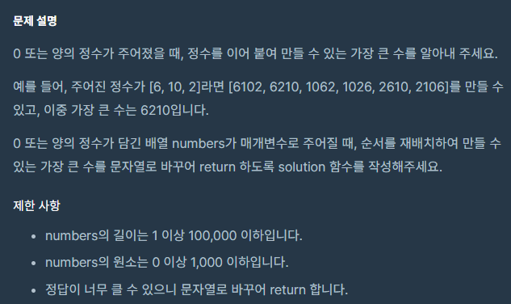
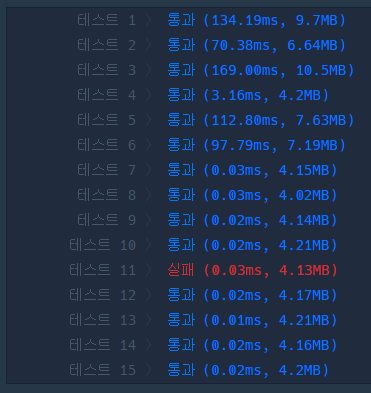
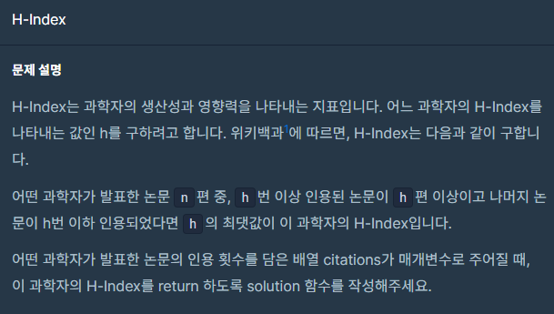

 <br>
이번 포스팅은 정렬입니다!! <br><br>

정렬문제는 뭐 어떤 방식으로 정렬을 한다거나, 정렬을 하고 그 순서대로 문제를 해결하는 방법이 대부분인것 같아요. <br>
이번에도 c++ sort함수 팍팍 썼습니다! <br>

 <br>

이번에는 <b>가장 큰 수</b>, <b>H-Index</b>만 포스팅하겠습니다. <br>
첫번째 문제는 귀엽습니다. 하하하ㅏ하ㅏㅎ <br>

# 가장 큰 수
문제 링크 : [https://school.programmers.co.kr/learn/courses/30/lessons/42746](https://school.programmers.co.kr/learn/courses/30/lessons/42746)  <br>

 <br>

숫자를 더하지 않고 이리저리 붙여서 가장 큰 수를 만드는 문제입니다. <br>

단순히 생각했을 때 숫자들의 자리수가 다르기 때문에 숫자의 크기로 정렬하면 안되겠고 <br>
각 숫자의 제일 왼쪽숫자가 크면 먼저 붙이는 게 좋을 것 같네요. <br>
```
36, 52, 71 가 있으면 71이 왼쪽 숫자가 7로 가장 크니까 먼저 붙이고 그 다음 순서대로 52, 36 붙이면
715236 으로 가장 커집니다.
```
<br>

이런식으로 정렬하면 가장 왼쪽 숫자가 같으면 어떡하지 라는 생각이 듭니다. <br>
11 이나 12 처럼 말이죠. 그럼 2번째 왼쪽숫자를 비교할까요?? 그래도 되지만 자릿수가 같으면 크기순으로 정렬하면 됩니다. <br>


그럼 자릿수가 다른 예로 1이랑 12는 어떻게 비교할까요. 자릿수가 다르기에 애매합니다. <br>
정렬할 때 각 숫자의 인덱스를 두어 비교하는 식으로 해볼까 했는데 뭔가 이건 아닌것같다는 생각이 듭니다. <br><br>

되게 무식한 방법같아서요... <br>

그러면 모든 수를 다 똑같은 자릿수로 만들어서 크기를 비교하면 어떨까? 라는 생각으로 접근했습니다. <br>
여기서 6이랑 66은 어떻게 붙여도 똑같습니다. 그래서 모든 숫자를 다 반복하는 형태로 자릿수를 맞춰보았습니다. <br>

입력의 최댓값은 1000이기에 4자리수로 맞추기 위해 모든 숫자를 4번 반복했습니다. <br>
4번 반복하면 분명 10000이 넘어가는 경우도 있기에 4번째 자리까지 잘라주고 크기를 비교했습니다. <br><br>

정렬만 한다면 간단합니다. 그저 문자열에 추가로 써주기만 하면 되니까요. <br>

결과는!! <br>
 <br>
하나의 테스트 케이스에서 틀렸습니다. <br>

하나의 테스트 케이스를 틀린 경우는 입력이 대부분 제한 사항의 경계에 있는 값들입니다. <br>
눈에 들어오는게 원소의 크기가 0이상입니다. <br>
그럼 입력이 {0, 0, 0, 0}이 들어오면 답이 0000이 됩니다. <br>
0000이란 숫자는 없거든요. <br>

따라서 이때 조건을 추가해주면 됩니다. <br>
우리는 정렬을 해주었기에 맨 앞자리가 0인지 아닌지만 확인하면 됩니다. <br>
맨 앞자리가 0인 경우에는 그대로 "0"을 반환해주면 되겠죠! <br><br>

완성된 코드는 다음과 같습니다. <br>
``` c++
#include <string>
#include <vector>
#include<algorithm>

using namespace std;

bool comp(string a, string b)
{
    string a4 = a + a + a + a;
    string b4 = b + b + b + b;

    return stoi(a4.substr(0, 4)) > stoi(b4.substr(0, 4));
}

string solution(vector<int> numbers) {
    string answer = "";
    vector<string> s;
    for (int num : numbers)
    {
        s.push_back(to_string(num));
    }
    sort(s.begin(), s.end(), comp);

    for (int i = 0; i < s.size(); i++)
    {
        answer += s[i];
    }

    if (answer[0] == '0')
        answer = '0';
    
    return answer;
}
```
시간복잡도는 단순히 정렬하기 때문에 O(NlogN)입니다. <br>
하지만 정렬하는 동안 원소의 최대 자릿수만큼 반복하기 때문에 최대자릿수가 M이라면 O(MNlogN)가 됩니다. <br>
근데 시간복잡도는 매우 큰 입력을 상정하고 대략적인 경향을 보는것입니다. <br>
상식적인 선에서는 자릿수가 커봤자 상수이므로 무시해도 됩니다. <br><br>

문제를 다 풀고 다른 사람의 코드를 봤는데 정렬하는 부분을 되게 심플하게 적으신 분이 있었습니다. <br>
``` c++
bool compare(const string &a, const string &b)
{
    if (b + a < a + b)
        return true;
    return false;
}
```

이러면 두말할것도 없이 O(NlogN) 입니다!! 진짜 대단하네요... <br><br><br>

# H-Index
문제 링크 : [https://school.programmers.co.kr/learn/courses/30/lessons/42747](https://school.programmers.co.kr/learn/courses/30/lessons/42747)  <br>
 <br>

문제 설명이 심상치 않습니다. 풀긴 풀었습니다만 코드가 정말 지저분합니다. <br>

입력은 논문의 인용 횟수를 담은 배열이고
여기 n개의 논문 중, h번 이상 인용된 논문이 h편 이상이고 나머지 논문이 h번 이하 인용되었다면 h의 최댓값을 
구하는 문제입니다. <br>

일단 제가 이해한 바로 푼 방법을 정리해보겠습니다. <br>

```
1. 논문의 인용 횟수를 오름차순으로 정렬한다.
2. 논문배열을 하나씩 보면서 논문배열의 값중에 H-index가 될 수 있는 값중 최댓값을 가져온다.
    1) 하나씩 봤는데 H-index가 되는 값이 없다.
        0부터 제일 작은 논문 인용 횟수 - 1 만큼 반복해서 H-index가 될 수 있는 값중 최댓값을 가져온다.
    2) 하나씩 봤는데 H-index가 되는 값이 있다.
        (H-index가 되는 값 + 1) 부터 ((H-index가 되는 값의 인덱스 + 1) 번째 인용 횟수 - 1) 만큼 반복해서 H-index가
        될 수 있는 값중 최댓값을 가져온다.

이렇게 해서 나온 H-index값을 반환한다...
```

이렇게 해서 나온 와장창창 코드는 다음과 같습니다. <br>

``` c++
#include <string>
#include <vector>
#include<algorithm>

using namespace std;

int solution(vector<int> citations) {
    int answer = 0;
    int minHIndex = -1;
    sort(citations.begin(), citations.end());

    for (int i = 0; i < citations.size(); i++)
    {
        int citationCount = citations[i];
        int lowerCount = i;
        int upperCount = citations.size() - i;

        if (lowerCount <= citationCount && upperCount >= citationCount)
        {
            minHIndex = i;
            answer = citations[minHIndex];
        }
        else
            break;
    }

    if (minHIndex != -1)
    {
        for (int citationCount = citations[minHIndex] + 1; citationCount < citations[minHIndex + 1]; citationCount++)
        {
            int upperH = citations.size() - minHIndex - 1;
            if (citationCount <= upperH)
                answer = citationCount;
        }
    }
    else
    {
        for (int citationCount = 0; citationCount < citations[0]; citationCount++)
        {
            int upperH = citations.size() - minHIndex - 1;
            if (citationCount <= upperH)
                answer = citationCount;
        }
    }
    
    return answer;
}
```
시간복잡도는 반복문 하나 돌기 때문에 O(N)입니다. <br><br><br>

# 느낀 점

H-Index 문제 다 풀고 다른 사람들의 코드를 봤는데 되게 간단하게 끝내셔서 놀랐습니다. <br>
그리고 질문하기도 봤는데 다른사람도 문제가 이해하기 어렵다 하네요. <br>

어떤 분이 H-index가 <br>
<b>정렬된 상태에서의 논문 순서가 인용 수와 같거나 커지는 시점</b> 이라고 하네요. <br>
이렇게 듣고 그냥 풀어보니까 되긴 되는데 왜 이렇게 되는지는 알듯말듯 합니다.... <br>
문제는 풀었는데 아직도 문제를 이해하지 못한 기분이 듭니다... <br>