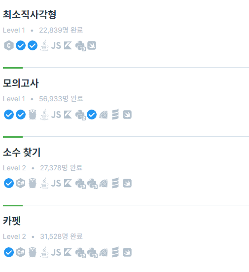
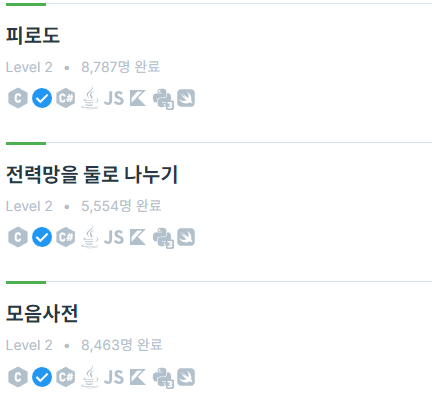
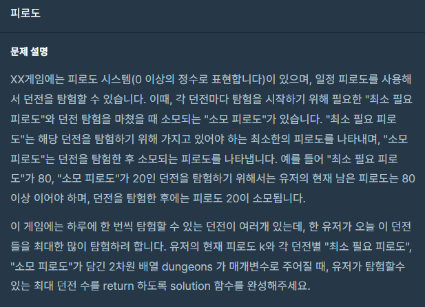
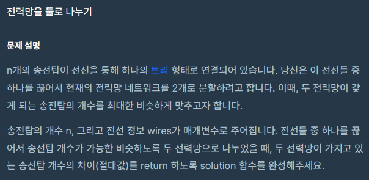
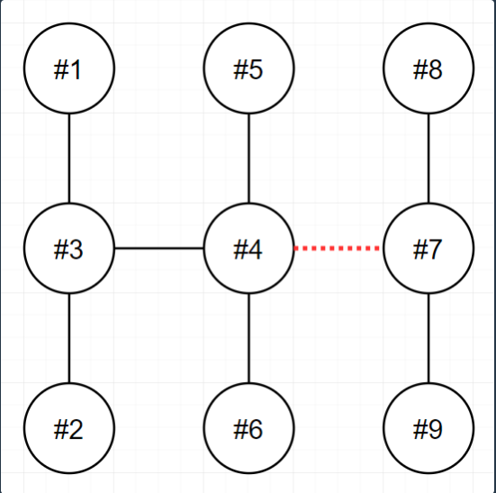
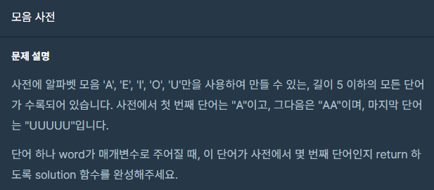

오늘 포스팅은 완전탐색입니다. <br>




피로도, 전력망을 둘로 나누기, 모음사전만 풀어보도록 합시다. <br>

완전탐색을 위해서는 모든 경우의 수를 확인해야하는 경우가 있습니다. 간단하게는 모든 수들의 순열을 구해서 하는경우가 많은데
여기서 [이전 순열 구하기 포스팅](https://hyeonjunje.github.io/algorithm/Permutation/)인 next_permutation을 많이 사용했습니다. <br><br>

# 피로도
[https://school.programmers.co.kr/learn/courses/30/lessons/87946](https://school.programmers.co.kr/learn/courses/30/lessons/87946)
<br>
현재 피로도가 주어졌을 때 탐험할 수 있는 최대 던전 수를 구하는 문제입니다.<br>
던전의 개수는 최대 8개이므로 완전탐색을 해도 괜찮을 정도이죠 <br>

## 순열로 구하기
<br>
단순히 던전의 모든 순열을 구해서 그 순서대로 던전을 몇 번 탐험할 수 있는지 계산하는 겁니다. <br>
던전의 모든 순열을 구하는 법은 c++의 next_permutation을 사용하면 간단하게 구할 수 있죠 <br>
각 던전의 순열을 돌면서 피로도를 계산합니다. 만약 필요 피로도보다 현재 피로도가 작다면 continue를 해주면 되겠죠<br>
반복되는 부분이 있을수도 있지만 입력의 크기가 작으므로 신경쓰지 않아도 됩니다. <br>


코드로 바로 보시죠
``` c++
#include <string>
#include <vector>
#include <algorithm>

using namespace std;

int solution(int k, vector<vector<int>> dungeons) {
    int answer = -1;

    vector<int> per;
    for (int i = 0; i < dungeons.size(); i++)
        per.push_back(i);

    do {
        int count = 0;
        int tempK = k;
        for (int i = 0; i < per.size(); i++)
        {
            if (tempK >= dungeons[per[i]][0])
            {
                count++;
                tempK -= dungeons[per[i]][1];
            }
        }
        answer = max(answer, count);
    } while (next_permutation(per.begin(), per.end()));

    return answer;
}
```
서로 다른 던전이지만 피로도가 같을 수도 있습니다. 따라서 순열의 형태로 만들기 위해 인덱스 오름차순인 vector을 사용해서 순열을 만드는 겁니다. <br><br>


## dfs로 구하기

dfs를 사용해서도 문제를 풀 수 있습니다. 이래저래 순열을 구하는 것과 비슷하지만 계산은 조금 덜 한다고 생각합니다. <br>
입출력 예로 설명해 봅시다. <br>
피로도는 80이고 던전의 피로도 정보는 (80, 20), (50, 40), (30, 10) 입니다. <br> 
이를 현재 피로도가 최소 피로도보다 적거나 모든 던전을 다 돌때까지 dfs를 반복합니다.<br> 

```
(80, 0)   // 현재 피로도와, 던전을 돈 횟수입니다.
   |     \   \
(60, 1)  (40, 1)  (70, 1)     // 각 던전을 돌고 남은 피로도와, 던전을 돈 횟수를 갱신합니다.
   |
  (x)  (20, 2)  (50, 2)  ...  // 전에 이미 돈 던전이라면 무시합니다.
                   |
                (10, 3)       // 현재 피로도가 탐험할 던전의 최소 피로도보다 적으면 무시합니다.
                              // 이렇게 반복하며 나온 던전을 돈 횟수의 최대값을 반환하면 됩니다.
```

이를 코드로 나타내봅시다. 재귀함수의 인자로는 던전의 정보, 현재 피로도, 방문기록, 돈 횟수가 필요해보입니다. <br>
``` c++
#include <string>
#include <vector>
#include <algorithm>

using namespace std;

int maxCount = -1;

void dfs(vector<vector<int>> dungeons, int fatigue, vector<bool> checked, int count = 0)
{
    maxCount = max(maxCount, count);
    if (count == dungeons.size())
        return;

    for (int i = 0; i < dungeons.size(); i++)
    {
        if (checked[i] || fatigue < dungeons[i][0])
            continue;
        checked[i] = true;
        dfs(dungeons, fatigue - dungeons[i][1], checked, count + 1);
        checked[i] = false;
    }
    return;
}

int solution(int k, vector<vector<int>> dungeons) {
    vector<bool> v(dungeons.size());
    dfs(dungeons, k, v);
    return maxCount;
}
```

정돈되지 않은 코드이지만 그래도 정답입니다!! <br><br>

# 전력망을 둘로 나누기
[https://school.programmers.co.kr/learn/courses/30/lessons/86971](https://school.programmers.co.kr/learn/courses/30/lessons/86971)
 <br>
트리형대의 전선의 간선을 하나 끊었을 때 최대한 노드의 개수가 비슷하게 맞추는 문제입니다. <br>
즉 간선을 하나 끊었을 때의 두 트리의 노드 수의 차이가 가장 작은 수를 반환하면 됩니다. <br>

여기서 다행히 전선이 사이클이 없는 트리형태이고 노드의 수는 최대 100개입니다. <br>
즉 간선을 하나하나 끊어서 검사할 수 있는 완전탐색 문제입니다. <br>


```
n  wires                                              result
9  [[1,3],[2,3],[3,4],[4,5],[4,6],[4,7],[7,8],[7,9]]  3
```

 <br>
다음 예제를 살펴봅시다. <br>

4와 7의 간선을 끊었을 때 dfs로 4번 노드에서 출발한 트리의 노드 수와 7번 노드에서 출발한 트리의 노드 수를 구하여
차이를 구하면 됩니다. <br>
하지만 여기서 총 트리의 노드 수는 n이기 때문에 4번 노드에서 출발한 트리의 노드 수만 구하면 됩니다.
그럼 7번 노드에서 출발한 트리의 노드 수는 dfs를 하지 않아도 
```
n - 4번 노드 트리의 노드 수
```
가 됩니다. <br> <br> 
그리고 트리의 경우 사이클이 없기 때문에 중복체크를 매우 쉽게 할 수 있습니다. <br>
단지 현재의 다음 노드가 현재의 이전 노드만 체크하면 됩니다. <br><br> 

각 간선의 배열은 wires로 주어지기 때문에 반복문을 돌면서 간선을 하나씩 끊으며 구하면 됩니다. <br> 
코드는 다음과 같습니다.
``` c++
#include <string>
#include <vector>
#include <algorithm>
#include <math.h>

using namespace std;

vector<vector<int>> graph(200);

int dfs(int current, int exceptNode, int count = 1)
{
    for (int i = 0; i < graph[current].size(); i++)
    {
        int next = graph[current][i];
        if (next == exceptNode)
            continue;
        count = dfs(next, current, count + 1);
    }
    return count;
}

int solution(int n, vector<vector<int>> wires) {
    int answer = 200;

    for (int i = 0; i < wires.size(); i++)
    {
        graph[wires[i][0]].push_back(wires[i][1]);
        graph[wires[i][1]].push_back(wires[i][0]);
    }

    for (int i = 0; i < wires.size(); i++)
    {
        int firstCount = dfs(wires[i][0], wires[i][1]);
        int secondCount = n - firstCount;
        answer = min(answer, abs(firstCount - secondCount));
    }
    return answer;
}
```
노드의 수는 최대 100개 입니다. 따라서 차이는 최대 99이지만 적당히 200으로 잡았습니다. <br>
간선을 끊어주는 작업은 반복문을 돌면서 실제로 그래프를 새로 만들거나 끊는 작업은 비효율적입니다. <br>
단지 끊긴 노드로 못가게만 하면 끊긴것과 다름이 없습니다. 따라서 dfs를 시작할 때 제일 처음으로 무시할 노드는
해당 노드와 인접한 끊긴 노드입니다. 그 다음은 앞서 말한대로 이전 노드가 될겁니다. <br><br>

# 모음사전
[https://school.programmers.co.kr/learn/courses/30/lessons/84512](https://school.programmers.co.kr/learn/courses/30/lessons/84512)

 <br>
A, E, I, O, U로만 사용하는 단어가 몇번째 단어인지 구하는 문제입니다. <br>
고작 5개의 문자기때문에 모든 순서를 다 구해서 반복문을 통해 구하는 방법을 써도 됩니다. <br>
정답처리도 문제없습니다. <br><br>

하지만 그렇게 푸는건 조금 찝찝하니 규칙을 찾아봅시다. <br>

AAAAA 로 시작되는 단어는 AAAAA 뿐입니다. <br>
AAAA 로 시작되는 단어는 AAAA, AAAAA, AAAAE, AAAAI, AAAAO, AAAAU 6가지죠 <br>
여기서 뭔가 보입니다. 총 5가지 문자이므로 AAAA로 시작되는 단어는 AAAA자신과 AAAAA로 시작되는 단어 * 5이죠 <br>
AAA로 시작하는 단어 역시 AAA와 (AAAA 6개), (AAAE 6개), (AAAI 6개), (AAAO 6개), (AAAU 6개) 총 1 + 6 * 5 입니다. <br>
<br>
이를 코드로 나타내봅시다. 
``` c++
vector<int> rule = { 0, 0, 0, 0, 1 };  // 5글자로 시작되는 단어는 5번째 값으로 생각하고 1로 설정합니다. 

for(int i = 3; i >= 0; i++)
    rule[i] = 1 + rule[i + 1] * 5;     // 1 + 이전 개수 * 단어의 개수
```

정리해봅시다.
```
AAAAA  => 1
AAAA   => 6
AAA    => 31
AA     => 156
A      => 781
```
입니다. <br>

이 값을 토대로 계산해 봅시다. AAAE 는 몇번째 단어일까요?? <br>
우선 AAAA 로 시작되는 단어는 6개입니다. 그리고 A, AA, AAA각각 1개씩 있습니다. AAAA 다음은 AAAE이고요. <br>
그럼  (1 + 1 + 1) + (6) + (1)로 10번째 입니다. <br> 
A, AA, AAA 1개씩 + AAAA로 시작되는 단어개수 + AAAA바로 다음 입니다. <br>

I 도 해봅시다. <br>
A로 시작되는 단어는 781개 입니다. 그럼 E로 시작되는 단어도 781개이고요. A로 시잗되는 단어와 E로 시작되는 단어 <br>
다음은 I가 되겠죠 그럼 781 + 781 + 1 로 1563이 됩니다. <br>

EIO도 해봅시다. <br>
A로 시작되는 단어는 781 입니다. 그 다음은 E이므로 781 + 1입니다. <br>
AA로 시작되는 단어는 156 입니다. AE로 시작되는 단어도 156입니다. 그 다음은 AI가 됩니다. 따라서 156 + 156 + 1 입니다.<br>
AAA로 시작되는 단어는 31, AAE도 31, AAI도 31, 그 다음은 AAO가 됩니다. 그럼 31 + 31 + 31 + 1 입니다. <br>
이를 다 합치면 781 + 312 + 93 + 3 = 1189 가 됩니다. <br> 

그럼 코드로 짜봅시다!! <br>
``` c++
#include <string>
#include <vector>
#include <map>

using namespace std;

int solution(string word) {
    int answer = 0;

    vector<int> rule = { 0, 0, 0, 0, 1 };

    string alpha = "AEIOU";
    map<char, int> dict;
    for (int i = 0; i < alpha.size(); i++)
        dict[alpha[i]] = i;

    for (int i = rule.size() - 2; i >= 0; i--)
        rule[i] = 1 + rule[i + 1] * alpha.size();
    
    for (int i = 0; i < word.size(); i++)
    {
        answer += dict[word[i]] * rule[i] + 1;
    }

    return answer;
}
```
앞서 설명한 내용을 그대로 코드에 적었습니다. 다만 AEIOU가 몇번째인지 알기 위해 map을 이용해 몇 번째인지 바로 알 수 있도록 했습니다. <br>
규칙에 따라 값을 계산하니 알파벳 모음이 달라지지 않는다면 어떤 단어가 나와도 똑같은 시간이 걸릴것입니다. <br><br>

# 느낀점
완전탐색문제인지 판별하기 위해서는 문제의 제약조건에서 입력의 크기를 유심히 봐야 합니다. <br>
모든 경우의 수를 구해도 시간이 충분할것같다면 완전탐색으로 푸는것도 나쁘지 않습니다. <br>
모든 경우의 수를 구해서 푼다는건 대체로 코드를 간단하고 빨리 짤 수 있으니까요. <br>

모음사전의 문제같은 경우에도 처음에는 나오는 모든 단어를 미리 배열로 구해서 반복문으로 확인하는 식으로 풀었는데 5분도 걸리지 않았습니다. <br>
만약 입력의 크기가 컸다면 이러한 방법은 무리였겠죠 그럴땐 규칙을 찾는 등 다른 방법을 생각해야 합니다. 
