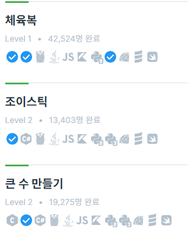
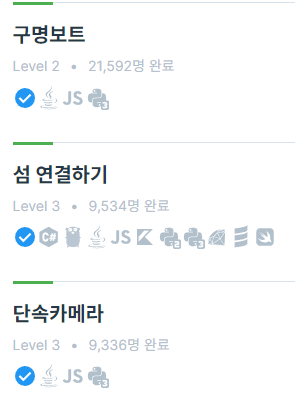
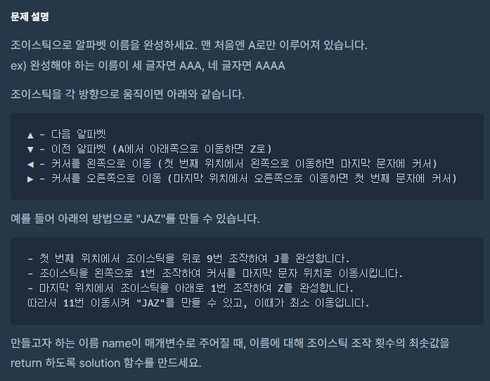
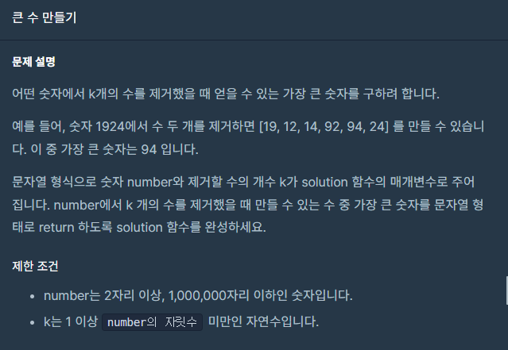
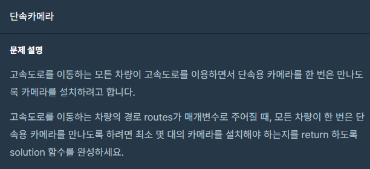

 <br>
이번 포스팅은 Greedy 알고리즘입니다. <br>
미래를 생각하지 않고 현재 가장 최선의 선택을 하다보면 답이 나오는 문제입니다. <br>
모든 문제의 해답이 될 순 없지만 어떤 순간에는 좋은 해결법이 될 수 있습니다. <br>




6문제 중 다뤄볼 문제는 조이스틱, 큰 수 만들기, 단속카메라 입니다.  <br>
섬 연결하기 문제는 단순한 MST문제입니다. Kruskal이나 Prim 중 아무거나 써도 정답이 됩니다. <br>
[이전 최소신장트리 포스팅!!](https://hyeonjunje.github.io/algorithm/MST/) <br>
최소신장트리 포스팅할 때에 Kruskal, prim 알고리즘 코드가 이 문제에 정답입니다. 그래서 이번 포스팅에서 다루진 않겠습니다. <br>

# 조이스틱
 <br>
다음 조작을 할 수 있는 조이스틱을 사용하여 입력으로 받은 문자열을 만들 수 있는 조작 횟수의 최솟값을 반환하면 됩니다.<br>

조작 횟수는 2가지로 나눌 수 있습니다. <br>
1. 알파벳을 변경
2. 위치를 변경

순서대로 봅시다. <br>

1. 알파벳을 변경 <br>
조이스틱을 위 아래로 움직여서 다음 이전 알파벳을 갈 수 있습니다. <br>
그리고 시작 알파벳은 무조건 A입니다. <br>
그럼 모든 알파벳으로 가는 조작 횟수는 다음과 같습니다.
```
A B C D E F G H I J K  L  M  N  O  P  Q  R S T U V W X Y Z
0 1 2 3 4 5 6 7 8 9 10 11 12 13 12 11 10 9 8 7 6 5 4 3 2 1
```
그럼 알파벳 변경은 간단합니다. <br>
JEROEN을 입력이라고 해봅시다. 그럼 제일 처음에는 AAAAAA 입니다. <br>
위의 조작 횟수를 참고하여 구하면 <br>
9(J) + 4(E) + 9(R) + 12(O) + 4(E) + 13(N) = 51 입니다. <br>
<br>

2. 위치를 변경
이 부분이 약간 복잡합니다. 단순히 한 방향으로 가면 오답이 될 수 있기 때문입니다. <br>
만약 문자열 중간의 A로 된 글자(1개 이상)가 있으면 무시할 수 있기에 이럴 경우 모두를 생각해서 최소의 위치 이동값을 구해야 하죠. <br>
따라서 변경할려는 문자열의 모든 A들의 정보를 알아야 합니다. <br>
만약 JEAAAAAROAAAAENAAA 라는 입력이 주어진다면 <br>
```
JE 'AAAAA' RO 'AAAA' EN 'AAA'
로 A뭉치들을 구해서 따로 모아줍니다. 
그리고 각 A뭉치들을 돌면서 이동할 수 있는 경우의 수를 모두 구해서 최솟값을 구하면 됩니다. 
A 5개짜리 뭉치가 선택됐을 때를 봅시다.
JE 'AAAAA' ROAAAAENAAA
그럼 이동할 수 있는 경우의 수는
1번 케이스 : JEAAAAAROAAAAENAAA (그냥 가기)
2번 케이스 : E J AAANEAAAAOR  (A 뭉치를 만날 때까지 오른쪽으로 갔다가 왼쪽으로 가기)
3번 케이스 : AAANEAAAAOR ROAAAAENAAA JE  (A 뭉치를 만날 때까지 왼쪽으로 갔다가 오른쪽으로 가기)
```
이중 2번 선택지가 가장 최솟값입니다. <br>

코드는 다음과 같습니다.
``` c++
#include <iostream>
#include <string>
#include <vector>
#include<utility>

using namespace std;

int alphaOrder[26];
string alphabet = "ABCDEFGHIJKLMNOPQRSTUVWXYZ";

// 알파벳이 들어오면 그 알파벳까지 조작하는 최솟값 반환
int GetOrder(char ch)
{
    for (int j = 0; j < alphabet.size(); j++)
        if (ch == alphabet[j])
            return alphaOrder[j];
}

int solution(string name) {
    int answer = 0;

    for (int i = 0; i <= alphabet.size() / 2; i++)
        alphaOrder[i] = i;
    for (int i = alphabet.size() / 2 + 1; i < alphabet.size(); i++)
        alphaOrder[i] = alphabet.size() - i;

    // A뭉치들을 보관할 vector,  각 A뭉치들의 시작 인덱스, 끝 인덱스 형태로 보관한다.
    vector<pair<int, int>> aVector; 
    bool isStart = false;
    int startIndex, endIndex;

    // A뭉치들을 구해서 aVector에 집어넣기
    for (int i = 1; i < name.size(); i++)
    {
        if (name[i] == 'A')
        {
            if (!isStart)
            {
                isStart = true;
                startIndex = i;
            }
        }
        else if (isStart)
        {
            endIndex = i - 1;
            isStart = false;
            aVector.push_back({ startIndex, endIndex });
        }
    }
    if (isStart)
    {
        aVector.push_back({ startIndex, name.size() - 1 });
    }

    // 1. 알파벳 조작 횟수 최솟값
    for (int i = 0; i < name.size(); i++)
        answer += GetOrder(name[i]);

    // 2. 위치 변경 조작 횟수 최솟값
    int minValue = name.size() - 1;    // 1번 케이스 : 그냥 가기
    for (pair<int, int> p : aVector)
    {
        // 2번 케이스 : A뭉치를 만날 때까지 오른쪽으로 갔다가 왼쪽으로 가기
        int rightAndLeft = (p.first - 1) * 2 + name.size() - p.second - 1;
        // 3번 케이스 : A뭉치를 만날 때까지 왼쪽으로 갔다가 오른쪽으로 가기
        int leftAndRight = (name.size() - p.second -1) * 2 + p.first - 1;

        minValue = min(minValue, min(rightAndLeft, leftAndRight));
    }
    answer += minValue;

    return answer;
}
```

단순 1번의 반복문이 여러번 등장합니다. 시간복잡도는 O(N) 이군요!! <br>


# 큰 수 만들기
 <br>
입력으로 받은 숫자에서 k개의 수를 제거했을 때 이어붙이면 나올 수 있는 가장 큰 숫자를 반환하는 문제입니다. <br>
입력으로 받은 숫자는 최대 1,000,000자리 숫자이므로 숫자로 표현할 수 없습니다. 문자열로 처리해야 합니다. <br>
엄청 큰 수가 되기에 next_permutation을 이용한 순열도 사용할 수 없습니다. (제가 그렇게 했습니다...) <br>

제가 생각한 풀이법은 stack을 활용한 풀이입니다. <br>
알고리즘을 정리하자면 다음과 같습니다. <br>

입력으로 받는 숫자를 number라는 문자열, 뺄 숫자 개수를 k라고 합시다. <br>
1. 스택에 number[0]을 넣고 시작합니다.
2. number를 1번 인덱스부터 끝까지 반복합니다.
3. 만약 해당 인덱스의 숫자가 stack의 top보다 크다면 하나씩 빼면서 k를 하나씩 줄입니다.
   k가 0이 되거나 s.top()이 해당 숫자보다 크면 중단합니다.
4. 3번이 종료되면 해당 숫자를 push합니다.
5. 만약 모든 number를 다 반복했는데 k가 0보다 크다면 0이 될때까지 stack을 pop합니다.
6. 다 끝나면 stack에 있는 숫자들이 가장 큰 숫자가 됩니다. 

4177252841 이라는 number와 4라는 k값을 예로 들어봅시다. <br>
```
각 자리를 돌면서 알고리즘을 적용해봅시다. 
stack     k
4         3
14        3
7         1
77        1
772       1
775       0
7752      0
7758      0
77584     0
775841    0
4개의 숫자를 없애서 775841 이라는 최댓값을 구할 수 있습니다.
```

코드는 다음과 같습니다.
``` c++
#include <string>
#include <stack>
#include<algorithm>

using namespace std;

string solution(string number, int k) {
    string answer = "";

    stack<int> s;
    s.push(number[0] - '0');
    for (int i = 1; i < number.size(); i++)
    {
        int num = number[i] - '0';

        // 이미 k만큼 뺐다면 그냥 추가
        if (k == 0)
        {
            s.push(num);
            continue;
        }

        // 뺄 수 있다면 빼줌
        while (k != 0 && !s.empty() && num > s.top())
        {
            k--;
            s.pop();
        }
        // 해당 숫자 push
        s.push(num);
    }
    // 반복문을 다 돌았는데도 다 못뺐다면 stack의 윗부분에서 부터 빼야하는 만큼 빼주기
    while (k != 0)
    {
        k--;
        s.pop();
    }

    while (!s.empty())
    {
        answer += to_string(s.top());
        s.pop();
    }
    reverse(answer.begin(), answer.end());
    return answer;
}
```

number의 순서를 바꾸는 것이 아니기 때문에 제일 앞의 자리가 가장 큰 수가 되게 하는 것이 중요합니다. <br>
이번 문제도 O(N)이군요. <br><br>

# 단속카메라
 <br>
레벨은 3이지만 앞의 2문제보다 쉬웠다고 생각합니다. <br>

차량의 진입/진출 지점이 담긴 routes이 주어질 때 모든 차량이 단속용 카메라를 만날 수 있도록 설치해야 합니다. <br>
물론 단속용 카메라의 최솟값을 반환하는 문제이죠 <br>
제한사항에서 진입/진출 지점에 설치되어 있어도 카메라를 만난 것으로 간주한다고 합니다. <br>

그럼 단순히 각 차량의 진출 지점이 가장 낮은 곳에 카메라를 설치하면 됩니다. (Greedy) <br>
모든 차량이 다 카메라를 만나야 하기 때문이죠. 그리고 그 지점에 겹치는 차량이 더 있으면 그 차량은 무시합니다. <br>
겹치는 차량이 아닌 차가 처음으로 오면 그 차량의 진출 지점에 다시 카메라를 설치합니다. <br>
이런식으로 모든 차량을 검사하면 됩니다. <br>

입력 예를 봅시다. <br>
[[-20,-15], [-14,-5], [-18,-13], [-5,-3]]	입니다. 말한대로 정렬해봅시다. <br>
[[-20,-15], [-18,-13], [-14,-5], [-5,-3]]	가 됩니다.  <br>

순서대로 봅시다. 
1. [-20, -15] <br>
-15에 단속카메라를 설치합니다. <br>
[-20, -15] 와 [-18, -13]이 포함됩니다. <br>
따라서 다음 확인할 차량은 포함되지 않는 바로 다음 차량인 [-14, -5] 입니다.<br>
2. [-14, -5] <br>
-5에 단속카메라를 설치합니다. <br>
[-14, -5] 와 [-5, -3]이 포함됩니다.<br>
모든 차량을 확인했으니 단속카메라의 최솟값은 2개가 됩니다. <br>


코드는 다음과 같습니다.
``` c++
#include<iostream>
#include <string>
#include <vector>
#include <algorithm>

using namespace std;

bool tmp(vector<int> a, vector<int> b)
{
    return a[1] < b[1];
}

int solution(vector<vector<int>> routes) {
    int answer = 0;

    sort(routes.begin(), routes.end(), tmp);

    int count = 0;
    while (count < routes.size())
    {
        int lastPos = routes[count][1];
        int temp = count;
        for (int i = temp; i < routes.size(); i++)
        {
            if (routes[i][0] <= lastPos && lastPos <= routes[i][1])
                count++;
            else
                break;
        }
        answer++;
    }
    return answer;
}
```

지극히 Greedy했습니다. <br>
이 문제도 각 차량마다 확인하는 것 뿐이니 시간복잡도가 O(N)입니다. <br>

# 느낀 점

조이스틱 문제는 Greedy 생각 안하고 풀었습니다. <br>
당장 최선의 답보다는 모든 경우의 수를 확인하는 풀이였습니다만 푼 사람들도 다 저와 비슷하게 푼 것 같습니다. <br>

그리디 알고리즘은 미래 상관없이 약간 멍청하게 푼다는 느낌인것 같습니다. <br>
그래서 알고리즘을 세우기도 코드를 짜기도 쉽습니다. <br>
따라서 문제를 풀 때 먼저 Greedy알고리즘인지 확인하는 것도 좋은 접근법인 것 같습니다. <br> 