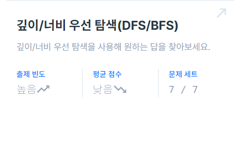
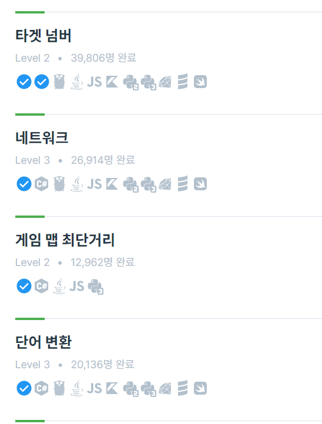
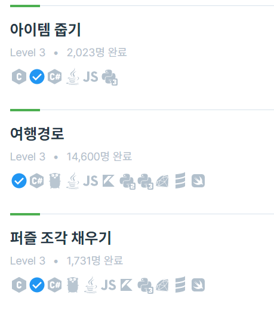
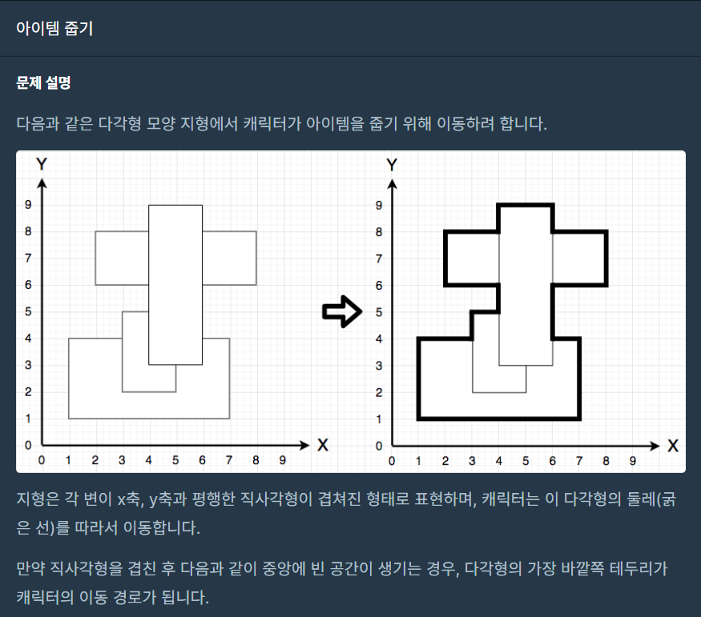
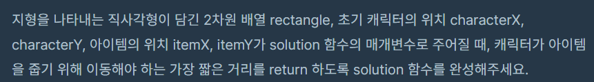
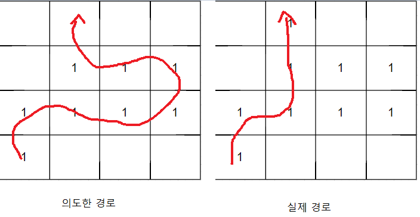
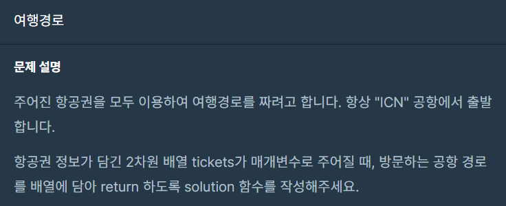
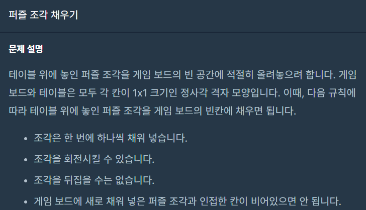
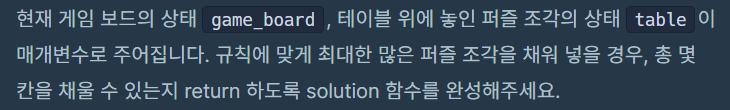
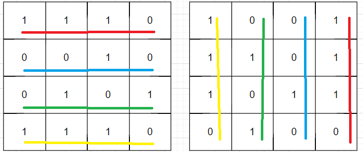

 <br>

오늘 포스팅할 내용은 BFS/DFS 입니다. <br>
두 알고리즘 다 탐색하는 용도이나 깊이를 우선으로 할건지 너비를 우선으로 할건지에 따라 사용합니다. <br>





문제는 총 7문제로 3단계 문제도 많이 끼여있습니다. <br>

앞의 4문제는 기본적인 bfs, dfs문제이고 데이터를 어떻게 그래프로 나타낼것인지를 생각하면 쉽게 풀 수 있는 문제입니다. <br>

따라서 이번에는 아이템 줍기, 여행경로, 퍼즐 조각 채우기 문제만 다루겠습니다. <br>
<br>
<br>

# 아이템 줍기

[https://school.programmers.co.kr/learn/courses/30/lessons/87694](https://school.programmers.co.kr/learn/courses/30/lessons/87694)

 <br>
 <br>

지형데이터가 주어지고 현재 위치에서 아이템 위치까지의 최단거리를 구하는 문제입니다. <br>

최단거리를 구하기 때문에 BFS를 사용하면 될것같은데 지형데이터를 어떻게 나타내면 좋을지가 이 문제의 재밌는점입니다. <br>

다행히 제한사항에서 좌표는 최대 50, 50이므로 50 * 50의 2차원 배열로 BFS하는것이 가장 직관적인 것 같습니다. <br>

여기서 지형데이터를 주는 방식이 직사각형의 시작점과 끝점만 주어진다는 것인데 입력으로 여러 직사각형이 들어오니 겹치는 부분이 있고
그 겹친 최종 도형의 가장자리가 지형이라고 했으니 이걸 표현해주면 되겠죠. <br>

50 * 50 2차원 배열에 갈 수 있는 길(가장자리)는 1로 직사각형에 겹쳐져있어 못가는 곳을 -1로 한번 만들어봅시다. <br>

만드는 방법은 이렇게 생각해봤습니다. <br>
1. 직사각형의 시작점과 끝점을 사용해서 2중 for문을 하여 가장자리는 1, 그 외에는 -1로 설정합니다.
2. 그 다음 직사각형도 똑같은 작업을 하는데 만약 이미 그 자리가 -1이라면 -1 그대로 둡니다.
3. 모든 직사각형에 대해서 위와 같은 방법을 취합니다. 

``` c++
1  1  1  1  1  1  1
1 -1 -1 -1 -1 -1  1
1 -1 -1 -1 -1 -1  1
1  1  1  1  1  1  1

   1  1  1  1  1
   1 -1 -1 -1  1
1  1 -1 -1 -1 -1  1
1 -1 -1 -1 -1 -1  1
1 -1 -1 -1 -1 -1  1
1  1  1  1  1  1  1
```

이런식으로 지형을 만들어가는 것입니다. <br>

하지만 이 경우  <br>
 <br>
다음과 같이 인접해 있는 1이 있으면 지형에 상관없이 지나갈 수 있어 의도한 경로와 다르게 될 수 있습니다. <br>

이러한 문제를 해결하기 위해 1이 최대한 인접해 있지 않도록 모든 좌표를 2배로 확대해줍니다. <br>
그러면 경로는 이어지지 않고 배열상 이어진 곳 사이에는 빈공간(0)으로 채워지기 때문에 BFS를 쉽게 할 수 있습니다. <br>

코드는 다음과 같습니다. <br>
``` c++
#include <string>
#include <vector>
#include <iostream>
#include <algorithm>
#include <queue>

using namespace std;

// 최단 거리, 방향
pair<int, bool> map[102][102];
pair<int, int> dir[4] = { {1, 0}, {0, 1}, {-1, 0}, {0, -1} };

int solution(vector<vector<int>> rectangle, int characterX, int characterY, int itemX, int itemY) {
    int answer = 0;

    // 모든 좌표 2배
    for (int i = 0; i < rectangle.size(); i++)
        for (int j = 0; j < rectangle[i].size(); j++)
            rectangle[i][j] *= 2;

    characterX *= 2;
    characterY *= 2;
    itemX *= 2;
    itemY *= 2;

    // 2차원 배열로 지형데이터 만드는 부분
    for (int i = 0; i < rectangle.size(); i++)
    {
        pair<int, int> startPoint = { rectangle[i][0], rectangle[i][1] };
        pair<int, int> endPoint = { rectangle[i][2], rectangle[i][3] };

        for (int x = startPoint.first; x <= endPoint.first; x++)
        {
            for (int y = startPoint.second; y <= endPoint.second; y++)
            {
                if (map[y][x].first == -1) continue;

                if (x == startPoint.first || x == endPoint.first || y == startPoint.second || y == endPoint.second)
                    map[y][x].first = 1;
                else
                    map[y][x].first = -1;
            }
        }
    }

    // queue를 이용한 BFS
    queue<pair<int, int>> q;
    q.push({ characterX, characterY });
    map[characterY][characterX].second = true;

    while (!q.empty())
    {
        int x = q.front().first;
        int y = q.front().second;
        q.pop();

        if (x == itemX && y == itemY)
        {
            // 좌표를 2배로 해주었기에 최단경로를 2로 나누어준다.
            answer = map[y][x].first / 2;
            break;
        }

        for (int i = 0; i < 4; i++)
        {
            int nextX = x + dir[i].first;
            int nextY = y + dir[i].second;

            // 범위 밖
            if (nextX < 0 || nextY < 0 || nextX > 100 || nextY > 100) continue;

            // 갈 수 없는 곳
            if (map[nextY][nextX].first == 0 || map[nextY][nextX].first == -1) continue;

            // 이미 갔던 곳
            if (map[nextY][nextX].second) continue;


            map[nextY][nextX].first = map[y][x].first + 1;
            map[nextY][nextX].second = true;

            q.push({ nextX, nextY });
        }
    }

    return answer;
}
```

시간복잡도를 보자면 입력인 rectangles의 길이는 최대 4이므로 깔끔하게 무시하면 O(N^2)이 되겠네요. <br>
여기서 좌표의 최댓값이 50이고 저희는 2배를 했으니 100이니까 시간적인 부분은 가뿐히 통과입니다. <br>

<br><br>

# 여행경로
[https://school.programmers.co.kr/learn/courses/30/lessons/43164](https://school.programmers.co.kr/learn/courses/30/lessons/43164)

 <br>

모든 항공권을 다 사용해야 합니다.<br>
그래서 DFS를 돌아 항공권 사용한 순서를 배열에 저장해주고 모든 항공권을 다 사용하면 return 하고 저장할 배열을 보여주면 정답이 되겠네요!! <br>

저희는 이제까지 그래프의 노드를 숫자로만 나타냈는데 이번에는 string인 공항을 취급해야 합니다. <br>
map<string, vector<string>> 을 사용해도 될 듯 하지만 그냥 모든 공항을 숫자로 매핑하는게 훨씬 편해보입니다. <br>
그 편이 나중에 간선을 체크할 때 2차원배열의 형태로 표현할 수 있어 좋습니다. <br>
같은 항공권도 여러 개 있는 케이스도 있으니 int edge[10001][10001] (최대 공항 수 10000개) 를 만들어 edge[출발공항][도착공항] = 항공권 개수 로 표현합시다. <br>


즉 필요한건 <br>
1. vector<string> graph[10001]  // 여행경로 그래프
2. map<string, int> node; // 공항을 정수로 매핑
3. int edge[10001][10001] // 간선 정보
4. vector<string> v  // 정답(모든 항공권을 사용했을 때 공항 순서)

가 됩니다. <br>

문제에서 갈 수 있는 항공권이 여러곳인 경우 알파벳 순서로 가야 하기 때문에 그래프의 모든 정점의 연결된 배열을 정렬해줘야 합니다. <br>


dfs 알고리즘으로 문제를 정리해봅시다. 
1. ICN에서 출발해서 알파벳 순서로 되어있는 갈 수 있는 공항들을 순서대로 확인합니다.
2. 연결된 공항으로 갈 수 있는 항공권이 1개 이상일 경우 공항 순서에 해당 공항을 push하고 해당 항공권(edge)의 값을 1감소한 후 dfs를 진행합니다.
3. dfs를 진행하면 count를 하나씩 올리고 count가 총 항공권에 개수와 같을 시 true를 return합니다.
4. dfs를 진행하다가 더 이상 다른 곳으로 갈 수 없고 count도 총 항공권에 개수와 다를 시 false를 return 합니다. 
5. dfs를 통해 return 받은 값이 false라면 공항 순서에 마지막 공항을 erase하고 해당 항공권을 1 증가시키고 진행합니다.


코드는 다음과 같습니다. <br>
``` c++
#include <string>
#include <vector>
#include <iostream>
#include <algorithm>
#include <queue>
#include <map>

using namespace std;

int edge[10001][10001];
map<string, int> node;
vector<string> graph[10001];
vector<string> v;

bool dfs(int current, int targetCount, int count = 0)
{
    if (targetCount == count)
        return true;

    for (int i = 0; i < graph[current].size(); i++)
    {
        int next = node[graph[current][i]];
        if (edge[current][next] != 0)
        {
            edge[current][next]--;
            v.push_back(graph[current][i]);
            bool flag = dfs(next, targetCount, count + 1);
            if (flag == false)
            {
                edge[current][next]++;
                v.erase(v.end() - 1);
            }
            else
                return true;
        }
    }

    return false;
}

vector<string> solution(vector<vector<string>> tickets) {

    int count = 0;
    for (int i = 0; i < tickets.size(); i++)
    {
        // 공항을 정수로 매핑
        if (node.count(tickets[i][0]) == 0)
            node[tickets[i][0]] = count++;
        if (node.count(tickets[i][1]) == 0)
            node[tickets[i][1]] = count++;

        // 여행경로 그래프 생성
        graph[node[tickets[i][0]]].push_back(tickets[i][1]);
        // 항공권 정보 갱신
        edge[node[tickets[i][0]]][node[tickets[i][1]]]++;
    }

    // 알파벳 순서로 정렬
    for (int i = 0; i < 10001; i++)
        sort(graph[i].begin(), graph[i].end());

    v.push_back("ICN");
    dfs(node["ICN"], tickets.size());

    return v;
}
```

인접리스트로 그래프를 구현하였기에 시간복잡도는 O(V + E)입니다. <br>
조금 복잡한 기본적인 dfs문제였던것 같네요.. <br>

# 퍼즐 조각 채우기
[https://school.programmers.co.kr/learn/courses/30/lessons/84021](https://school.programmers.co.kr/learn/courses/30/lessons/84021)

 <br>
 <br>

퍼즐을 최대한 맞춰야 하는데 퍼즐을 돌릴 수도 있습니다.(실제론 당연한 소리지만..) <br>

이건 꼼짝없이 2차원배열인 인접행렬로 생각해봐야 합니다. <br>
퍼즐의 모양은 dfs로 좌표의 배열로 구할 수 있죠. <br>


단순하게 생각해서 알고리즘은 다음과 같이 짜봤습니다.
1. game_board에 dfs를 돌려 비어있는 조각들을 모두 구합니다.
2. table에 dfs를 돌려 조각들을 모두 구합니다.
3. 만약 비어있는 조각들을 채울 수 있는 조각이 있으면 채우고 조각배열과 비어있는 조각 배열에 해당 부분을 없앱니다.
4. table전체를 90도 돌려서 2~3번을 반복합니다.
5. 돌려서 제자리로 돌아올 때까지 4번을 실행합니다.


우선 판을 돌리는 부분부터 생각해봅시다. <br>
이는 규칙을 찾으면 쉽게 구할 수 있습니다. <br>

 <br>
왼쪽 판을 90도 돌리면 오른쪽의 판이 될것입니다. <br>
색깔로 표현하면 규칙이 보일 것입니다. <br>

이를 코드로 나타내면
``` c++
vector<vector<int>> rotation(vector<vector<int>> &table)
{
    vector<vector<int>> result(table.size(), vector<int>(table.size()));

    for (int i = 0; i < table.size(); i++)
        for (int j = 0; j < table.size(); j++)
            result[j][table.size() - 1 - i] = table[i][j];

    table = result;
    return table;
}
```

가 됩니다. <br>


dfs로 조각들을 구하는 것은 쉽습니다. <br>
인접행렬 하나하나 돌면서 조각이 시작되는 곳이고 이미 확인하지 않은 곳이라면 dfs를 수행하고 결과를 좌표의 배열로 저장합니다. <br>

정리하면
1. vector<vector<pair<int, int>>> empty;  // 비어있는 조각들이 모여 있는 배열
2. vector<vector<pair<int, int>>> block;  // 조각들이 모여 있는 배열

이제 이 배열들을 하나하나 확인해보면서 맞출 수 있으면 맞춰줍니다. <br>
좌표로 조각들을 구했으니 모양이 같아도 좌표는 다를 수 있습니다. <br>
일단 비어있는 조각과 조각의 첫 좌표의 차를 구해서 다른 좌표들의 차도 처음의 차와 같으면 같은 모양임을 알 수 있죠. <br>


모든 알고리즘을 정리했으니 남은 일을 코드로 옮기는 일입니다. <br>
솔직히 코드 엄청 더럽습니다. <br>
``` c++
#include <string>
#include <vector>
#include <iostream>
#include <algorithm>
#include <stack>

using namespace std;

pair<int, int> dir[4] = { {1, 0}, {0, 1}, {-1, 0}, {0, -1} };
vector<pair<int, int>> piece;
vector<vector<int>> check;

// 90도 회전 함수
vector<vector<int>> rotation(vector<vector<int>> &table)
{
    vector<vector<int>> result(table.size(), vector<int>(table.size()));

    for (int i = 0; i < table.size(); i++)
        for (int j = 0; j < table.size(); j++)
            result[j][table.size() - 1 - i] = table[i][j];

    table = result;
    return table;
}

// 조각좌표 구하는 dfs
void dfs(vector<vector<int>>& game_board, int x, int y, int value, int nonValue)
{
    stack<pair<int, int>> s;
    s.push({ x, y });
    check[y][x] = nonValue;
    piece.push_back({ x, y });

    while (!s.empty())
    {
        int currentX = s.top().first;
        int currentY = s.top().second;
        s.pop();

        for (int i = 0; i < 4; i++)
        {
            int nextX = currentX + dir[i].first;
            int nextY = currentY + dir[i].second;

            if (nextX < 0 || nextY < 0 || nextX >= game_board.size() || nextY >= game_board.size()) continue;
            if (check[nextY][nextX] == nonValue) continue;

            s.push({ nextX, nextY });
            piece.push_back({ nextX, nextY });
            check[nextY][nextX] = nonValue;
        }
    }
}

// dfs를 사용해서 비어있는 조각과 조각의 배열을 구하고 각 배열의 조각들을 match하는 함수
int match(vector<vector<int>> &game_board, vector<vector<int>> &table)
{
    int answer = 0;

    vector<vector<pair<int, int>>> empty;
    check = game_board;
    for (int i = 0; i < game_board.size(); i++)
    {
        for (int j = 0; j < game_board.size(); j++)
        {
            if (check[i][j] == 0)
            {
                piece.clear();
                dfs(game_board, j, i, 0, 1);
                empty.push_back(piece);
            }
        }
    }

    vector<vector<pair<int, int>>> block;
    check = table;
    for (int i = 0; i < table.size(); i++)
    {
        for (int j = 0; j < table.size(); j++)
        {
            if (check[i][j] == 1)
            {
                piece.clear();
                dfs(table, j, i, 1, 0);
                block.push_back(piece);
            }
        }
    }


    // 이미 맞춰진 조각이라면 기록하고 다음에 다시 나오면 무시
    vector<int> blockCheck(block.size());
    for (int i = 0; i < empty.size(); i++)
    {
        bool isMatch = true;
        for (int j = 0; j < block.size(); j++)
        {
            isMatch = true;
            if (blockCheck[j]) { isMatch = false; continue; }

            if (empty[i].size() == block[j].size())
            {
                int diffX = 0, diffY = 0;
                for (int h = 0; h < empty[i].size(); h++)
                {
                    if (h == 0)
                    {
                        diffX = empty[i][h].first - block[j][h].first;
                        diffY = empty[i][h].second - block[j][h].second;
                    }
                    else
                    {
                        if (diffX != empty[i][h].first - block[j][h].first || diffY != empty[i][h].second - block[j][h].second)
                        {
                            isMatch = false;
                            break;
                        }
                    }
                }
            }
            else
            {
                isMatch = false;
            }

            if (isMatch)
            {
                blockCheck[j] = true;
                for (int hh = 0; hh < block[j].size(); hh++)
                {
                    int x = block[j][hh].first;
                    int y = block[j][hh].second;
                    table[y][x] = 0;
                }
                break;
            }
        }

        if (isMatch)
        {
            for (int hhh = 0; hhh < empty[i].size(); hhh++)
            {
                int x = empty[i][hhh].first;
                int y = empty[i][hhh].second;
                game_board[y][x] = 1;
                answer++;
            }
        }
    }

    return answer;
}

int solution(vector<vector<int>> game_board, vector<vector<int>> table) {
    int answer = 0;

    for (int i = 0; i < 4; i++)
    {
        answer += match(game_board, table);
        rotation(table);
    }

    return answer;
}
```

모든 좌표마다 dfs를 수행하니 O(N^2 * V^2) 일겁니다... <br>
그래도 입력의 크기가 작기 때문에 충분히 소화할 수 있습니다. <br>

<br><br>

# 느낀 점

7문제를 풀어본 결과 해결방법은 거의 다 똑같았습니다. <br>
다만 그래프를 표현하는 방식에서 난이도를 가르는 거라 생각합니다. <br>
dfs, bfs문제는 구현문제에 많이 나옵니다. 특히 이번 퍼즐 조각 맞추기 같은 구현 문제가 코테에 종종 나옵니다. <br>
dfs, bfs 알고리즘은 여러 곳에 쓰일 수 있기에 이 알고리즘을 아무 생각 없이 구현할 정도로 많이 연습하시면 도움이 되실겁니다. <br>
아무튼 3단계문제를 혼자힘으로 풀 수 있어 기뻤습니다. <br>