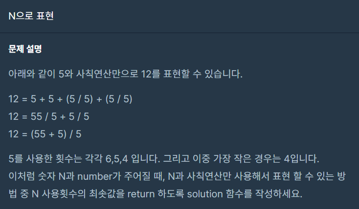
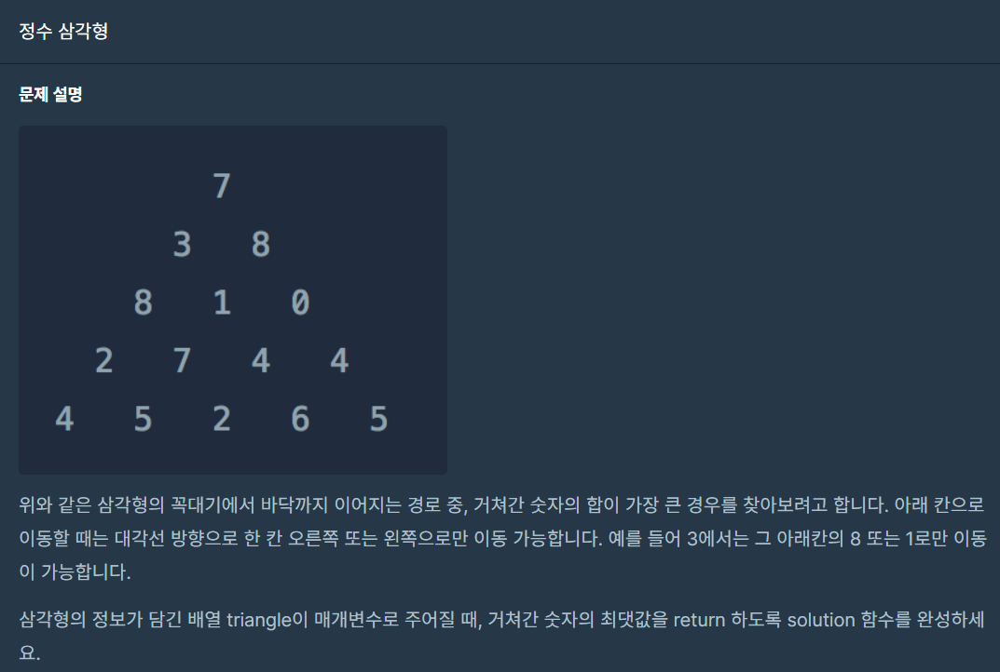
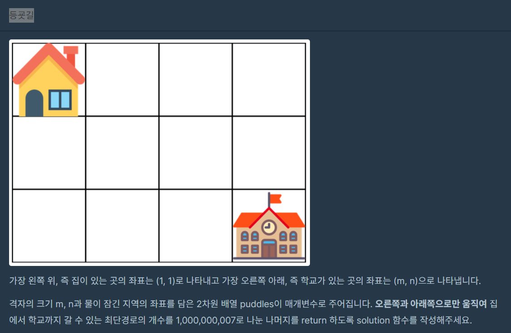

오늘 포스팅할 내용은 동적계획법(Dynamic Programming) 입니다. <br>

동적계획법은 불필요한 계산을 줄일 수 있어 잘 쓴다면 좋지만 어렵습니다... <br>


난이도가 무려 3단계 3문제, 4단계 2문제로 총 5문제입니다. <br>

난이도가 난이도인지라 이번에는 5문제 전부 포스팅해보겠습니다. 

그래도 한번에 올리진 않고 나눠서 올려야 할것같네요. <br>

이 포스팅에는 레벨3 3문제만 보겠습니다.

<br>
<br>

# N으로 표현
[https://school.programmers.co.kr/learn/courses/30/lessons/42895](https://school.programmers.co.kr/learn/courses/30/lessons/42895)

 <br>

한 자리 숫자와 사칙연산만으로 목표로 하는 숫자를 만드는데 가장 숫자를 적게 사용하여 만들어야 하는 문제입니다. <br>
예시에는 덧셈과 나눗셈, 이어붙이기만 있는데 사칙연산이기에 뺄셈과 곱셈도 생각해줘야 합니다. <br>

제한조건으로 최솟값이 8보다 크면 -1을 return하기에 숫자를 최대 8번 사용할 수 있습니다. <br>

dfs로 무식하게 모든 경우의 수를 확인하며 풀어도 답은 됩니다.(제가 해봤어요...) <br>
하지만 시간이 오래 걸리고 제한조건이 조금만 더 빡빡했다면 오답처리가 됐을겁니다. <br>
따라서 좀 더 제대로 풀기 위해서는 dp를 활용하는게 좋습니다. <br>

우선 숫자 하나로 표현할 수 있는 숫자는 자기자신밖에 없습니다. <br>

그리고 숫자 2개로 표현할 수 있는 숫자는
1. 숫자하나 * 10 + 숫자하나
2. 숫자하나 + 숫자하나
3. 숫자하나 - 숫자하나
4. 숫자하나 * 숫자하나
5. 숫자하나 / 숫자하나 
총 5가지입니다. <br>

3개로 표현할 수 있는 숫자는 숫자 2개로 표현할 수 있는 숫자와 숫자 1개로 표현할 수 있는 숫자의 조합이겠죠. <br>
여기서 중요한건 +, *는 두 피연산자의 순서를 바꿔도 똑같은 결과이지만 -, /는 바꾸면 다른 결과가 나옵니다. <br>
따라서 3개로 표현할 수 있는 숫자는
1. 숫자 2개로 표현할 수 있는 숫자, 숫자 1개로 표현할 수 있는 숫자의 조합
2. 숫자 1개로 표현할 수 있는 숫자, 숫자 2개로 표현할 수 있는 숫자의 조합
입니다. <br>

그럼 일반화를 해봅시다. <br>
n개로 표현할 수 있는 숫자는 <br>
(n - 1, 1)  (n - 2, 2) ... (n - k, k) ... (2, n - 2), (1, n - 1) <br>
입니다. <br>
 
조합으로 나온 결과가 중복된 값이 나올 수 있으니 Set 자료구조를 사용합시다. <br>
그리고 최대 8개의 숫자로 표현할 수 있는 값을 넣어둘 크기가 9짜리 배열을 사용합시다. (0번째는 비워둠..) <br>

그럼 코드는 다음과 같습니다. <br>
``` c++
#include <string>
#include <vector>
#include<iostream>
#include<set>

using namespace std;

set<int> dp[9];

int solution(int N, int number) {
    int answer = -1;

    int num = 0;
    for (int i = 1; i <= 8; i++)
    {
        num = num * 10 + N;
        dp[i].insert(num);
        for (int j = 1; j < i; j++)
        {
            for (auto iter = dp[j].begin(); iter != dp[j].end(); iter++)
            {
                for (auto innerIter = dp[i - j].begin(); innerIter != dp[i - j].end(); innerIter++)
                {
                    dp[i].insert(*iter + *innerIter);
                    dp[i].insert(*iter - *innerIter);
                    dp[i].insert(*iter * *innerIter);
                    if(*innerIter != 0)
                        dp[i].insert(*iter / *innerIter);
                }
            }
        }

        for (auto iter = dp[i].begin(); iter != dp[i].end(); iter++)
            if (*iter == number)
                return i;
    }
    return answer;
}
```

dfs로 풀었던 코드의 결과가 없어져서 정확한 비교는 못하지만 기억상으로 비교하자면 어떤 케이스는 1000배 시간차이가 나기도 하는군요... <br>
동적계획법 만만세입니다. <br>

시간복잡도의 경우에는 8번 반복이 전제이기 때문에 O(1)이라고 생각합니다. <br>
하지만 제한조건이 걸려있지 않았다면 한번 진행할 때마다 기하급수적으로 늘어나기 때문에 와우우우... <br>
계산하기가 쉽지 않네요... <br>
<br><br>

# 정수 삼각형
[https://school.programmers.co.kr/learn/courses/30/lessons/43105?language=cpp](https://school.programmers.co.kr/learn/courses/30/lessons/43105?language=cpp)



동적계획법 문제치고는 쉬운 편입니다. <br>

삼각형 제일 위에서 제일 밑으로 내려오면서 거쳐간 숫자의 합이 가장 큰 경우를 찾으면 되는 문제입니다. <br>

2차원 배열을 만들어 삼각형을 내려올 때마다 어떤 값을 더해야 더 큰지 판단하고 더한 값을 저장하면서 내려와 가장 밑에 숫자들 중 최댓값을 찾아 반환하면 됩니다. <br>

이동할 때는 대각선 방향으로 한 칸씩만 이동할 수 있습니다. <br>

삼각형의 특성상 각 단계에서 제일 오른쪽과 왼쪽은 그대로 내려오는 수밖에 없습니다. <br>

그리고 사이의 값들은 오른쪽 대각선, 왼쪽 대각선 중 큰값을 더해서 저장해야 합니다. <br>

따로 뭐 설명할게 없네요... <br>
코드로 확인합시다!! <br>

``` c++
#include<iostream>
#include <string>
#include <vector>

using namespace std;

int solution(vector<vector<int>> triangle) {
    int answer = 0;

    // dp 생성
    vector<vector<int>> dp(triangle.size());

    // dp 초기화
    for (int i = 0; i < triangle.size(); i++)
    {
        dp[i] = vector<int>(triangle[i].size());
    }

    // 맨 위의 최댓값은 삼각형의 최댓값
    dp[0][0] = triangle[0][0];

    for (int i = 1; i < triangle.size(); i++)
    {
        // 제일 오른쪽과 왼쪽은 그대로 내려오는 수밖에 없음
        dp[i][0] = triangle[i][0] + dp[i - 1][0];
        dp[i][triangle[i].size() - 1] = triangle[i][triangle[i].size() - 1] + dp[i - 1][triangle[i - 1].size() - 1];

        // 사이에 있는 곳들은 오른쪽 대각선과 왼쪽 대각선의 값중 큰 값과 더해서 저장됨
        for (int j = 1; j < triangle[i].size() - 1; j++)
        {
            dp[i][j] = max(triangle[i][j] + dp[i - 1][j - 1], triangle[i][j] + dp[i - 1][j]);
        }
    }

    // 맨 밑에 값들 중 최댓값이 정답!
    for (int i = 0; i < dp[dp.size() - 1].size(); i++)
        answer = max(answer, dp[dp.size() - 1][i]);

    return answer;
}
```

3단계치고는 쉬운 문제였습니다. <br>
모든 경로를 확인하는 것이 아닌 dp를 활용하여 기존의 경로의 값을 사용하기 때문에 시간복잡도는 O(N^2)으로 풀 수 있었습니다. <br>


# 등굣길
[https://school.programmers.co.kr/learn/courses/30/lessons/42898?language=cpp](https://school.programmers.co.kr/learn/courses/30/lessons/42898?language=cpp)

 <br>


오른쪽과 아래쪽으로만 움직여 집에서 학교가 있는 곳까지 최단경로의 개수를 구하는 문제입니다. <br>
다만 물에 잠긴 지역은 이동할 수 없어 이 부분을 생각해줘야 합니다. <br>
또 경우의 수가 많기 때문에 1,000,000,007로 나눈 나머지를 return해야 합니다. <br>

집의 좌표는 (1, 1)이고 학교의 좌표는 (m, n)입니다. <br>
그리고 오른쪽과 아래쪽으로만 이동할 수 있기에 물웅덩이만 피하면 어떤 경로든 최단경로가 될 수 밖에 없습니다. <br>

2차원 배열을 이용해 해당 좌표로 가는 최단경로의 개수를 dp로 삼고 계속 진행하여 (m, n)좌표에 도달했을 때 계산된 값을 return하면 되겠죠. <br>
계산하는 방법은 단순합니다. <br>
해당좌표의 최단경로 개수는 해당좌표 위쪽의 최단경로 개수 + 해당죄표 왼쪽의 최단경로 개수 입니다. <br>
일반화해보면 <br>
dp[i][j] = dp[i - 1][j] + dp[i][j - 1] 입니다. <br>

물웅덩이의 dp값은 당연히 0으로 해줘야 합니다. <br>

코드는 다음과 같습니다. <br>
``` c++
#include <string>
#include<iostream>
#include <vector>

#define MOD 1000000007

using namespace std;

int solution(int m, int n, vector<vector<int>> puddles) {
    int answer = 0;
    vector<vector<int>> dp(m + 1, vector<int>(n + 1, 0));

    // 물웅덩이 좌표 초기화
    for (auto p : puddles) dp[p[0]][p[1]] = -1;

    // 시작점 초기화
    dp[1][1] = 1;

    // 좌표를 돌면서 계산해줌
    for (int i = 1; i <= m; i++) {
        for (int j = 1; j <= n; j++) {
            if (dp[i][j] == -1) dp[i][j] = 0;   // 물웅덩이라면 0으로 해줌
            else dp[i][j] += (dp[i - 1][j] + dp[i][j - 1]) % MOD;  // 위 좌표, 오른쪽 좌표의 dp값을 더해주고 나누라고 한 값으로 나눈 나머지를 넣어준다.
        }
    }

    return answer = dp[m][n];
}
```

이 문제도 레벨3 치고는 쉬웠습니다. <br>
시간복잡도는 좌표를 도는 부분이 있어 O(MN)이 되겠습니다. <br>


# 느낀 점

동적계획법은 어려우면 진짜 어렵게 낼 수 있습니다. 이 정도 문제라 다행이였습니다. <br>
동적계획법의 어려운 점은 어떤걸 dp로 만들것인가?  점화식의 형태는 어떤식인가를 생각해야하기 때문에 어렵습니다. <br>
물론 동적계획법 문제를 많이 풀다보면 쉬운 문제는 단번에 이런 점화식 형태를 쓰면 되겠다 생각이 난답니다. <br>
즉 동젹계획법 역시 잘 풀려면 많은 문제를 풀어야 합니다.... <br>
다음 포스팅은 이번에 다루지 않았던 레벨4 2문제를 다뤄보겠습니다. <br>
