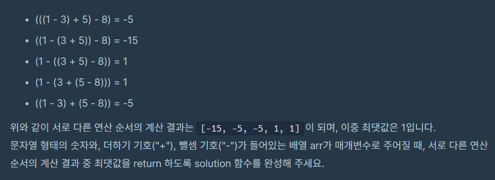
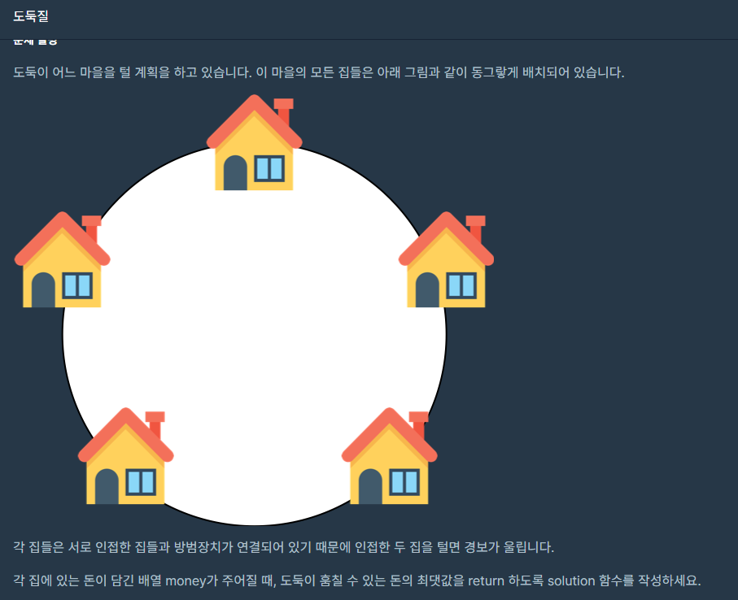

 <br>
오늘은 지난 포스팅에 이어 동적계획법 part.2 입니다. <br>

지난번에 빼먹은 레벨4 2문제를 다뤄보겠습니다. <br>

# 사칙연산
[https://school.programmers.co.kr/learn/courses/30/lessons/1843](https://school.programmers.co.kr/learn/courses/30/lessons/1843)

 <br>

숫자와 연산자를 string의 배열로 주어서 연산 순서에 따라 뺄셈의 결합법칙으로 인해 값이 다르게 나올 수 있는데 여러 결과 중 가장 큰 값을 return하는 문제입니다. <br>

문제는 사칙연산이지만 더하기 빼기만 있습니다. <br>
정말 다행입니다...<br>

그럼 차근차근 해결해봅시다. <br>

일단 한번에 처음부터 끝까지 계산할 때 최댓값을 구하는건 불가능하기에 수식을 쪼개봅시다. <br>

문제의 예시인 입력값입니다. ["1", "-", "3", "+", "5", "-", "8"]  <br>

숫자 하나만 있을 땐 최댓값은 얼마일까요? 당연히 자기자신입니다. <br>
1, 3, 5, 8 이죠 <br>

그러면 숫자 2개면 최댓값은 얼마일까요? 당연히 2개를 계산한 값입니다. <br>
-2, 8, -3 이죠 <br>


숫자 3개라면 어떨까요? <br>
1. 숫자 2개를 계산한 최댓값과 숫자 1개를 계산한 최댓값
2. 숫자 1개를 계산한 최댓값과 숫자 2개를 계산한 최댓값
이 두 경우중에 최댓값이 숫자 3개일 때 최댓값이 되겠죠.. <br>

숫자 4개라면?
1. 1개, 3개 계산한 최댓값
2. 2개, 2개 계산한 최댓값
3. 3개, 1개 계산한 최댓값
이 됩니다. <br>

다시 예시로 가봅시다. <br>
1-3+5-8  입니다. <br>
이 식은 다음과 같이 나눌 수 있습니다. <br>
1. (1) - (3 + 5- 8)
2. (1 - 3) + (5 - 8)
3. (1 - 3 + 5) - (8)

2번 케이스를 봅시다. 2번 케이스의 최댓값을 구하기 위해서는 (1 - 3) 부분의 최댓값과 (5 - 8)의 최댓값을 더하면 되죠. <br>
그리고 숫자 2개만 있는 최댓값은 그냥 계산하면 나오죠. <br>

그럼 1번케이스를 봅시다. 2번과 달리 식을 나누었을 때 사이의 연산자가 - 입니다. 이 식에서 최댓값을 구하기 위해서는
(1)의 최댓값과 (3 + 5 - 8)의 최솟값을 빼주면 최댓값이 될것입니다. <br>

결국 최댓값을 구하기 위해 최솟값의 dp도 구해줘야 합니다. 하지만 최댓값 dp를 구한 것과 유사하기에 다행입니다. <br>

정리하자면 각 구간마다 최댓값, 최솟값을 가지는 dp가 필요합니다. <br>
int maxDp[i][j] : i 부터 j 까지의 최댓값
int minDp[i][j] : i 부터 j 까지의 최솟값
이라고 정의합시다. <br>

점화식을 적어보면 이렇게 나타낼 수 있겠네요.. <br>

만약 더하기라면 <br>
maxDp[i][j] = max(maxDp[i][j], maxDp[i][k] + maxDp[k + 1][j]) <br>
minDp[i][j] = min(minDp[i][j], minDp[i][k] + minDp[k + 1][j]) <br>


만약 빼기라면 <br>
maxDp[i][j] = max(maxDp[i][j], maxDp[i][k] - minDp[k + 1][j]) <br>
minDp[i][j] = min(minDp[i][j], minDp[i][k] - maxDp[k + 1][j]) <br>


물론 maxDp는 -무한대, minDp는 무한대로 설정해줘야 합니다. <br>

코드는 다음과 같습니다. <br>
``` c++
#include <vector>
#include <string>
#include <iostream>
#include <limits.h>

#define MAX 102

using namespace std;

int maxDp[MAX][MAX];
int minDp[MAX][MAX];


int solution(vector<string> arr)
{
    int answer = -1;

    int numberCount = arr.size() / 2 + 1;

    for (int i = 0; i < numberCount; i++)
    {
        for (int j = 0; j < numberCount; j++)
        {
            maxDp[i][j] = -INT32_MAX;
            minDp[i][j] = INT32_MAX;
        }
    }
    
    vector<int> numbers;
    vector<string> opers;

    // 숫자만 넣어서 보관
    for (int i = 0; i < arr.size(); i += 2)
    {
        numbers.push_back(stoi(arr[i]));
    }

    // 연산자만 넣어서 보관
    for (int i = 1; i < arr.size(); i += 2)
    {
        opers.push_back(arr[i]);
    }

    // step : i와 j의 간격,   하나씩 step을 올려줘서 전체 구간의 최댓값을 구한다.
    for (int step = 0; step < numbers.size(); step++)
    {
        for (int i = 0; i < numbers.size() - step; i++)
        {
            int j = i + step;

            // 간격이 0이라면 최대, 최솟값은 자기자신 
            if (step == 0)
            {
                maxDp[i][i] = numbers[i];
                minDp[i][i] = numbers[i];
            }
            else
            {
                for (int k = i; k < j; k++)
                {
                    if (opers[k] == "+")
                    {
                        maxDp[i][j] = max(maxDp[i][j], maxDp[i][k] + maxDp[k + 1][j]);
                        minDp[i][j] = min(minDp[i][j], minDp[i][k] + minDp[k + 1][j]);
                    }
                    else if (opers[k] == "-")
                    {
                        maxDp[i][j] = max(maxDp[i][j], maxDp[i][k] - minDp[k + 1][j]);
                        minDp[i][j] = min(minDp[i][j], minDp[i][k] - maxDp[k + 1][j]);
                    }
                }
            }
        }
    }

    answer = maxDp[0][numbers.size() - 1];

    return answer;
}
```

사실 처음 풀 때는 너무 어려워서 계속 고민하다가 결국 해설을 약간 봤습니다. <br>
dp를 뭘로 할지, minDp의 존재 등등 좋은 풀이를 배울 수 있었습니다. <br>
시간복잡도는 O(N^3) 인 것 같습니다. <br>


# 도둑질
[https://school.programmers.co.kr/learn/courses/30/lessons/42897](https://school.programmers.co.kr/learn/courses/30/lessons/42897)

 <br>

집들이 원형으로 되어 있고 도둑은 인접한 두 집을 털면 안되는 상태에서 훔칠 수 있는 돈의 최댓값을 구하는 문제입니다. <br>

입력으로 각 집에서 훔칠 수 있는 돈의 배열을 주는데 맨 끝과 맨 처음의 값은 이어져있다고 생각하고 문제를 풀어야 합니다. <br>

처음과 끝이 이어지지 않았더라면 어떻게 풀 수 있을까요?? <br>
dp[i]를 처음 집부터 i번째 집까지 턴 돈의 최댓값이라고 생각해봅시다. 그러면 <br>
dp[i] = max(dp[i - 1], dp[i - 2] + money[i])가 될것입니다.  <br>

이런식으로 진행하여 dp[마지막 집] 까지 갔다고 하면 제일 처음 집이 포함되어있는지 안되어있는지 모릅니다. <br>
따라서 방식은 위에 말한 방식과 동일하게 진행하되 <br>

1번째 집을 포함할 수 있는 경우에서 dp[마지막 - 1]의 값과 <br>
1번째 집을 포함할 수 없는 경우의 dp[마지막] 값을 비교하여 더 큰 값을 반환하면 됩니다. <br>
따라서 이 문제도 2개의 dp로 나눌 수 있지만 저는 그냥 2차원배열로 하기로 했습니다. <br>

dp[0][i] = 첫번째 집을 포함할 수 있을 때 i까지 털었을 때 훔칠 수 있는 돈의 최댓값 <br>
dp[1][i] = 첫번째 집을 포함할 수 없을 때 i까지 털었을 때 훔칠 수 있는 돈의 최댓값 <br>
으로 dp를 정의내립시다. <br>

그럼 점화식은 다음과 같습니다. <br>

dp[0][i] = max(dp[0][i - 1], dp[0][i - 2] + money[i]); <br>
dp[1][i] = max(dp[1][i - 1], dp[1][i - 2] + money[i]); <br>


코드는 다음과 같습니다. <br>
``` c++
#include <string>
#include <vector>
#include <iostream>
#include <algorithm>

using namespace std;

// 처음이 포함됐을 때, 포함 안 됐을 때
int dp[2][1000002];

int solution(vector<int> money) {
    int answer = 0;

    // 첫번째 집을 포함할 때 첫번째 집까지 털 수 있는 최대 돈은 당연히 처음 집의 돈
    dp[0][1] = money[0];

    // 첫번째 집을 포함하지 않을 때 첫번째 집까지 털 수 있는 최대 돈은 0,
    // 첫번째 집을 포함하지 않을 때 두번째 집까지 털 수 있는 최대 돈은 두번째 집의 돈
    // 첫번째 집을 포함하지 않을 때 세번째 집까지 털 수 있는 최대 돈은 max(두번째 집의 돈, 세번째 집의 돈)
    dp[1][2] = money[1];
    dp[1][3] = max(money[1], money[2]);

    for (int i = 2; i <= money.size(); i++)
    {
        dp[0][i] = max(dp[0][i - 1], dp[0][i - 2] + money[i - 1]);
    }

    for (int i = 4; i <= money.size(); i++)
    {
        dp[1][i] = max(dp[1][i - 1], dp[1][i - 2] + money[i - 1]);
    }

    answer = max(dp[0][money.size() - 1], dp[1][money.size()]);

    return answer;
}
```

이건 제 스스로 풀었습니다!! <br>
시간복잡도는 O(N)이 되겠습니다!! <br>

<br>


# 느낀 점

레벨4 문제라고 너무 쫄아있었습니다. <br>
물론 레벨4짜리 구현관련 문제라면 손도 못쓰겠지만 말이죠... <br>
사실 두번째 문제는 백준에서 어디선가 풀어본 기억이 있어서 쉽게 풀 수 있었습니다. <br>
역시 많이 풀어봐야 잘 풀 수 있겠네요!! <br>
