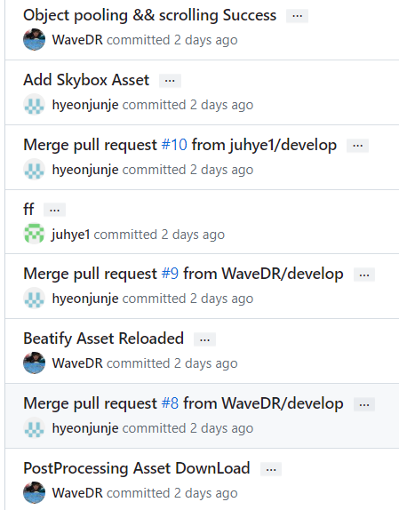
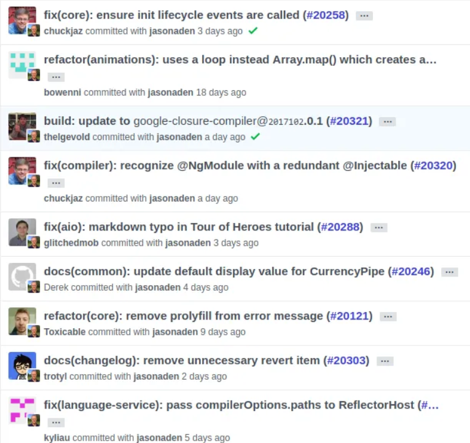

요즘 Github으로 협업을 하는데 커밋 메시지를 어떻게 적어야 할지를 모르겠습니다. <br>
 <br>
[처음 협업하는 사람들의 커밋메시지...]

이렇게 커밋메시지를 작성하다간 나중에 history를 보고 아무것도 이해하지 못할 것 같습니다... <br>
따라서 이번 포스팅은 제대로 협업을 하기 전에 커밋 메시지를 작성하는 법을 다뤄볼까 합니다. <br>

<br><br>


# 좋은 Git 커밋 메시지의 7가지 규칙

+ 제목과 본문을 빈 행으로 구분
+ 제목은 영문 기준 50글자 이하 (한글은 약 30글자 이하)
+ 첫 글자는 대문자로 작성
+ 제목 끝에 마침표 X
+ 제목은 명령문으로 사용, 과거형 X
+ 본문의 각 행은 영문 기준 72글자 이하
+ 어떻게 보다는 무엇과 왜


# 커밋 메시지 구조

``` c#
type: Subject
body
footer
```

## Subject
+ 첫 글자는 대문자로 입력한다. (영어기준)
+ 마지막에는 .(period)을 찍지 않으며 영문 기준 최대 50자를 넘지 않는다. (한글은 30자가 적당)
+ 제목은 명령문의 형태로 작성한다. (동사원형 사용) (영어기준)

## body
+ 각 줄은 최대 72자를 넘지 않도록 한다.
+ 어떻게 변경했는지보다, 무엇을 변경했고, 왜 변경했는지를 설명한다.

## footer
+ 선택사항이며, 관련된 이슈를 언급한다. 예) Fixes: #1, #2
+ 주로 Closes(종료), Fixes(수정), Resolves(해결), Ref(참고), Related to(관련) 키워드를 사용한다.


## 타입

+ feat : 새로운 기능 추가
+ fix : 버그 수정
+ docs : 문서 수정
+ style : 코드 formatting, 세미콜론(;) 누락, 코드 변경이 없는 경우
+ refactor : 코드 리팩터링
+ test : 테스트 코드, 리팩터링 테스트 코드 추가(프로덕션 코드 변경 X)
+ chore : 빌드 업무 수정, 패키지 매니저 수정 (프로덕션 코드 변경 X)
+ design : CSS 등 사용자 UI 디자인 변경
+ build : 관련 변경 사항 빌드
+ ci : CI관련 변경 사항
+ perf : 성능을 향상시키는 코드 변경
+ comment : 필요한 주석 추가 및 변경
+ revert : 되돌리기
+ rename : 파일 혹은 폴더명을 수정하거나 옮기는 작업만인 경우
+ remove : 파일을 삭제하는 작업만 수행하는 경우
+ !BREAKING CHANGE : 커다란 API 변경의 경우
+ !HOTFIX : 급하게 치명적인 버그를 고쳐야 하는 경우

[커밋 메시지 영문 예시] <br>
 <br>
출처 : [https://medium.com/@yuiltripathee/writing-git-commits-that-everybody-understands-especially-your-team-1f3f278daa6a](https://medium.com/@yuiltripathee/writing-git-commits-that-everybody-understands-especially-your-team-1f3f278daa6a)

<br><br>

## 예시
[refactor] : Refactor SubSystem X for readability  (영어 예시)  <br>
[refactor] : 가독성을 위해 서브시스템 X 리팩토링 (한글 예시)

<br><br>

# 느낀점

깃허브 커밋메시지를 찾아봐도 영문이 대부분이였습니다. 하지만 커밋메시지는 알아보기 쉬운 것이 제일 중요하다 생각합니다. <br>
선생님, 조교님들도 한글 상관없다고 하니 굳이 영어를 쓸 필요는 없을 것 같습니다. <br>

저는 개인적으로 제목에 . 을 붙이지 않고, 서술형으로 쓰지 않고, 맨 처음에 type을 명시해주는 것이 좋을 것 같습니다. <br>
이해를 위한 작업이니 각 팀, 회사에서 적절한 형식을 정하는 것도 좋은 방안인 것 같습니다. <br>
