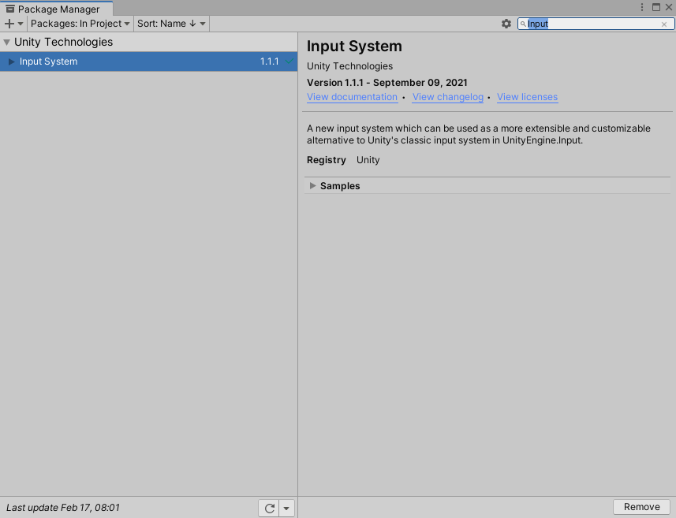

유니티를 사용하면서 계속 기존 input system을 사용했었는데 어느 계기로 <br>
New Input System을 알게 되어서 공부한걸 포스팅할까 합니다. <br>
내용이 많은 관계로 분할해서 올려보겠습니다. <br>

# 소개

새로운 입력 시스템은 다양한 기기와 플랫폼 전반에 걸친 사용 편의성과 일관성에 초점을 맞추어 개발되었습니다. <br>
기존의 입력 관리 시스템은 지금처럼 많은 플랫폼과 기기를 지원하기 이전에 설계되었기에 사용자 친화적이지 않았습니다. <br>
예를 들어 모바일에서 조이스틱 같은것도 직접 여러 인터페이스를 구현해서 만들었었죠.. <br>
어찌저찌 여러 이유로 인해 새로운 입력 시스템을 만들었다고 합니다. <br>
<br>

기존 입력 시스템보다 좋은점 <br>
1. 여러 플랫폼과 연동 가능 <br>
2. 입력의 callback을 받아낼 수 있어 유연하게 사용가능 <br>
    (예전에는 update문에서 GetKeyDown같은 함수로 매 프레임마다 실행되는 점이
    새로운 입력 시스템은 매 프레임이 아닌 입력을 받으면 실행하는게 가능합니다!!)
3. 런타임으로 입력키를 ReBinding 할 수 있는 기능이 잘 만들어져 있다. <br>
4. 인터페이스가 친절함!! <br>

<br>

물론 복잡한 부분도 있지만 공부하면 됩니다.
<br><br><br>

# 설치하기

사용하기 위해서는 Unity Package Manager에서 Input System을 검색해서 다운로드 합니다. <br>
verified된 버전이 안정되어있지만 1.1버전 이상을 추천합니다. 그 버전이 저장기능이 구현되어 있어요. <br><br>



설치 다하면 Unity가 꺼졌다가 다시 실행될겁니다.<br><br>

다하면 Edit -> Project Settings -> Player에서 Active Input Handling을 <br>
Input System Package(New)로 되어있는지 확인합니다. 저는 그냥 Both 했습니다..<br>
<br>


<br><br>

만약 EventSystem을 사용하고 있었다면 이렇게 되어있습니다. <br><br>
 <br>

그럼 Replace with InputSystemUIInputModule을 눌러주시면 됩니다. <br><br><br>

# 사용하기

본격적으로 사용하기 위해서는 InputActionAsset을 만들어야 합니다. <br>
Project창에서 우클릭 -> Create에 맨 밑에 Input Actions 생성해줍시다. <br><br>
 <br>

저는 테스트용으로 미리 만들었습니다. <br><br> 
 <br><br>

Action Maps부분은 캐릭터나 UI 등등 다른 곳에 쓰일 키들을 모아놓은 거라 생각하고 있습니다. <br>
참고로 Menu에는 아무것도 만들지 않았습니다. <br>

Actions에는 실질적인 키를 추가할 수 있습니다. <br>

그 옆에는 Properties로 Actions에 값들을 누르면 해당 프로퍼티들을 설정할 수 있습니다. 인스펙터창 같은 거죠. <br>

 <br>
바인딩된 값들을 선택하면 Binding Properties로 path로 키를 설정해줄 수 있습니다. <br><br>

정말 직관적입니다! <br><br><br>

사용하는 방법은 PlayerInput을 사용하는 방식과 코드로 다 하는 방식이 있습니다. <br>
WASD와 F로 InputActionAsset을 만들었으니 이를 두 방법으로 활용해봅시다. <br><br>

## PlayerInput 컴포넌트 사용하기

WASD로 이동하고 F를 누르면 점프라고 Debug하는 Player를 만들겠습니다. <br>

 <br>
색깔만 파란색인 Cube입니다. Player라고 합시다. <br><br>

 <br>

Player에 PlayerInput 컴포넌트를 검색해서 붙여주고 우리가 만든 InputActionAsset을 붙여줍니다. <br> 
그리고 간단한 PlayerController 스크립트도 만들어줍시다. <br>

``` c#
using UnityEngine;
using UnityEngine.InputSystem;

public class TestPlayerController : MonoBehaviour
{
    Vector2 inputVector;
    Vector3 moveVector;

    void Update()
    {
        transform.Translate(moveVector.normalized * Time.deltaTime * 3);
    }

    public void OnMovement(InputAction.CallbackContext value)
    {
        inputVector = value.ReadValue<Vector2>();
        moveVector = new Vector3(inputVector.x, 0f, inputVector.y);
    }

    public void OnJump(InputAction.CallbackContext value)
    {
        if(value.started)
            Debug.Log("점프");
    }
}
```
진짜 간단하게 짰습니다. <br>
앞서 말했듯이 콜백으로 입력 시 행동을 정해줄 수 있습니다. 따라서 OnJump는 코드가 간편합니다. <br>
 
``` c#
InputAction.CallbackContext value
```
콜백 함수의 파라미터로 InputAction.CallbackContext를 사용합니다. 이를 사용하기 위해 UnityEngine.InputSystem을 using 선언해야 합니다. <br>

InputAction.CallbackContext 타입을 가지는 value는 입력의 상태를 확인할 수 있습니다. <br>

value.started : 입력이 시작되었을 때 <br>
value.performed : 입력이 수행되었을 때 <br>
value.canceled : 입력이 취소되었을 때(키를 땔 때) <br>

적절하게 사용해줍시다. <br>

이제 만든 함수들을 넣어줘야 합니다. 이 작업은 PlayerInput 컴포넌트에서 할 수 있습니다. <br>

 <br>
PlayerInput 컴포넌트에서 Behavior를 Invoke Unity Events로 바꿔줍시다. 여기서 함수들을 할당할 수 있습니다. <br>
키들을 Player라는 Action Maps에 만들었기에 각 키에 맞는 event들이 있는걸 볼 수 있습니다. <br>
여기에 만든 함수들을 넣어주면 됩니다. <br>

 <br>
잘 작동되네요!!
<br><br><br>

## 코드로 사용하기

이 방법은 PlayerInput 컴포넌트를 사용하지 않습니다. 따라서 일일이 event에 넣어주는 귀찮음이 없습니다. <br>

 <br>
만들었던 InputActionAsset에 Generate C# Class를 체크하고 Apply를 하면 스크립트가 하나 생성됩니다. <br>

스크립트를 열어보면 <br>
 <br>
JSON 형태로 key들이 저장되어 있는것을 볼 수 있습니다. <br>

이 스크립트를 이용해서 코드로 직접 이벤트를 넣어줍시다. <br>

 <br>
기존의 Player에 TestPlayerController 빼고 PlayerInput도 빼주고 새로운 스크립트를 넣어줍니다. TestInputActionCSharp <br>

``` c#
using UnityEngine;
using UnityEngine.InputSystem;

public class TestInputActionCSharp : MonoBehaviour
{
    Vector2 inputVector;
    Vector3 moveVector;

    private TestInputAction playerInput;

    private void Awake()
    {
        playerInput = new TestInputAction();

        playerInput.Player.Movement.started += OnMovement;
        playerInput.Player.Movement.performed += OnMovement;
        playerInput.Player.Movement.canceled += OnMovement;

        playerInput.Player.Jump.started += OnJump;
    }

    void Update()
    {
        transform.Translate(moveVector.normalized * Time.deltaTime * 3);
    }


    public void OnMovement(InputAction.CallbackContext value)
    {
        inputVector = value.ReadValue<Vector2>();
        moveVector = new Vector3(inputVector.x, 0f, inputVector.y);
    }

    public void OnJump(InputAction.CallbackContext value)
    {
        Debug.Log("점프");
    }

    private void OnEnable()
    {
        playerInput.Player.Enable();
    }

    private void OnDisable()
    {
        playerInput.Player.Disable();
    }
}
```

<br>
전에 코드와 차이가 있다면 Awake에서 코드로 함수를 연결해주는 것과 OnEnable, OnDisable에서 
해당 ActionMap을 활성화 비활성화 시켜주는 겁니다. <br>

코드로 사용할 때에는 해당 키를 사용하기 전에 활성화를 해주어야 사용할 수 있습니다. <br>
여기서 선택적으로 ActionMap을 활성화 비활성화 시켜줘서 같은 키값이어도 다른 Map에서는 사용할 수 없게 하는 방식도 가능합니다. <br>


 <br>
물론 잘 됩니다. <br>