오늘은 이전 포스팅의 새로운 입력시스템을 사용하여 런타임중에 키 입력값을 바꿔보겠습니다. <br><br><br>

# 사전 준비
<br>
우선 그냥 만들면 심심하니 롤의 단축기 설정하는 부분은 따라 만들어 보겠습니다. <br>
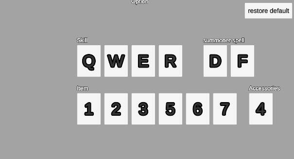 <br>
UI는 이렇게 준비했습니다. 각 입력 버튼을 누르고 아무 키나 입력하면 그 값으로 바뀌는 식으로 구현해보겠습니다. <br>

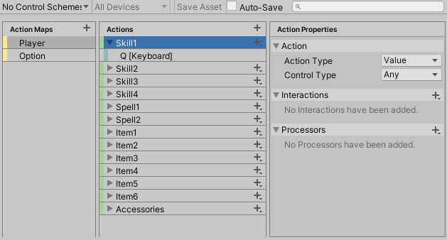 <br>
해당 InputActionAsset은 다음과 같이 설정했습니다. <br>

여기서 개념정리를 하고 갑시다. 나중에 가면 복잡해지니까요! <br>

1. InputActionAsset은 위에 보이는 창 전체를 말합니다. <br>
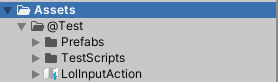 <br>
저는 해당 InputActionAsset을 LolInputAction이라고 저장했고 프로젝트 뷰에 있는걸 확인할 수 있습니다. <br>

2. InputActionReference는 InputActionAsset에서 설정한 키들의 정보라고 생각하면 됩니다. <br>
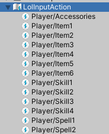 <br>
InputActionAsset을 펼치면 다음과 같이 나옵니다. <br>

3. InputAction은  <br>
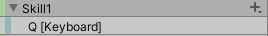 <br>
이것들 하나하나를 말하는 것으로 InputActionReference의 action프로퍼티로 가져올 수 있습니다.  <br>
또 action프로퍼티의 bindings프로퍼티로 바인딩된 키들을 가져올 수 있고 이를 InputBinding이라 합니다. <br>
쉽게 위 사진에서 Skill1은 InputAction, Q[Keyboard]는 InputBinding이라고 생각합시다. <br><br>

이 정도만 설명하고 필요한건 그때그때 또 설명하겠습니다. <br><br>

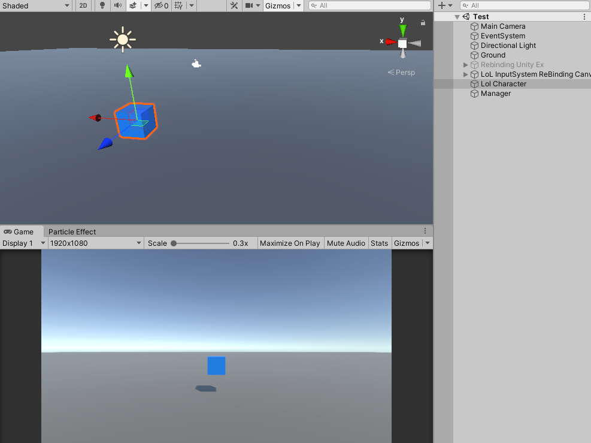 <br>
역시 간단한 캐릭터(큐브...)를 만들었고 Lol Character라고 명명했습니다. <br><br>

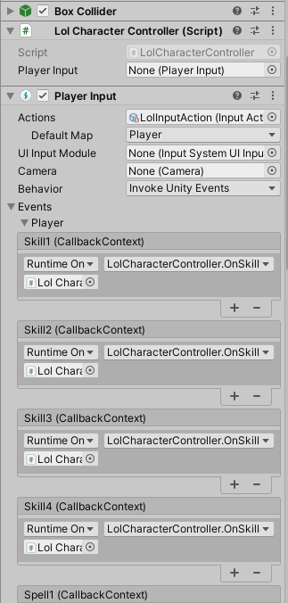 <br>
먼저 PlayerInput 컴포넌트를 추가하고 각 이벤트에 맞는 콜백함수를 넣어주었습니다.

간단한 LolCharacterController 컴포넌트에 함수들을 다 집어넣었구요. 내용은 단순히 Debug.log로 <br>
Console창에 어떤 버튼이 눌렸는지 보여주는 기능만 있습니다. <br>

``` c#
using UnityEngine.InputSystem;

public class LolCharacterController : MonoBehaviour
{
    public  PlayerInput _playerInput;

    private void Awake()
    {
        _playerInput = GetComponent<PlayerInput>();
    }

    public void OnSkill1(InputAction.CallbackContext value)
    {
        if (value.started)
            Debug.Log("1번 스킬");
    }

    public void OnSkill2(InputAction.CallbackContext value)
    {
        if (value.started)
            Debug.Log("2번 스킬");
    }

    .....

    public void OnItem6(InputAction.CallbackContext value)
    {
        if (value.started)
            Debug.Log("6번 아이템");
    }

    public void OnAccessories(InputAction.CallbackContext value)
    {
        if (value.started)
            Debug.Log("악세서리");
    }
}
```
<br>
그럼 현재는 해당 입력을 누르면 단순히 로그찍는 큐브일 뿐입니다. <br>
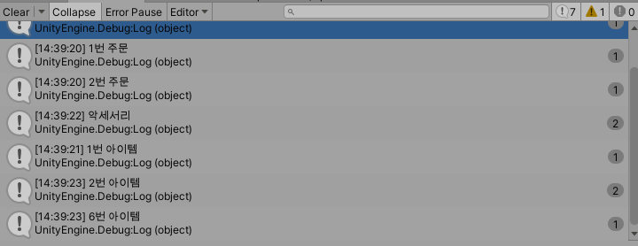 <br>
하지만 롤에서는 버튼을 눌러 다른 키로 인게임중에 바꿀 수 있죠!! <br>
이번 포스팅도 이게 목표입니다. <br><br><br>


# UI
<br>
 <br>
위에 스킬, 주문, 아이템, 장신구의 버튼들은 입력하는 키만 다르지 하는 일은 현재 어떤 키인지 보여주는 것과 키를 바꾸는 Rebinding 기능 밖에 없습니다. <br>
그럼 Prefab으로 만들어 관리합시다. <br><br>
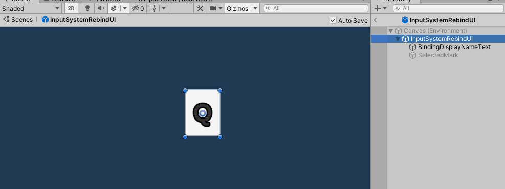 <br>
그리고 Rebinding해주는 기능을 갖게해줄 스크립트도 하나 만들어서 붙여줍시다. <br>
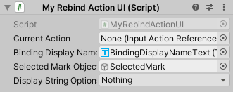 <br>

1. CurrentAction은 현재 할당된 원본 키의 정보인 InputActionReference를 넣어줍니다. <br>
2. BindingDisplayName은 버튼에 적힌 키 이름입니다. Q, W, E, R 이런 값들이죠. <br>
3. SelectedMarkObject는 버튼을 눌렀을 때 눌렀는지 안눌렀는지 확인하기 위해 임의로 넣은것입니다. 간단하게 체크모양 image로 했습니다. <br>
4. DisplayStringOption은 버튼에 적힐 키 이름의 옵션입니다. <br>
Enum으로 되어있고 Layer처럼 비트레이트 방식으로 여러개를 한번에 설정할 수 있습니다. <br>
[https://docs.unity3d.com/Packages/com.unity.inputsystem@1.0/api/UnityEngine.InputSystem.InputBinding.DisplayStringOptions.html](https://docs.unity3d.com/Packages/com.unity.inputsystem@1.0/api/UnityEngine.InputSystem.InputBinding.DisplayStringOptions.html) <br>
Unity Scripting API를 확인하시면 다 나옵니다. <br>
저는 그냥 아무것도 설정하지 않겠습니다. <br><br><br>

# 런타임 ReBinding
<br>
드디어 대망의 코드입니다. MyRebindActionUI 코드를 살펴봅시다.

``` c#
using UnityEngine;
using UnityEngine.InputSystem;
using TMPro;

public class MyRebindActionUI : MonoBehaviour
{
    [SerializeField]
    private InputActionReference currentAction = null;
    [SerializeField]
    private TMP_Text bindingDisplayNameText = null;
    [SerializeField]
    private GameObject selectedMarkObject;
    [SerializeField]
    private InputBinding.DisplayStringOptions displayStringOptions;

    private InputActionRebindingExtensions.RebindingOperation rebindingOperation;

    public void StartRebinding()
    {
        // 리바인딩 시작하는 함수. 각 버튼에 OnClick함수로 넣어줄 함수.
    }

    private void RebindCancel()
    {
        // 리바인딩이 취소됐을 때 실행될 함수
    }

    private void RebindComplete()
    {
        // 리바인딩이 완료됐을 때 실행될 함수
    }

    public void ShowBindText()
    {
        // 바인딩된 입력 키를 버튼에 보여줄 함수
    }
}
```

변수 설명은 앞에서 했고 그 밖에 변수는 진행하면서 설명하겠습니다. <br><br>

## StartRebinding 함수
``` c#
public void StartRebinding()
{
    currentAction.action.Disable();

    selectedMarkObject.SetActive(true);

    rebindingOperation = currentAction.action.PerformInteractiveRebinding()
        .WithControlsExcluding("<Mouse>/rightButton")
        .WithCancelingThrough("<Mouse>/leftButton")
        .OnCancel(operation => RebindCancel())
        .OnComplete(operation => RebindComplete())
        .Start();
}
```
버튼을 클릭하면 실행될 함수입니다. <br>
1. 해당 키를 리바인딩하기 전에 해당 InputAction을 비활성화시켜야 합니다. (currentAction.action) <br>
2. 그리고 선택되었다는 표시를 SetActive(true) 해줍니다. <br>
3. 마지막은 리바인딩을 하는 PerformInteractiveRebinding() 함수입니다. <br>
키를 바인딩하기 위해서는 평범한 함수처럼 한번에 실행될 수 없습니다. <br>
사용자의 입력을 받아야 하고 이를 처리해야 하기 때문이죠. <br>
그래서 PerformInteractiveRebinding() 함수는 그런 일련의 과정인 InputActionRebindingExtensions.RebindingOperation 타입 변수를 반환합니다. <br>
그게 앞서 변수로 설정한 rebindingOperation입니다. <br>
따라서 리바인딩이 취소됐을 때 OnCancel, 완료됐을 때 OnComplete를 콜백함수로 넣을 수 있게 만들어져 있습니다. <br>
또 해당 키는 무시한다는 WithControlsExcluding과 해당 키를 누르면 취소된다는 WithCancelingThrough도 추가했습니다. <br>
다 설정하고 Start함수로 시작하면 됩니다. <br><br>

그럼 총 과정은 사용자가 버튼을 누릅니다. 그러면 리바인딩 작업을 Start부분 덕분에 시작합니다. 여기서 사용자의 입력을 기다립니다. 사용자의 입력에 따라 무시하거나 취소하고 적절한 키를 입력해서 바인딩이 완료되면 OnComplete부분을 실행하고 완료됩니다. <br><br>

[https://docs.unity3d.com/Packages/com.unity.inputsystem@1.0/manual/ActionBindings.html#runtime-rebinding](https://docs.unity3d.com/Packages/com.unity.inputsystem@1.0/manual/ActionBindings.html#runtime-rebinding) <br>
자세한 내용은 Unity 공식 문서를 읽어보시면 이해가 가실겁니다. <br><br>

## RebindComplete 함수
``` c#
private void RebindComplete()
    {
        selectedMarkObject.SetActive(false);
        rebindingOperation.Dispose();
        currentAction.action.Enable();
        ShowBindText();
    }
```
리바인딩이 완료되면 실행될 함수입니다. <br>
1. 완료되었으니 선택되었다는 표시를 SetActive(false) 해줍니다.
2. 리바인딩하는 동작(operation)을 Dispose해줍니다. 
> IMPORTANT: You must dispose of InputActionRebindingExtensions.RebindingOperation instances via Dispose(), so that they don't leak memory on the unmanaged memory heap.

공식문서에서 해당과정은 꼭 dispose해주라는 말이 있습니다. <br>
이 작업이 끝나도 GC가 처리해주지 않아서 메모리 누수가 생길 수 있으니 직접 처리해주어야 한다고 합니다. <br>
이 때문에 미리 변수로 rebindingOperation를 만들어 놓았습니다. 사실 OnComplete의 operation 부분이 이 부분인데 이를 사용하셔도 됩니다. 저는 그냥 변수로 만들었어요. <br>
3. 시작할 때 Disable했던걸 Enable 합니다. 
4. 새로운 키가 바인딩되었으니 텍스트로 보여줍니다. <br><br>

## ShowBindText 함수
``` c#
public void ShowBindText()
{
    var displayString = string.Empty;
    var deviceLayoutName = default(string);
    var controlPath = default(string);

    displayString = currentAction.action.GetBindingDisplayString(0, out deviceLayoutName, out controlPath, displayStringOptions);

    bindingDisplayNameText.text = displayString;
}
```
해당 키에 바인딩된 값을 찾는 방법은 여러가지가 있는데 저는 GetBindingDisplayString을 썼습니다. <br>
1. 전달인자로는 바인딩된 인덱스를 넣습니다. 저희는 InputAction마다 하나의 키만 설정했으니 0번째 밖에 없습니다. <br>
2. 그리고 기기의 정보와, 경로를 out으로 넣습니다. 이 값들은 사용하지 않았는데 쓸만한 구석이 있습니다. <br>
예를들어 키보드에서 K를 누르면 deviceLayoutName은 Keyboard 가 되고, controlPath는 k가 됩니다. <br>
3. 마지막 전달인자로는 설정을 넣는데 키만 보이게 할건지, 장치도 같이 넣을건지 등등이 있습니다. 위에 공식문서 링크에 잘 나와있습니다. <br>

이렇게 해서 반환된 값을 displayString에 넣고 이 값을 Text에 넣습니다. 참고로 displayString은 아무런 설정을 하지 않았으니 K
가 됩니다. <br><br>

## RebindCancel 함수
``` c#
private void RebindCancel()
{
    rebindingOperation.Dispose();
    currentAction.action.Enable();
    selectedMarkObject.SetActive(false);
}
```
취소되면 작업 dispose해주고 enable해주고 선택 표시 비활성화 해주는게 끝입니다. <br><br>

## 전체 코드
``` c#
using UnityEngine;
using UnityEngine.InputSystem;
using TMPro;

public class MyRebindActionUI : MonoBehaviour
{
    [SerializeField]
    private InputActionReference currentAction = null;
    [SerializeField]
    private TMP_Text bindingDisplayNameText = null;
    [SerializeField]
    private GameObject selectedMarkObject;
    [SerializeField]
    private InputBinding.DisplayStringOptions displayStringOptions;

    private InputActionRebindingExtensions.RebindingOperation rebindingOperation;

    public void StartRebinding()
    {
        currentAction.action.Disable();

        selectedMarkObject.SetActive(true);

        rebindingOperation = currentAction.action.PerformInteractiveRebinding()
            .WithControlsExcluding("<Mouse>/rightButton")
            .WithCancelingThrough("<Mouse>/leftButton")
            .OnCancel(operation => RebindCancel())
            .OnComplete(operation => RebindComplete())
            .Start();
    }

    private void RebindCancel()
    {
        rebindingOperation.Dispose();
        currentAction.action.Enable();
        selectedMarkObject.SetActive(false);
    }

    private void RebindComplete()
    {
        selectedMarkObject.SetActive(false);
        rebindingOperation.Dispose();
        currentAction.action.Enable();
        ShowBindText();
    }

    public void ShowBindText()
    {
        var displayString = string.Empty;
        var deviceLayoutName = default(string);
        var controlPath = default(string);

        displayString = currentAction.action.GetBindingDisplayString(0, out deviceLayoutName, out controlPath, displayStringOptions);

        bindingDisplayNameText.text = displayString;
    }
}
```
<br><br><br>

# 결과
<br>
결과를 보기전에 제대로 작동하는지 확인하기 위해 LolCharacterController에 한 줄만 추가합시다. <br>

``` c#
public void OnSkill1(InputAction.CallbackContext value)
{
    if (value.started)
        Debug.Log("1번 스킬 " + value.action.bindings[0].overridePath + " 입력");
}
```
1번 스킬을 누르면 해당 InputAction에 새롭게 바인딩된 키 값(경로)를 로그로 보여줍니다. <br>
단 바인딩을 하지 않았다면 override된 값들이 없어 아무 값도 나오지 않게 됩니다. <br>
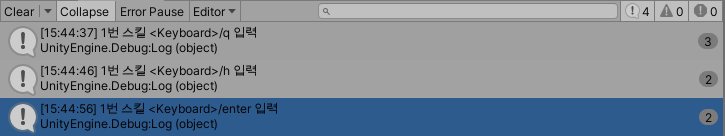<br>
런타임중에도 1번스킬의 키값들이 리바인딩되는 것을 볼 수 있습니다. <br><br>

# 문제점
<br>
지금은 단순히 리바인딩만 할 수 있습니다. <br>
에디터를 다시 실행시키면 기존의 값들로 다시 돌아갑니다. <br>
또 다른 단축키에 같은 값을 넣을 수 있습니다. 롤로 치면 Q를 누르면 모든 스킬을 다 누르게 되는 상황이 생길 수도 있다는것입니다. <br>
다음 포스팅에는 이러한 문제를 해결해보겠습니다. <br>

