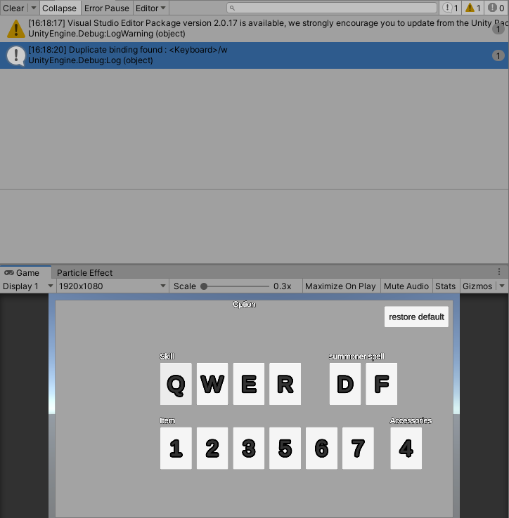
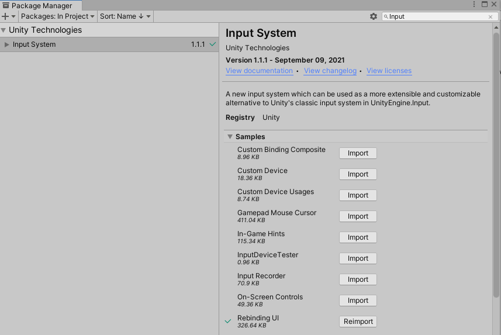
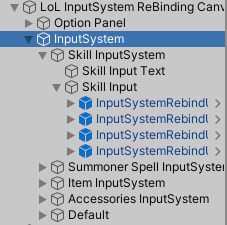
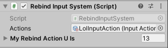
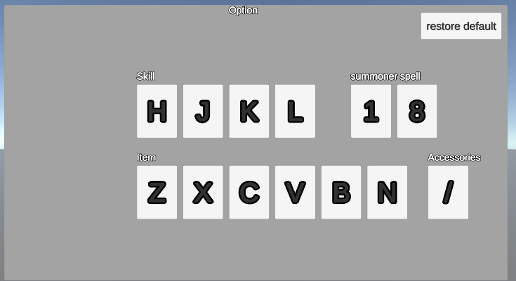
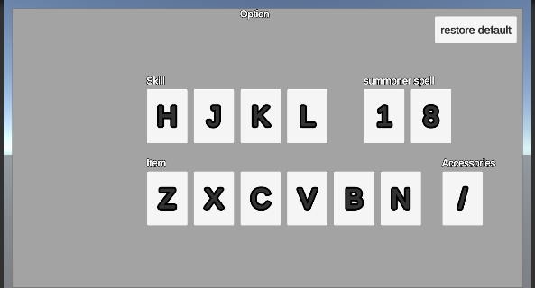
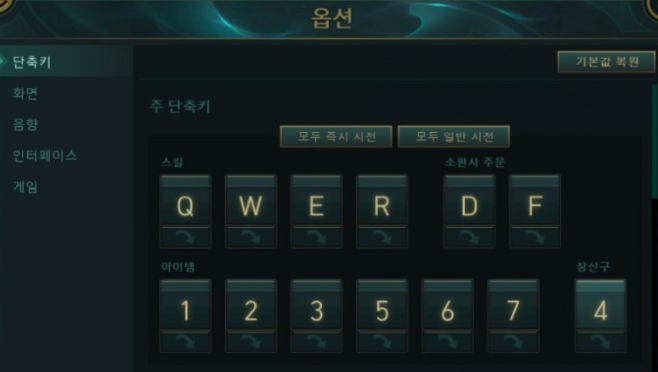
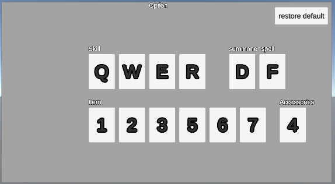

[이전 포스팅 보러가기](https://hyeonjunje.github.io/unity/Unity_NewInputSystem2/) <br>
이전 포스팅에서 중복문제를 해결하고 저장하는 부분까지 해보겠습니다. <br>
코드는 이전 포스팅에서 조금씩만 추가하는 형태입니다. <br><br>

# 런타임 ReBinding 중복문제
<br>
이전 포스팅에서 다른 단축키지만 중복이 가능하여 Q를 누르면 모든 스킬이 실행될 수 있는 문제가 있었습니다. 이를 해결해봅시다. <br> 이전 MyRebindActionUI 스크립트에서 중복 검사를 해주는 함수를 추가해봅시다. <br>

``` c#
private bool CheckDuplicateBindings(InputAction action)
{
    InputBinding newBinding = action.bindings[0];
    foreach (InputBinding binding in action.actionMap.bindings)
    {
        if (binding.action == newBinding.action)
            continue;
        if (binding.effectivePath == newBinding.effectivePath)
        {
            Debug.Log("Duplicate binding found : " + newBinding.effectivePath);
            return true;
        }
    }
    return false;
}
```

만약 중복이 있다면 true, 없다면 false를 반환합니다. <br><br>
중복을 검사하는 방법입니다. <br>
1. 해당 InputAction의 InputBinding을 가져옵니다. 저희는 바인딩된 키가 하나씩만 있기에 인덱스가 0입니다. <br>
2. 해당 InputAction의 actionMap의 모든 InputBinding들을 가져옵니다. 이러면 자기자신뿐만 아니라 자기가 속한 Map에 모든 InputBinding들을 가져올 수 있습니다. 
3. 반복문을 돌며 자기자신이면 무시하고, 해당 InputBinding의 경로가 같은 InputBinding이 있으면 중복이 있다는 것으로 판단하고 return true를 합니다.
<br>

이 함수를 RebindComplete() 함수에 넣어서 중복검사를 합시다. <br>
``` c#
private void RebindComplete()
    {
        selectedMarkObject.SetActive(false);
        rebindingOperation.Dispose();
        currentAction.action.Enable();

        if (CheckDuplicateBindings(currentAction.action))
        {
            if (path != null)
                currentAction.action.ApplyBindingOverride(path);
            return;
        }

        ShowBindText();
    }
```
전의 코드와 다른 점은 중복이 있다면 해당 InputAction의 바인딩경로를 갱신하지 않고 기존의 path로 덮어씁니다. <br>
여기서 기존의 경로인 path는 변수로 추가하고 StartRebinding() 함수에서 갱신합시다. <br>

``` c#
private string path = null;

public void StartRebinding()
{
    currentAction.action.Disable();
    selectedMarkObject.SetActive(true);

    if(currentAction.action.bindings[0].hasOverrides)
        path = currentAction.action.bindings[0].overridePath;
    else
        path = currentAction.action.bindings[0].path;

    rebindingOperation = currentAction.action.PerformInteractiveRebinding()
        .WithControlsExcluding("<Mouse>/rightButton")
        .WithCancelingThrough("<Mouse>/leftButton")
        .OnCancel(operation => RebindCancel())
        .OnComplete(operation => RebindComplete())
        .Start();
}
```
만약 InputBinding이 override되지 않았다면 기존의 default 경로를 override되었으면 기존의 override 된 경로를 path에 집어 넣습니다. <br><br>

 <br>
1번 스킬인 Q를 W로 바꿀려고 하면 중복이 있다는 로그와 함께 Rebinding 작업을 하지 않습니다. <br><br><br>

# 런타임 ReBinding 저장 / 불러오기
<br>
사실 저장 / 불러오기 기능은 이미 만들어져 있습니다. <br>
그 스크립트를 가져옵시다. 다만 InputSystem Package 1.1 이상부터 가능할 것입니다. <br>

Package Manager에서 InputSystem 검색해서 Sample에 Rebinding UI를 Import 합시다. <br>
 <br>
이 Sample에 사실 리바인딩하고 저장하고 등등의 스크립트가 다 있습니다. 저도 여기 코드를 많이 참고했구요. <br>
Sample에 있는 코드도 살펴보시면 좋습니당! <br>

그럼 Sample에 있는 RebindSaveLoad 코드를 살펴봅시다. <br>
``` c#
using UnityEngine;
using UnityEngine.InputSystem;

public class RebindSaveLoad : MonoBehaviour
{
    public InputActionAsset actions;

    public void OnEnable()
    {
        var rebinds = PlayerPrefs.GetString("rebinds");
        if (!string.IsNullOrEmpty(rebinds))
            actions.LoadBindingOverridesFromJson(rebinds);
    }

    public void OnDisable()
    {
        var rebinds = actions.SaveBindingOverridesAsJson();
        PlayerPrefs.SetString("rebinds", rebinds);
    }
}
```
코드가 되게 짧습니다. <br> 
대체로 보면 InputActionAsset 변수가 있고 이거 통째로 Json 형태로 바꾼 string 값을 PlayerPrefs로 저장/불러오는 방식입니다. <br> 저장, 불러오기 같은 귀찮은 기능을 SaveBindingOverridesAsJson, LoadBindingOverridesFromJson 함수로 쉽게 할 수 있다는게 또 새로운 입력시스템이 장점입니다. <br><br>

그럼 이 코드를 이용해서 저희 맛대로 써봅시다. <br>
 <br>
UI의 형태를 보면 버튼들을 스킬, 주문, 아이템, 장신구로 묶었고 또 그걸 InputSystem이라는 GameObject로 묶어놓았습니다. <br>
그럼 저장기능을 InputSystem이라는 곳에 붙여봅시다. <br>
저희는 버튼안에 입력값들도 텍스트로 갱신하고 있기에 추가할 부분이 있어 새로운 스크립트를 만들어야 합니다. <br>

 <br>
RebindInputSystem이라 명명했습니다.(스크립트 이름은 신경쓰지 마세요... 진짜 생각없이 적었네요...)<br>
저장할 InputActionAsset을 집어놓고 모든 키 버튼들을 List형태로 넣어줍시다. <br>

그럼 코드를 살펴봅시다. <br>
``` c#
using System.Collections.Generic;
using UnityEngine;
using UnityEngine.InputSystem;

public class RebindInputSystem : MonoBehaviour
{
    public InputActionAsset actions;

    [SerializeField]
    private List<MyRebindActionUI> _myRebindActionUIs = new List<MyRebindActionUI>();

    public void OnEnable()
    {
        var rebinds = PlayerPrefs.GetString("rebinds");
        if (!string.IsNullOrEmpty(rebinds))
            actions.LoadBindingOverridesFromJson(rebinds);

        foreach(MyRebindActionUI myRebindActionUI in _myRebindActionUIs)
            myRebindActionUI.ShowBindText();
    }

    public void OnDisable()
    {
        var rebinds = actions.SaveBindingOverridesAsJson();
        PlayerPrefs.SetString("rebinds", rebinds);
    }
}
```

저장, 불러오기 방식은 Sample Code와 동일합니다. 거기서 불러올 때 저장된 키 값들로 모든 버튼들의 텍스트를 갱신해줍니다. <br>

 <br>
모든 키들을 무작위로 다음과 같이 바꾸고 종료하고 다시 실행해도 <br>
 <br>
(같은 사진 아님...) 저장과 불러오기가 잘 되어있다는 것을 확인할 수 있습니다. 

<br><br><br>

# 추가) 기본값 복원

 <br>
롤에서 보면 기본값 복원이라는 버튼도 있습니다. 이 기능도 만들어봅시다. <br>
InputActionAsset의 모든 InputBinding들의 override된 값들을 지워주면 되는데 이 기능이 함수로 구현되어 있습니다!! <br>
ActionMap의 RemoveAllBindingOverrides()라는 함수입니다. (메소드 이름도 참 잘 지었네요!!) <br>
InputActionAsset의 모든 Map들을 돌면서 해당 함수를 실행해주고 버튼의 텍스트들도 갱신시켜줍시다.
그리고 PlayerPrefs에 저장된 값들도 지워주면 되겠죠. <br><br>

코드는 다음과 같고 이 함수를 만들어놓은 UI의 restore default 버튼에 OnClick으로 넣어줍시다. <br>
``` c#
public void resetAllBindings()
{
    foreach (InputActionMap map in actions.actionMaps)
        map.RemoveAllBindingOverrides();

    foreach (MyRebindActionUI myRebindActionUI in _myRebindActionUIs)
        myRebindActionUI.ShowBindText();

    PlayerPrefs.DeleteKey("rebinds");
}
```

 <br>
기존의 완전 엉망이었던 단축키들을 초기화시킨 것을 확인할 수 있습니다. <br>

롤 처럼 단축키 하나하나 초기화시킬 수도 있죠. RemoveAllBindingOverrides도 있으니 RemoveBindingOverride 함수도 있습니다. <br>
이것도 만들어놓은 함수를 사용하면 구현하기 쉽지만 저는 구현하지 않겠습니다!! (UI 또 만드는 것도 귀찮구요...) <br><br><br>

# 전체 코드

## RebindInputSystem.cs
``` c#
using System.Collections.Generic;
using UnityEngine;
using UnityEngine.InputSystem;

public class RebindInputSystem : MonoBehaviour
{
    public InputActionAsset actions;

    [SerializeField]
    private List<MyRebindActionUI> _myRebindActionUIs = new List<MyRebindActionUI>();

    public void OnEnable()
    {
        var rebinds = PlayerPrefs.GetString("rebinds");
        if (!string.IsNullOrEmpty(rebinds))
            actions.LoadBindingOverridesFromJson(rebinds);

        foreach(MyRebindActionUI myRebindActionUI in _myRebindActionUIs)
            myRebindActionUI.ShowBindText();
    }

    public void OnDisable()
    {
        var rebinds = actions.SaveBindingOverridesAsJson();
        PlayerPrefs.SetString("rebinds", rebinds);
    }

    public void resetAllBindings()
    {
        foreach (InputActionMap map in actions.actionMaps)
            map.RemoveAllBindingOverrides();

        foreach (MyRebindActionUI myRebindActionUI in _myRebindActionUIs)
            myRebindActionUI.ShowBindText();

        PlayerPrefs.DeleteKey("rebinds");
    }
}
```

## MyRebindActionUI.cs

``` c#
using UnityEngine;
using UnityEngine.InputSystem;
using TMPro;

public class MyRebindActionUI : MonoBehaviour
{
    [SerializeField]
    private InputActionReference currentAction = null;
    [SerializeField]
    private TMP_Text bindingDisplayNameText = null;
    [SerializeField]
    private GameObject selectedMarkObject;
    [SerializeField]
    private InputBinding.DisplayStringOptions displayStringOptions;

    private InputActionRebindingExtensions.RebindingOperation rebindingOperation;
    private string path = null;

    public void StartRebinding()
    {
        currentAction.action.Disable();
        selectedMarkObject.SetActive(true);

        if(currentAction.action.bindings[0].hasOverrides)
            path = currentAction.action.bindings[0].overridePath;
        else
            path = currentAction.action.bindings[0].path;

        rebindingOperation = currentAction.action.PerformInteractiveRebinding()
            .WithControlsExcluding("<Mouse>/rightButton")
            .WithCancelingThrough("<Mouse>/leftButton")
            .OnCancel(operation => RebindCancel())
            .OnComplete(operation => RebindComplete())
            .Start();
    }

    private void RebindCancel()
    {
        rebindingOperation.Dispose();
        currentAction.action.Enable();
        selectedMarkObject.SetActive(false);
    }

    private void RebindComplete()
    {
        selectedMarkObject.SetActive(false);
        rebindingOperation.Dispose();
        currentAction.action.Enable();

        if (CheckDuplicateBindings(currentAction.action))
        {
            if (path != null)
                currentAction.action.ApplyBindingOverride(path);
            return;
        }

        ShowBindText();
    }

    public void ShowBindText()
    {
        var displayString = string.Empty;
        var deviceLayoutName = default(string);
        var controlPath = default(string);

        displayString = currentAction.action.GetBindingDisplayString(0, out deviceLayoutName, out controlPath, displayStringOptions);

        bindingDisplayNameText.text = displayString;
    }

    private bool CheckDuplicateBindings(InputAction action)
    {
        InputBinding newBinding = action.bindings[0];
        foreach (InputBinding binding in action.actionMap.bindings)
        {
            if (binding.action == newBinding.action)
                continue;
            if (binding.effectivePath == newBinding.effectivePath)
            {
                Debug.Log("Duplicate binding found : " + newBinding.effectivePath);
                return true;
            }
        }
        return false;
    }
}

```

이것으로 간단한 롤 단축키 설정하는 부분을 완성했습니다. <br>
더 추가하고 싶은게 생기면 이어서 포스팅해보겠습니다 <br>