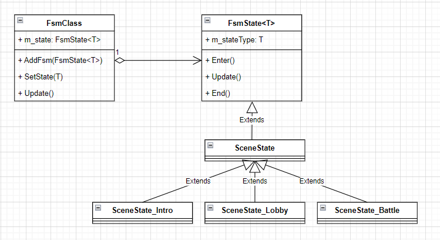

상태 패턴(State Pattern)이란 객체가 상태에 따라 행위를 다르게 할 때, 직접 상태를 체크하여 상태에 따른 행위를 호출하는 것이 아니라 상태를 객체화하여 필요에 따라 다르게 행동하도록 위임하는 디자인 패턴입니다.

예를 들어보자면 저희 집 정수기에는 냉수, 정수, 온수 상태를 설정할 수 있습니다. <br>
이 정수기를 코드로 구현하자면 여러 if문을 만들고 조건을 검사하며 각 상태에 맞는 행동을 취해야 하겠죠. <br>
이러한 방법은 상태가 많아져 추가, 확장할 시 매우 복잡해집니다. <br>
하지만 상태 패턴을 사용하면 냉수, 정수, 온수의 상태를 따로 클래스로 만들고 정수기에는 그 상태에 따라 행동만 시켜주는 방식으로 구현하면 쉽게 만들 수 있습니다. <br>
그리고 확장을 한다고 하면 기존의 코드를 수정할 필요없이 새로운 상태인 클래스를 만들어서 구현해주면 되죠 <br>
이 패턴을 잘 사용하면 객체지향의 개방-폐쇄 원칙을 잘 지킬 수 있는 코드가 될 수 있습니다!! <br>


저는 유니티로 게임을 만들 때 상태 패턴을 활용해서 유한상태머신(FSM)을 자주 만듭니다. <br>
캐릭터의 로직이나, AI, 가챠 애니메이션 등등 여러가지로 활용될 수 있습니다. <br>

> 유한상태머신 : 주어지는 모든 시간에서 처해 있을 수 있는 유한개의 상태를 가지고 주어지는 입력에 따라 어떤 상태에서 다른 상태로 전환하거나 출력이나 액션이 일어나게 하는 장치 또는 그런 장치를 나타낸 모델이다. 


오늘은 간단한 게임의 씬을 상태로 나타내고 전환하는 것을 만들어보겠습니다. <br>
해당 유튜브 영상으로 공부했습니다. <br>


<br><br><br>

# FSM의 기본 구조

  <br>

(일반화 부분) <br>
FSMClass : 여러 상태클래스를 가지고 있고 상태끼리의 전환, 행동, 시작 등등을 여기에서 처리합니다. <br>
FsmState<T> : 모든 상태들의 부모입니다. 각 상태가 처리할 행동들을 담고 있습니다. <br>

(구현한 부분) <br>
SceneState : 게임의 씬을 상태로 만들기 위해 씬 상태 클래스들의 부모가 될 클래스입니다. <br>
SceneState_Intro, Lobby, Battle : 각 씬 상태 클래스입니다. 각 씬에 들어갈 때, 있을 때 나갈 때 어떤 행동을 해야하는지 여기에서 구현합니다. <br>


# 코드

## FsmClass.cs

``` c#
using System.Collections;
using System.Collections.Generic;
using UnityEngine;

public class FsmClass<T> where T : System.Enum
{
    protected Dictionary<T, FsmState<T>> m_stateList = new Dictionary<T, FsmState<T>>();
    protected FsmState<T> m_state;
    protected bool m_isStateChanging = false;

    public FsmState<T> getState { get { return m_state; } }

    public T getStateType
    {
        get
        {
            if (m_state == null)
                return default(T);

            return m_state.stateType;
        }
    }

    public virtual void Init()
    {

    }

    public virtual void Clear()
    {
        m_stateList.Clear();
        m_state = null;
    }

    public virtual void AddFsm(FsmState<T> _state)
    {
        if(_state == null)
        {
            Debug.LogError("FsmClass::AddFsm()[ null == FsmState<T>]");
            return;
        }

        if(m_stateList.ContainsKey(_state.stateType) == true)
        {
            Debug.LogError("FsmClass::AddFsm()[ have state : " + _state.stateType); ;
            return;
        }

        m_stateList.Add(_state.stateType, _state);
    }

    public virtual void SetState(T _stateType)
    {
        if(!m_stateList.ContainsKey(_stateType))
        {
            Debug.LogError("FsmClass::SetState()[ no have state : " + _stateType);
            return;
        }

        if(m_isStateChanging)
        {
            Debug.LogError("FsmClass::SetState()[ change state : " + _stateType);
            return;
        }

        FsmState<T> _nextState = m_stateList[_stateType];

        // 같은 스테이트로 이동시 허용불가할려면 여기서 return
        if(_nextState == m_state)
        {
            Debug.LogWarning("FsmClass::SetState()[ same state : " + _stateType);
        }

        m_isStateChanging = true;

        if(m_state != null)
        {
            m_state.End();
        }

        m_state = _nextState;
        m_state.Enter();
        m_isStateChanging = false;
    }

    public virtual void Update()
    {
        if (m_state == null)
            return;

        m_state.Update();
    }
}

```


## FsmState.cs

``` c#
using System.Collections;
using System.Collections.Generic;
using UnityEngine;

public class FsmState<T> where T : System.Enum
{
    protected T m_stateType;

    public T stateType { get { return m_stateType; } }

    public FsmState(T _stateType)
    {
        m_stateType = _stateType;
    }

    // 상태가 변경될 때 해당 상태의 Enter호출
    public virtual void Enter()
    {

    }
    
    // 상태가 종료될 때까지 Update 계속 호출
    public virtual void Update()
    {

    }

    // 상태가 종료되면 End 실행 후 상태를 넘김
    public virtual void End()
    {

    }
}

```

각 상태들은 FsmState를 상속받습니다. <br>
그리고 각 상태의 구분은 Enum으로 합니다. <br>
각 상태는 Enter, Update, End가 있으며 이를 상속받은 클래스에서 재정의를 해줍니다. <br>
보통 Update에서 다른 상태로 가는 코드를 넣는 방식입니다. <br>
FsmClass에서 Dictionary로 키로 enum값을 받고 값으로 state를 넣습니다. <br>

## SceneState.cs

``` c#
using System.Collections;
using System.Collections.Generic;
using UnityEngine;

public enum eSCENE_STATE
{
    INTRO,
    LOBBY,
    BATTLE,
}

public class SceneState : FsmState<eSCENE_STATE>
{
    protected SceneManager m_sceneManager;

    public SceneState(SceneManager _sceneManager, eSCENE_STATE _stateType) : base(_stateType)
    {
        m_sceneManager = _sceneManager;
    }
}

```

## SceneManager.cs

``` c#
using System.Collections;
using System.Collections.Generic;
using UnityEngine;

public class SceneManager : Singleton<SceneManager>
{
    public FsmClass<eSCENE_STATE> fsm = new FsmClass<eSCENE_STATE>();

    public void Init()
    {
        fsm.AddFsm(new SceneState_Intro(this));
        fsm.AddFsm(new SceneState_Lobby(this));
        fsm.AddFsm(new SceneState_Battle(this));
    }

    private void Update()
    {
        fsm.Update();
    }
}

```

SceneManager는 이전 포스팅에서 소개한 싱글톤 클래스를 상속받게 하여 싱글톤의 역할을 하게 합니다. <br>
그리고 fsmClass클래스의 객체를 가지고 있으며 여러 상태를 생성해서 넣어줍니다. <br>
각 상태는 update문에 따라 자동으로 바뀌기 때문에 fsm.Update()만으로 끝낼 수 있습니다. <br>

``` c#
using System.Collections;
using System.Collections.Generic;
using UnityEngine;

public class SceneState_Intro : SceneState
{
    float m_timer = 0f;

    public SceneState_Intro(SceneManager _sceneManager) : base(_sceneManager, eSCENE_STATE.INTRO)
    {

    }

    public override void Enter()
    {
        m_timer = 0f;
        Debug.Log("enter intro scene");
    }

    public override void Update()
    {
        base.Update();
        m_timer += Time.deltaTime;
        if(m_timer > 1f)
        {
            m_sceneManager.fsm.SetState(eSCENE_STATE.LOBBY);
        }
    }
}


using System.Collections;
using System.Collections.Generic;
using UnityEngine;

public class SceneState_Lobby : SceneState
{
    public SceneState_Lobby(SceneManager _sceneManager) : base(_sceneManager, eSCENE_STATE.LOBBY)
    {

    }

    public override void Enter()
    {
        Debug.Log("enter lobby scene");
    }
}


using System.Collections;
using System.Collections.Generic;
using UnityEngine;

public class SceneState_Battle : SceneState
{
    public SceneState_Battle(SceneManager _sceneManager) : base(_sceneManager, eSCENE_STATE.BATTLE)
    {

    }

    public override void Enter()
    {
        Debug.Log("enter battle scene");
    }
}

```

각 상태를 클래스로 만들어 정의했습니다. <br>
각 상태에 Enter시 log로 상태를 알려줍니다. <br>

위 예제는 시작은 Intro 씬하다가 1초가 지나면 Lobby 씬으로 이동하게 됩니다. <br>
각 상태의 전이부분은 이렇게 update부분에서 하거나 따로 다른 함수를 만들어서 할 수 있습니다. <br>


이렇게 상태로 일련의 행동들을 나타내면 코드 유지보수가 쉬워집니다. <br>
모든 상태가 나누어져 있어 보기도 좋습니다. <br>
다만 유한상태머신도 상태가 많아지면 많아질수록 전이부분이 복잡해지기에 계층적 유한상태머신이나 비헤이비어 트리를 사용하기도 합니다. <br>