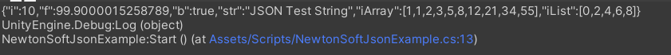
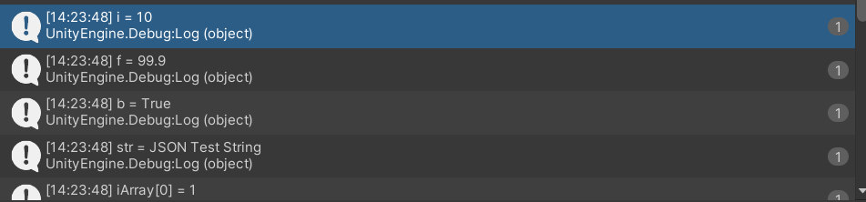
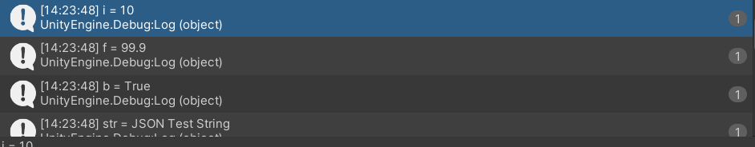
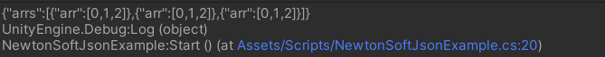
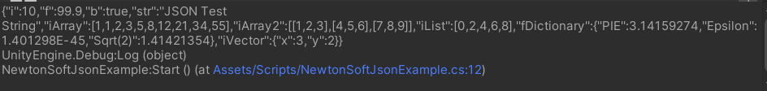
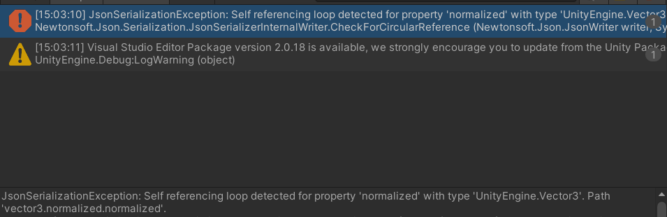

Json은 일종의 데이터 포맷으로 웹이나 네트워크에서 서버와 클라이언트 사이에 데이터를 주고 받을 때 사용합니다. <br>

유니티에서도 Json을 자주 사용하는데 네트워크 게임을 개발할 때 게임에 필요한 데이터를 주고 받거나, <br>
게임 진행 상황이나 게임 설정을 저장하는 식으로 사용됩니다. <br>

유니티에서 Json을 사용하기 위해선 다양한 방법이 있지만 이번에 포스팅할 내용은 UnityEngine에 포함되어 있는 JsonUtility 라이브러리와 Newtonsoft.Json 라이브러리를 알아보겠습니다. <br>

원래 Newtonsoft의 json을 사용하기 위해서는 다운을 받아서 dll 파일을 유니티에 넣어야 했지만 이제 유니티에서 공식적으로 지원하기 때문에 그냥 사용할 수 있게 되었습니다. <br><br><br>


# Json 사용법
<br>

## UnityEngine.JsonUtility

JsonUtility에는 StaticMethod로 ToJson, FromJson, FromJsonOverwrite가 있습니다. <br>

ToJson은 오브젝트를 string형태인 jsonData로 변환해줍니다. 이를 직렬화라고도 합니다. <br>

FromJson은 string형태인 jsonData를 오브젝트로 변환해줍니다. 이를 역직렬화라고 합니다. <br>

FromJsonOverwrite는 string형태인 jsonData를 읽어 한 오브젝트에 덮어쓰기를 해줍니다. <br>

코드로 알아보겠습니다. <br>

``` c#
public class JsonTestClass
{
    public int i;
    public float f;
    public bool b;
    public string str;
    public int[] iArray;
    public int[,] iArray2;
    public List<int> iList = new List<int>();
    public Dictionary<string, float> fDictionary = new Dictionary<string, float>();
    public IntVector2 iVector;

    public JsonTestClass()
    {
        i = 10;
        f = 99.9f;
        b = true;
        str = "JSON Test String";
        iArray = new int[] { 1, 1, 2, 3, 5, 8, 12, 21, 34, 55 };
        iArray2 = new int[, ] { { 1, 2, 3 }, { 4, 5, 6 }, { 7, 8, 9 } };
        for (int idx = 0; idx < 5; idx++)
        {
            iList.Add(2 * idx);
        }

        fDictionary.Add("PIE", Mathf.PI);
        fDictionary.Add("Epsilon", Mathf.Epsilon);
        fDictionary.Add("Sqrt(2)", Mathf.Sqrt(2));

        iVector = new IntVector2(3, 2);
    }

    public void Print()
    {
        Debug.Log("i = " + i);
        Debug.Log("f = " + f);
        Debug.Log("b = " + b);
        Debug.Log("str = " + str);

        for (int idx = 0; idx < iArray.Length; idx++)
        {
            Debug.Log(string.Format("iArray[{0}] = {1}", idx, iArray[idx]));
        }

        for(int idx1 = 0; idx1 < iArray2.GetLength(0); idx1++)
        {
            for (int idx2 = 0; idx2 < iArray2.GetLength(0); idx2++)
            {
                Debug.Log(string.Format("iArray[{0}, {1}] = {2}", idx1, idx2, iArray2[idx1, idx2]));
            }
        }

        for (int idx = 0; idx < iList.Count; idx++)
        {
            Debug.Log(string.Format("iList[{0}] = {1}", idx, iList[idx]));
        }

        foreach (var data in fDictionary)
        {
            Debug.Log(string.Format("iDictionary[{0}] = {1}", data.Key, data.Value));
        }

        Debug.Log("iVector3 = " + iVector.x + " , " + iVector.y);
    }

    public class IntVector2
    {
        public int x;
        public int y;

        public IntVector2(int x, int y)
        {
            this.x = x;
            this.y = y;
        }
    }
}
```
코드로 알아보기 위해 json으로 변형시킬 클래스를 만듭니다. 이 클래스에는 기본 데이터타입, 컨테이너 타입, 사용자가 만든 클래스가 있습니다. <br>
생성자로 클래스를 생성하자마자 값이 들어가게 하고 print함수로 데이터를 출력할 수 있게 하였습니다. <br>
이 클래스로 만든 오브젝트를 Json화 시켜보겠습니다. <br>

``` c#
private void Start()
{
    JsonTestClass jTest1 = new JsonTestClass();

    string jsonUtilityData = JsonUtility.ToJson(jTest1);  // 직렬화
    Debug.Log(jsonUtilityData);

    JsonTestClass result = JsonUtility.FromJson<JsonTestClass>(jsonUtilityData);  // 역직렬화
    result.Print();

    JsonTestClass jTest2 = new JsonTestClass();
    jTest2.i = 10000;
    JsonUtility.FromJsonOverwrite(jsonUtilityData, jTest2);  // 덮어쓰기
    jTest2.Print();
}
```

직렬화 결과 <br>
 <br>

역직렬화 결과 <br>
 <br>

덮어쓰기 결과 <br>
 <br>

오브젝트의 데이터를 Json화 시켜 string으로 저장할 수 있고 이 string을 다시 오브젝트로 변환시키거나 덮어쓸 수 있는걸 볼 수 있습니다. <br>
이러한 string형태의 jsonData를 파일에 적어 보관하다가 게임 시작시 역직렬화를 통해 오브젝트에 데이터를 넣어 Save&Load 기능을 구현할 수 있습니다.<br>

JsonUtility는 다만 Dictionary나 사용자가 만든 클래스, 2차원배열이 아닌 기본자료형만 직렬화를 시킬 수 있습니다. <br>
사용자가 만든 클래스를 직렬화하기 위해서는 어트리뷰트로 클래스 위에 [System.Serializable]을 추가해야 합니다. <br>
2차원 배열을 사용하기 위해서는 사용자가 따로 배열을 담은 클래스를 만들고 그 클래스를 배열로 저장하면 직렬화가 가능하기도 합니다. <br>

``` c#
private void Start()
{
    MyArr2 arr2 = new MyArr2(3);
    for(int i = 0; i < arr2.arrs.Length; i++)
    {
        arr2.arrs[i] = new MyArr(3);
        for(int j = 0; j < arr2.arrs[i].arr.Length; j++)
        {
            arr2.arrs[i].arr[j] = j;
        }
    }
    string jsonData = JsonUtility.ToJson(arr2);
    Debug.Log(jsonData);
}

[System.Serializable]
public class MyArr
{
    public int[] arr;

    public MyArr(int Length)
    {
        arr = new int[Length];
    }
}

[System.Serializable]
public class MyArr2
{
    public MyArr[] arrs;

    public MyArr2(int Length)
    {
        arrs = new MyArr[Length];
    }
}
```
 <br>
이런식으로 구현은 가능합니다. <br>


## Newtonsoft.Json

Newtonsoft.Json은 Dictionary, 2차원 데이터, 사용자 지정 클래스 모두 직렬화가 가능합니다. <br>
앞에 오브젝트를 그래로 사용하여 직렬화, 역직렬화를 해보겠습니다. <br>
Newtonsoft.Json을 사용하기 위해서는 using Newtonsoft.Json; 은 선언해주어야 합니다. <br>

``` c#
private void Start()
    {
        JsonTestClass jTest1 = new JsonTestClass();
        string jsonData = JsonConvert.SerializeObject(jTest1);  // 직렬화 
        Debug.Log(jsonData);

        JsonTestClass jTest2 = JsonConvert.DeserializeObject<JsonTestClass>(jsonData);  // 역직렬화
        jTest2.Print();
    }
```

 <br>
2차원 배열도 지원하고, Dictionary, 사용자 지정 클래스도 직렬화가 가능합니다. <br>

메소드 이름도 직관적이라 사용하기 간편합니다. <br><br>


# JsonUtility vs Newtonsoft.Json

JsonUtility는 기본자료형만 직렬화가 가능하지만 Newtonsoft.Json은 다양한 자료형을 직렬화할 수 있습니다. <br>
JsonUtility는 GameObject, Vector3등 유니티에서 지원하는 자료형을 직렬화할 수 있지만 NewtonSoft.Json은 에러를 냅니다. <br>

```c#
private void Start()
{
    JsonVector jVector = new JsonVector();
    Debug.Log(JsonConvert.SerializeObject(jVector));
}

public class JsonVector
{
    public Vector3 vector3 = new Vector3(3, 3, 3);
}
```



이러한 이유는 vector3.normalized.normalized 처럼 순환적으로 자기 참조를 하기 때문이고 <br>
GameObject도 gameObject.gameObject.gameObject처럼 가능하기에 에러를 뱉어냅니다. <br><br><br>


# 느낀 점
저는 Newtonsoft.Json보다는 JsonUtility를 사용했었지만 유니티에서 Newtonsoft.Json을 지원하기 시작해서 공부를 시작해보았는데 <br>
아직까지는 Newtonsoft.Json의 장점을 잘 모르겠습니다. <br>
그래도 JsonUtility에서 사용하던 메소드와 Newtonsoft.Json의 메소드가 거의 동일해서 사용하기 편했습니다. <br>
계속 공부해봐야겠습니다. <br><br>

# 참고한 영상


[고라니 JSON 영상 링크](https://www.youtube.com/watch?v=N9r2ju3xJGk)