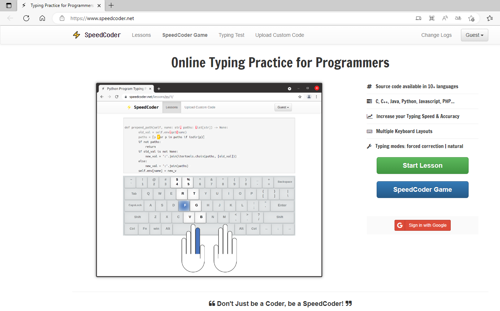
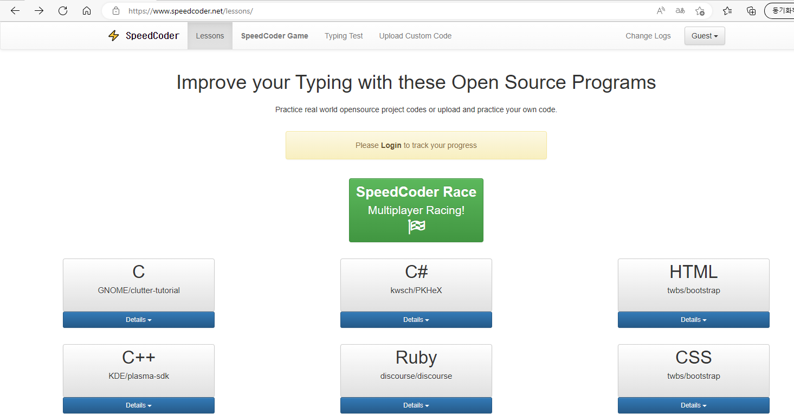
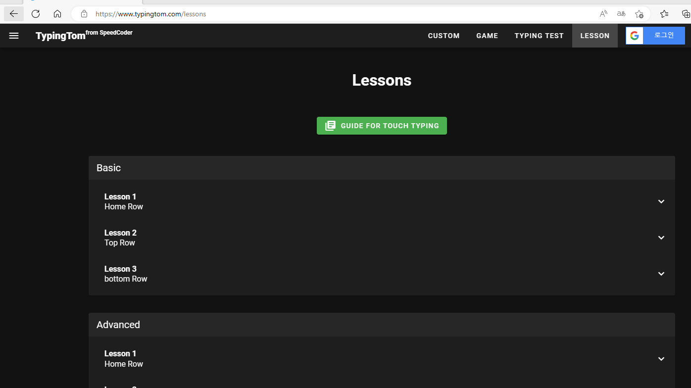

# 타자연습

이제껏 감으로 타자를 치던 습관을 고치고자 영타를 연습해보기로 했습니다. 
사실 연습한지는 포스팅하기 1주일전부터 매일 했지만 지금 올리기 시작하네요 .

제가 타자연습이용하는 사이트는
[https://www.speedcoder.net/](https://www.speedcoder.net/) 입니다.

 

이렇게 각 언어마다 타자연습을 할 수 있고

 

영타를 처음하시는 분들을 위한 자리연습도 할 수 있어요!!

 
저는 타자연습을 오래하진 않고 c#, c++ 타자연습을 끝까지 하고 더 하고 싶으면 c타자연습이나 특수키($%^& 이런거) 자리 연습을 하고 있습니다.
영타가 익숙해질때까지 계속할 생각입니다. 별로 시간도 안걸리고요.