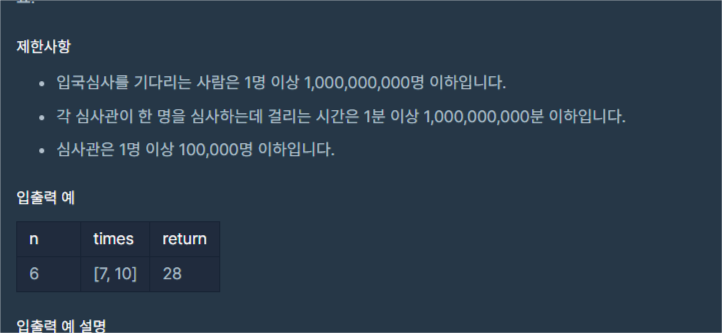

 <br>
이번에 항해99 코딩 스터디를 신청해서 하루하루마다 코테 문제를 풀게 되었습니다. <br>
항해 99 취지에 맞게 푼 문제를 TIL(Today I Learned)으로 제 블로그에 정리해볼까합니다. <br>


# 입국심사
[https://school.programmers.co.kr/learn/courses/30/lessons/43238?language=cpp](https://school.programmers.co.kr/learn/courses/30/lessons/43238?language=cpp)

 <br>

n명이 입국심사를 하는데 각 심사관이 한 명을 심사하는데 걸리는 시간을 배열로 주고<br>
n명이 심사를 받는데 가장 짧게 걸리는 시간을 return 하면 되는 문제입니다. <br>


입력값의 [1, 1,000,000,000]이니 단순하게 풀면 안되고 O(logn)으로 생각해야합니다.<br>
그리고 O(logN)이라 하면 이분탐색입니다. <br>

이분탐색은 정렬된 숫자중에서 내가 원하는 값을 찾는 알고리즘으로 여기서 저희가 찾을건<br>
최소로 걸리는 시간입니다. <br>

그럼 걸리는 시간이 m이라고 했을 때 몇명까지 심사를 받을 수 있을까요? <br>
단순히 심사관 배열을 돌면서 m / 심사관의 배열[i]를 하면 됩니다. <br>
심사관의 배열은 최대 100,000이니까 시간복잡도도 충분합니다. <br>

``` c++
long long Calculate(long long n, const vector<int>&times)
{
    long long result = 0;
    
    for(int time : times)
    {
        result += n / time;
    }
    
    return result;
}
```
이런 식으로 간단하게 짤 수 있겠네요. 그러면 이 값으로 이분탐색을 하면 전체 코드는 다음과 같습니다. <br>

``` c++
#include <string>
#include <vector>
#include <algorithm>
using namespace std;

long long Calculate(long long n, const vector<int>&times)
{
    long long result = 0;
    
    for(int time : times)
    {
        result += n / time;
    }
    
    return result;
}

long long BinarySearch(long long n, const vector<int>&times)
{
    long long start = 1;
    long long end = times[times.size() - 1] * n;
    long long answer = 0;
    while(start < end)
    {
        long long mid = start + (end - start) / 2;
        long long value = Calculate(mid ,times);
        if(value < n)
        {
            start = mid + 1;
        }
        else
        {
            answer = mid;
            end = mid;
        }
    }
    
    return answer;
}

long long solution(int n, vector<int> times) {
    long long answer = 0;
    sort(times.begin(), times.end());
    answer = BinarySearch(n, times);
    return answer;
}
```


# 느낀 점

이전에 풀어본 문제라서 큰 어려움은 없었는데 역시 오랜만에 하다보니 어색하네요. <br>
코드는 후다닥 적었지만 long long과 int 형변환에 있어서 테케가 통과가 되지 않아 시간이 많이 지체되었습니다. <br>
틀려서 괜히 이분탐색 코드가 잘못된줄 알고 엉뚱한 곳만 고쳤네요 <br>
이분탐색에 대한 정확한 이해가 안되서 생긴 일인듯합니다. <br>
조만간 제대로 공부해서 정리가 필요하겠네요. <br>