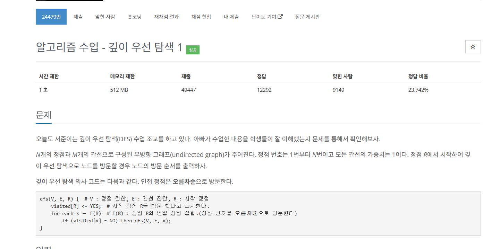

 <br>
오늘도 항해 99문제 TIL입니다. <br>
매주 목요일에는 특강을 하는데 오늘의 문제는 쉬웠으니 특별문제까지 같이 포스팅하겠습니다. <br>


# 알고리즘 수업 - 깊이 우선 탐색 1
[https://www.acmicpc.net/problem/24479](https://www.acmicpc.net/problem/24479)

 <br>

간단하게 dfs를 수행하면 되는 문제입니다. <br>
근데 이제 정렬을 곁들인... <br>

문제 조건 중 인접 정점은 오름차순으로 방문하기에 그래프의 간선 정보를 오름차순으로 정렬할 필요가 있어보입니다. <br>

그리고 dfs할 때 보통 visited[n]이라는 1차원 배열로 방문 여부를 판단하는데 여기에 그 정점까지의 거리를 사용해서 <br>
거리와 방문 여부 둘다 사용할 수 있게 해보겠습니다. <br>
단순한 dfs라 설명할게 없네요. 코드로 보면 다음과 같습니다. <br>

``` c++
#include<iostream>
#include<vector>
#include <algorithm>

using namespace std;

vector<int> graph[100001];
int visited[100001] = { 0, };
int d = 1;

void dfs(int start)
{
    for (int i = 0; i < graph[start].size(); ++i)
    {
        int current = graph[start][i];
        if (visited[current] == 0)
        {
            visited[current] = ++d;
            dfs(current);
        }
    }
}

int main()
{
    ios::sync_with_stdio(false);
    cin.tie(NULL);

    int n, m, start, a, b;
    cin >> n >> m >> start;
    for (int i = 0; i < m; ++i)
    {
        cin >> a >> b;
        graph[a].push_back(b);
        graph[b].push_back(a);
    }
    for (int i = 1; i <= n; ++i)
    {
        sort(graph[i].begin(), graph[i].end());
    }

    visited[start] = 1;
    dfs(start);

    for (int i = 1; i <= n; ++i)
    {
        cout << visited[i] << '\n';
    }
}
```

# 예산
[https://www.acmicpc.net/problem/2512](https://www.acmicpc.net/problem/2512)

 <br>

어제와 마찬가지로 이분탐색을 이용해서 풀 수 있는 문제입니다. <br>
무지성으로 이분탐색을 유추한게 아닙니다. <br>

1. 입력값의 범위가 어마무시하게 크다. <br>
2. 찾으려는 숫자가 정렬된 숫자들 중에 있다. <br>

라는 이유로 이분탐색을 유추할 수 있습니다. <br>

문제의 조건을 잘 봅시다. <br>

1. 모든 요청이 배정될 수 있는 경우에는 요청한 금액을 그대로 배정한다. <br>
2. 모든 요청이 배정될 수 없는 경우에는 특정한 정수 상한액을 계산하여 그 이상인 예산요청에는 모두 상한액을 배정한다. <br>
상한액 이하의 예산요청에 대해서는 요청한 금액을 그대로 배정한다. <br>

조건을 잘 봐야합니다. 저는 1번 조건은 어떻게든 되겠지 했다가 코드 다 적었는데 안돼서 1번 조건 다시 보고 풀었습니다... <br>

1번 조건은 모든 요청이 배정될 수 있다면 요청한 금액을 그대로 배정하는데 요청한 값을 다 더했는데 예산보다 적다면 <br>
간단하게 요청한 금액들의 최댓값을 반환해주면 모든 곳에 요청대로 배정할 수 있습니다. <br>

2번 조건은 모든 요청을 배정할 수 없다면 상한액을 계산해야 합니다. 그럼 여기서 저희는 이분탐색의 mid를 <br>
요청할 수 있는 금액 중 가장 최대값으로 설정합니다. 즉 상한액입니다. <br>

그럼 이 mid로 구한 금액과 총 예산을 비교하며 범위를 줄여나가면 답이 나오게 되어있습니다. <br>

적합한 값 중에 가장 최댓값을 구해야 하니 start(left)를 갱신할 때 mid를 저장해주면 되겠죠! <br>

바로 코드는 다음과 같습니다. <br>

``` c++
#include <iostream>
#include <vector>
#include <algorithm>
using namespace std;

long long Calc(long long target, const vector<int>& vec)
{
    long long result = 0;

    for (int i = 0; i < vec.size(); ++i)
    {
        if (target >= vec[i])
        {
            result += vec[i];
        }
        else
        {
            result += target;
        }
    }

    return result;
}

long long BinarySearch(long long target, const vector<int>& vec)
{
    long long start = 0;
    long long end = target;
    long long result = 0;
    while (start <= end)
    {
        long long mid = start + (end - start) / 2;
        long long value = Calc(mid, vec);
        if (value > target)
        {
            end = mid - 1;
        }
        else
        {
            result = mid;
            start = mid + 1;
        }
    }
    return result;
}

int main()
{
    int num;
    long long n, m;
    vector<int> vec;
    cin >> n;
    for (int i = 0; i < n; ++i)
    {
        cin >> num;
        vec.push_back(num);
    }
    cin >> m;
    sort(vec.begin(), vec.end());

    long long result = 0;
    for (int i = 0; i < vec.size(); ++i)
    {
        result += vec[i];
    }
    if (result <= m)
    {
        cout << vec[vec.size() - 1];
    }
    else
    {
        result = BinarySearch(m, vec);
        cout << result;
    }
}
```


# 느낀 점

dfs는 딱히 큰 어려움이 없었습니다. 그래서 느낀 점이 없어요... <br>
이분탐색은 워낙 입력값이 클 수 있고 또 이전에 데이터타입으로 시간을 낭비해버려서 그냥 다 long long으로 해버렸습니다. <br>
이분탐색에 대해 아직 알쏭달쏭하지만 계속 풀어보고 박치기하니까 알것같기도 한 느낌이네요. <br>
아무튼 두 문제 다 할만한 문제였네요. <br> 