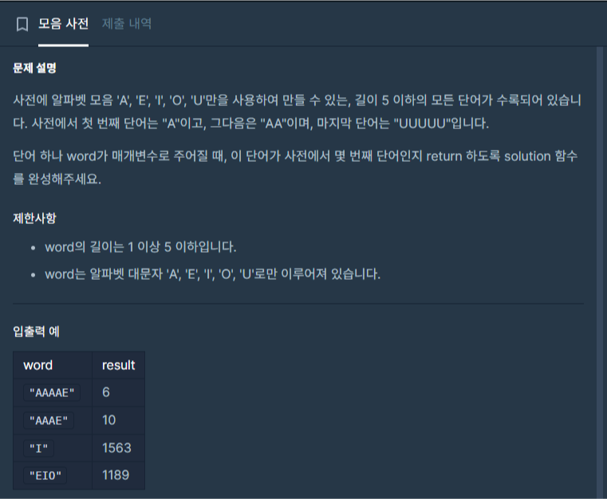
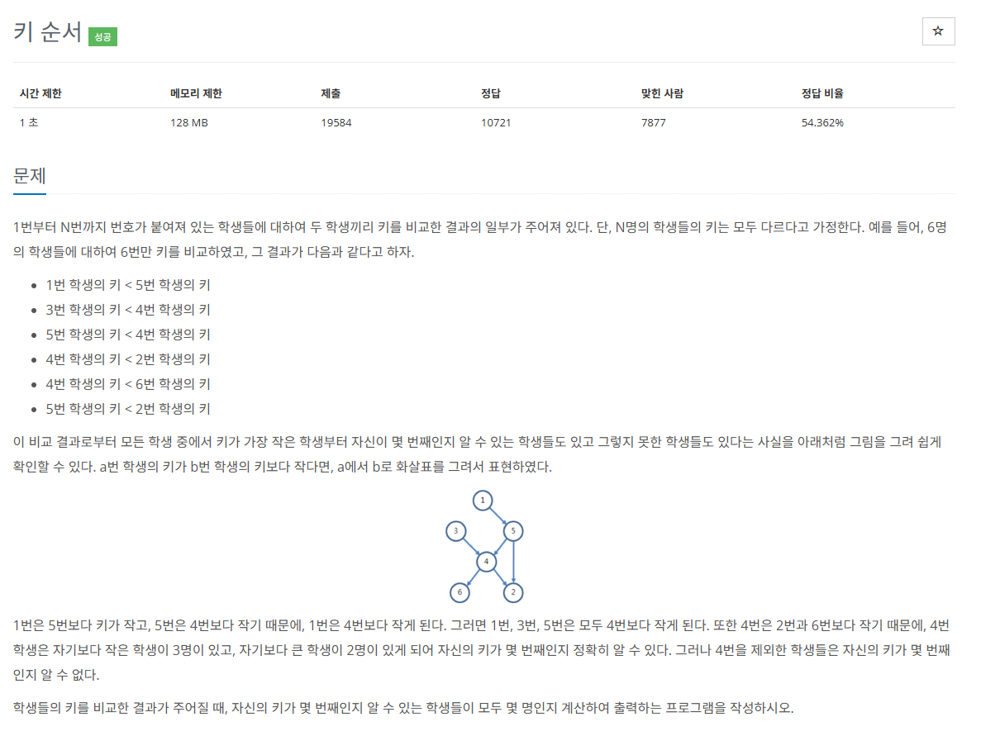
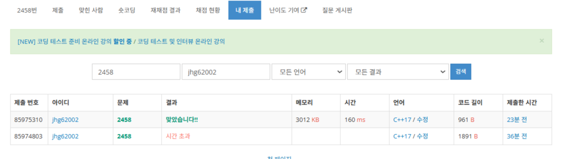

 <br>
오늘도 항해 99 코테 스터디 3번째 TIL입니다. <br>
11월 2일의 미들러 문제와, 11월 3일의 첼린저문제를 풀어봤습니다. <br>

# 모음사전
[https://school.programmers.co.kr/learn/courses/30/lessons/84512](https://school.programmers.co.kr/learn/courses/30/lessons/84512)
 <br>

이전에 풀어본 문제인데다가 블로그에 포스팅도 해놨습니다. <br> 
풀이과정은 똑같으므로 설명은 이전 포스팅을 참조하겠습니다. <br>
[https://hyeonjunje.github.io/codingtest/ProgrammersExhaustiveSearch/#%EB%AA%A8%EC%9D%8C%EC%82%AC%EC%A0%84](https://hyeonjunje.github.io/codingtest/ProgrammersExhaustiveSearch/#%EB%AA%A8%EC%9D%8C%EC%82%AC%EC%A0%84)

이번에 푼 문제의 코드입니다. <br>
``` c++
#include <string>
#include <vector>
#include <map>
#include<iostream>
using namespace std;

int solution(string word) {
    int answer = 0;
    
    string alpha = "AEIOU";
    map<char, int> m;
    int digitNumber[5];
    digitNumber[4] = 1;
    for(int i = 3; i >= 0; --i)
    {
        digitNumber[i] = digitNumber[i + 1] * 5 + 1;
    }
    
    for(int i = 0;i < alpha.size(); ++i)
    {
        m[alpha[i]] = i;
    }
        
    for(int i = 0; i < word.size(); ++i)
    {
        char ch = word[i];
        answer += (1 + m[ch] * digitNumber[i]);
    }
    
    return answer;
}
```

# 키 순서
[https://www.acmicpc.net/problem/2458](https://www.acmicpc.net/problem/2458)

 <br>

딱 문제를 보면 정점이 500으로 굉장히 작습니다. <br>
그래서 막 풀면 될 줄 알고 dfs를 여러번해서 각 정점에 연결된 노드를 저장한다음<br>
모든 dfs가 끝났을 때 정점을 돌면서 다 연결되어있는 정점이라면 count를 1씩 증가시켜줘서 답을 찾을려고 했습니다.<br>

그래서 나온 코드가 <br>

``` c++
#include<iostream>
#include<vector>
#include<set>
#define MAX 501

using namespace std;

set<int> d[MAX];
vector<int> graph[MAX];
bool visited[MAX] = { false, };

void dfs(int start)
{
    visited[start] = true;
    for (int i = 0; i < graph[start].size(); ++i)
    {
        int next = graph[start][i];
        if (!visited[next])
        {
            for (auto it = d[start].begin(); it != d[start].end(); ++it)
            {
                d[next].insert(*it);
            }
            dfs(next);
        }
    }
}

void dfs2(int init, int start)
{
    visited[start] = true;
    d[init].insert(start);
    for (int i = 0; i < graph[start].size(); ++i)
    {
        int next = graph[start][i];
        if (!visited[next])
        {
            dfs2(init, next);
        }
    }
}

void Init(int n)
{
    for (int i = 1; i <= n; ++i)
    {
        visited[i] = false;
    }
}

int main()
{
    ios::sync_with_stdio(false); cin.tie(NULL); cout.tie(NULL);

    int n, m, a, b;
    cin >> n >> m;

    for (int i = 1; i <= n; ++i)
    {
        d[i].insert(i);
    }

    for (int i = 0; i < m; ++i)
    {
        cin >> a >> b;
        graph[a].push_back(b);
    }

    for (int i = 1; i <= n; ++i)
    {
        Init(n);
        dfs(i);
    }
    for (int i = 1; i <= n; ++i)
    {
        Init(n);
        dfs2(i, i);
    }
    int result = 0;
    int answer = 0;
    for (int i = 1; i <= n; ++i)
    {
        answer += i;
    }
    for (int i = 1; i <= n; ++i)
    {
        int temp = 0;
        for (int val : d[i])
        {
            temp += val;
        }
        if (temp == answer)
        {
            result++;
        }
    }
    cout << result;
}
```

테스트케이스는 올바른 답을 반환했지만 제출결과는 시간 초과였습니다. <br>
 <br>

그래서 처음부터 잘못된걸 깨닫고 다시 문제를 읽어봤습니다. <br>
입력 정보를 잘 보면 정점보다 간선의 개수가 훨씬 많습니다. 여기서 무작정 플로이드 와샬 알고리즘이 떠올랐습니다. <br> 

모든 정점끼리의 거리를 구합니다. 각 정점마다 거리는 1로 둡니다. <br>
만약 다 모든 정점이 다 이어져있어 정점마다의 거리를 저장한 배열이 다 갱신되어있으면 키를 정확하게 알 수 있겠죠<br>

예를 들어 4번 정점이라면 <br>
4 -> 1  거리 : INF <br>
4 -> 2  거리 : 1<br>
4 -> 3  거리 : INF<br>
4 -> 4  거리 : 0<br>
4 -> 5  거리 : INF<br>
4 -> 6  거리 : 1<br>
입니다. 방향그래프이다 보니 반대로는 갈 수 없어 그림에선 다 이어져있지만 무한대의 거리이죠<br>
그럼 무한대일 경우에는 반대로 보면됩니다. <br>

1 -> 4  거리 : 2<br>
4 -> 2  거리 : 1<br>
3 -> 4  거리 : 1<br>
4 -> 4  거리 : 0<br>
5 -> 4  거리 : 1<br>
4 -> 6  거리 : 1<br>

이러면 4는 모든 정점과 연결되어있다는것을 알 수 있습니다. <br>

플로이드 와샬을 이용하면 쉽게 구현할 수 있겠죠<br>
그럼 이를 적용시킨 코드는 다음과 같습니다. <br>

``` c++
#include<iostream>
#include<vector>

#define MAX 501
#define INF 1000000
using namespace std;

vector<int> graph[MAX];
int d[MAX][MAX];

void FloydWashal(int n)
{
	for (int k = 1; k <= n; ++k)
	{
		for (int i = 1; i <= n; ++i)
		{
			for (int j = 1; j <= n; ++j)
			{
				if (d[i][j] > d[i][k] + d[k][j])
				{
					d[i][j] = d[i][k] + d[k][j];
				}
			}
		}
	}
}

int main()
{
	ios::sync_with_stdio(false); cin.tie(NULL); cout.tie(NULL);

	int n, m, a, b;
	cin >> n >> m;
	
	for (int i = 1; i <= n; ++i)
	{
		for (int j = 1; j <= n; ++j)
		{
			if (i == j) d[i][j] = 0;
			else d[i][j] = INF;
		}
	}

	for (int i = 0; i < m; ++i)
	{
		cin >> a >> b;
		d[a][b] = 1;
	}


	FloydWashal(n);
	int answer = 0;
	for (int i = 1; i <= n; ++i)
	{
		long long result = 0;
		for (int j = 1; j <= n; ++j)
		{
			if (d[i][j] >= INF)
			{
				result += d[j][i];
			}
			else
			{
				result += d[i][j];
			}
		}
		if (result < INF)
		{
			answer++;
		}
	}
	cout << answer;
}
```


# 느낀 점

모음사전은 오랜만에 푸는데도 그때 인상깊어서 그런가 아직도 풀이방법이 기억이 났었네요<br>
역시 문제를 많이 풀어봐야 좋은듯합니다. <br>
키 순서 문제는 뻘짓을 많이 해서 시간이 좀 걸렸는데 플로이드 와샬을 알아차리니까 푸는데는 시간이 <br>
얼마 걸리지 않았습니다.<br>
늘 생각하지만 입출력의 크기 제한을 제대로 봐야한다는걸 또다시 깨달았습니다.<br>