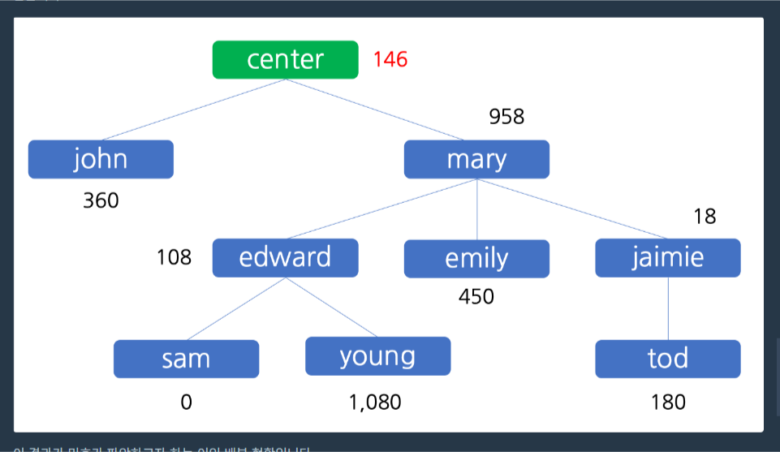
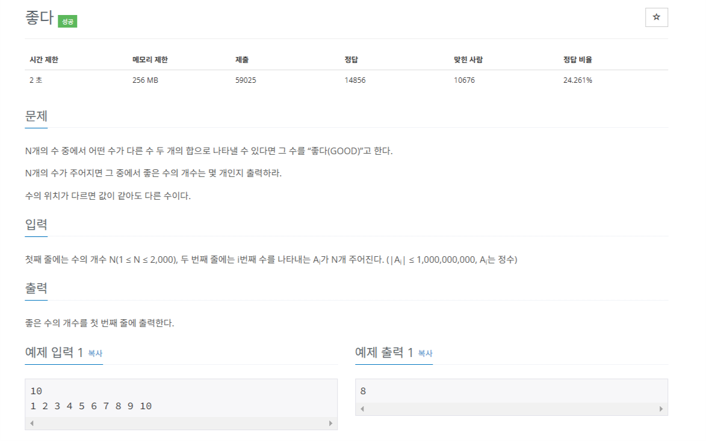
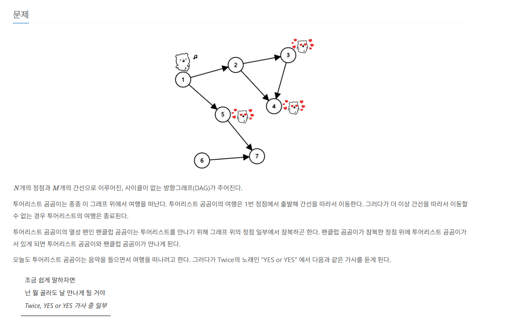
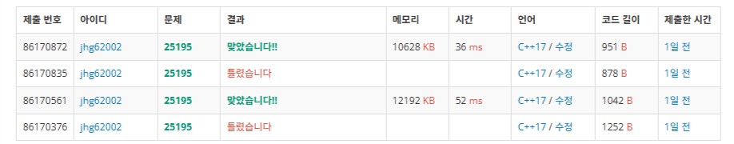
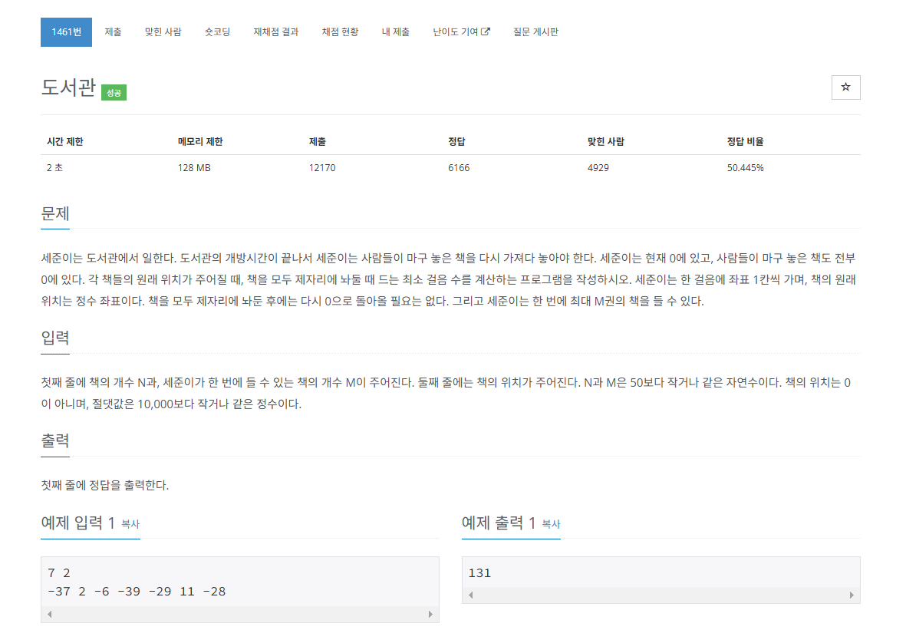

 <br>
오늘도 항해 99 코테 스터디 4번째 TIL입니다. <br>
바빠서 혹은 포스팅할 문제가 별로 없었기에 이때까지 나온 문제 중 흥미로운 문제 위주로 포스팅을 하겠습니다. <br>

# [챌린저 Day 9] 다단계 칫솔 판매
[https://school.programmers.co.kr/learn/courses/30/lessons/77486](https://school.programmers.co.kr/learn/courses/30/lessons/77486)
 <br>

이 문제 같은 경우 상당히 재밌었습니다. <br>
C++은 코테할 때만 사용하기에 클래스를 만들 일이 없는데 이번에는 tree class를 직접 만들어야 하는 문제였습니다.<br>

이 문제는 알고리즘이 아닌 단순 자료구조 문제였습니다. <br>
하지만 그 자료구조를 직접 만들어야만 하죠<br>

입력으로 seller와 그에 따른 amount를 주기 때문에 enroll, referral로 tree를 만들고 selloer를 돌면서 <br>
그 부모 노드를 따라가며 분배금을 계산하면 됩니다. <br>

``` c++
#include <string>
#include <vector>
#include <map>
#include<iostream>
using namespace std;

class Node
{
public:
    string nodeName;

    Node* parent;

    int money = 0;
    int totalMoney = 0;

    // 기본 생성자 추가
    Node() : parent(nullptr) {}

    // 이름을 초기화하는 생성자
    Node(string name) : nodeName(name), parent(nullptr) {}

    bool hasParent() const
    {
        return parent != nullptr;
    }
};

map<string, Node> m;

vector<int> solution(vector<string> enroll, vector<string> referral, vector<string> seller, vector<int> amount) {
    vector<int> answer;

    m["(root)"] = Node("(root)"); 

    for (int i = 0; i < enroll.size(); ++i)
    {
        Node node(enroll[i]);
        m[enroll[i]] = node;
    }

    for (int i = 0; i < enroll.size(); ++i)
    {
        string nodeName = enroll[i];
        string parentName = referral[i];
        if (parentName == "-")
        {
            m[nodeName].parent = &m["(root)"];
        }
        else
        {
            m[nodeName].parent = &m[parentName];
        }

    }

    for (int i = 0; i < seller.size(); ++i)
    {
        string sellerName = seller[i];
        int cost = amount[i] * 100;
        int remainCost = 0;

        Node* node = &m[sellerName];

        while (node->hasParent())
        {
            int upperCost = cost / 10;
            int remainCost = cost - upperCost;
            node->money += remainCost;

            node = node->parent;
            cost = upperCost;

            if (cost < 1) break;
        }
        node = &m[sellerName];
        while (node->hasParent())
        {
            node->totalMoney += node->money;

            node->money = 0;
            node = node->parent;
        }
    }

    for (int i = 0; i < enroll.size(); ++i)
    {
        answer.push_back(m[enroll[i]].totalMoney);
    }

    return answer;
}
```
저는 map을 사용해서 이름으로 해당 노드를 바로 찾을 수 있게 했습니다. <br>
그리고 각 노드는 parent를 가지고 있어 parent가 없을 때 까지 while문으로 분배금을 계산했습니다. <br>
seller의 길이가 n이라면 시간복잡도는 O(nlogn) 이겠네요.<br>
n <= 100,000이니까 입력 조건은 충족하게 될겁니다! <br>


# [챌린저 Day 10] 좋다
[https://www.acmicpc.net/problem/1253](https://www.acmicpc.net/problem/1253)

 <br>

입력과 출력이 단순한 문제입니다.  직관적이라 문제 이해는 좋습니다. <br>
어떤 수가 다른 수 두 개의 합으로 나타낼 수 있다면 카운트를 하면 됩니다. <br>

입력조건부터 보면 수의 개수는 2,000개 입니다. O(n^2)까지는 가능하다는 얘기입니다. <br>

수의 배열을 돌면서 투포인터로 알맞은 값을 정해가며 구해주면 O(n^2)가 될겁니다.<br>
우선 투포인터를 하기 위해 정렬을 해야합니다.<br>

입력을 보면 수의 값은 음수도 될 수 있습니다. 따라서 투포인터를 할 때 배열의 처음과 끝을 left(start)와 right(end)로 잡아야 합니다. <br>
그리고 자기 자신은 포함하면 안되고요 <br>

이러한 조건을 생각하여 코드를 짜면 다음과 같습니다. <br>

``` c++
#include<iostream>
#include<vector>
#include<algorithm>

using namespace std;

int main()
{
	ios::sync_with_stdio(false); cin.tie(NULL); cout.tie(NULL);

	vector<long long> v;
	int n;
	long long a;
	cin >> n;
	for (int i = 0; i < n; ++i)
	{
		cin >> a;
		v.push_back(a);
	}

	sort(v.begin(), v.end());
	
	int result = 0;
	int start, end;
	for (int i = 0; i < v.size(); ++i)
	{
		start = 0;
		end = v.size() - 1;

		while (start < end)
		{
			if (i == end)
			{
				end--;
				continue;
			}
			if (i == start)
			{
				start++;
				continue;
			}


			if (v[i] > v[start] + v[end])
			{
				start++;
			}
			else if(v[i] <= v[start] + v[end])
			{
				if (v[i] == v[start] + v[end])
				{
					result++;
					break;
				}
				end--;
			}
		}
	}

	cout << result;
}
```

현재 선택한 인덱스(i)가 end와 같다면 end를 하나 줄여줘야겠죠. start도 마찬가지고요. 자기자신은 포함이 안되니까! <br>
그리고 while조건문에 의해 start, end가 같은 값이 절대로 될수도 없습니다. <br>
수들의 범위가 크기 때문에 혹시 몰라 long long으로 자료형을 정했습니다. <br>


# [미들러 Day 11] yes or yes
[https://www.acmicpc.net/problem/25195](https://www.acmicpc.net/problem/25195)

 <br>

이 문제는 딱 보고 dfs가 떠올랐습니다. <br> 
대신 모든 경로를 끝까지 가서 그 경로에 팬클럽이 있으면 체크를 해줘야하죠. <br>

그래서 처음에는 방문처리를 하지 않는 dfs로 문제를 풀어서 제출했습니다. <br>

``` c++
#include<iostream>
#include<vector>
#define MAX 100001

using namespace std;

vector<int> graph[MAX];
bool fan[MAX];
bool result = true;

void dfs(int start, bool isFan)
{
    if (graph[start].size() == 0)
    {
        if (!isFan)
        {
            result = false;
        }
    }

    for (int i = 0; i < graph[start].size(); ++i)
    {
        int next = graph[start][i];

        if (fan[next] || isFan)
        {
            dfs(next, true);
        }
        else
        {
            dfs(next, false);
        }
    }
}

int main()
{
    ios::sync_with_stdio(false); cin.tie(NULL); cout.tie(NULL);

    int n, m, u, v, s, S;
    cin >> n >> m;
    for (int i = 0; i < m; ++i)
    {
        cin >> u >> v;
        graph[u].push_back(v);
    }
    cin >> s;
    for (int i = 0; i < s; ++i)
    {
        cin >> S;
        fan[S] = true;
    }

    dfs(1, fan[1]);

    if (result)
    {
        cout << "Yes";
    }
    else
    {
        cout << "yes";
    }
}
```

문제는 정답이었습니다. 다만, 다른 사람들 결과를 보면서 시간이 좀 느리다는 것을 확인할 수 있었습니다. <br>

다른 사람들의 코드를 확인해본결과 dfs를 진행하는데 그 경로에 팬클럽이 있으면 그 다음 경로는 계산을 안하는 거였습니다. <br>
생각해보면 당연한 말이죠. 팬클럽이 있으면 그 경로를 계산을 안해도 해당 경로는 팬클럽이 있는 경로니까요! <br>

따라서 이를 상정하여 코드를 짜면 다음과 같습니다. <br>
``` c++
#include<iostream>
#include<vector>
#define MAX 100001

using namespace std;

vector<int> graph[MAX];
bool fan[MAX];
bool result = true;

void dfs(int start)
{
    if (graph[start].size() == 0)
    {
        if (!fan[start])
        {
            result = false;
        }
    }

    for (int i = 0; i < graph[start].size(); ++i)
    {
        int next = graph[start][i];

        if(!fan[next])
        {
            dfs(next);
        }
    }
}

int main()
{
    ios::sync_with_stdio(false); cin.tie(NULL); cout.tie(NULL);

    int n, m, u, v, s, S;
    cin >> n >> m;
    for (int i = 0; i < m; ++i)
    {
        cin >> u >> v;
        graph[u].push_back(v);
    }
    cin >> s;
    for (int i = 0; i < s; ++i)
    {
        cin >> S;
        fan[S] = true;
    }

    if(fan[1])
    {
        cout << "Yes";
        return 0;
    }
    
    dfs(1);

    if (result)
    {
        cout << "Yes";
    }
    else
    {
        cout << "yes";
    }
}
```
 <br>
시간이 준것을 확인할 수 있습니다. <br>


# [챌린저 Day 11] 도서관
[https://www.acmicpc.net/problem/1461](https://www.acmicpc.net/problem/1461)

 <br>

책을 가져다 놓는 행위는 단순하므로 그리디하게 생각하면 답이 쉽게 나옵니다. <br>
그리고 또 중요한 점은 책을 모두 제자리에 놔둔 후에는 다시 0으로 돌아올 필요가 없죠 <br>

그럼 그리디하게 매번 움직일 때는 먼것부터 계산하고 가장 먼 책은 마지막에 가져다 놓으면 최소거리가 되겠네요. <br>

거리는 음수, 양수가 있으니 음수와 양수를 왔다갔다 하는건 낭비니까 음수 따로, 양수 따로 생각을 해야했습니다. <br>

그래서 음수용, 양수용 우선순위 큐를 만들고 그 우선순위 큐의 내용물이 다 빠질 때까지 연산을 하도록 했습니다. <br>

그리고 연산을 하기 전에 제일 거리가 먼 책을 미리 계산해서 마지막에 다시 돌아올 필요가 없다는 조건을 잘 이용했죠 <br>

지금 생각해보면 정렬해서 스택2개로 해도 되겠는데(더 빠를듯...) 우선순위 큐가 편리해서 사용한듯합니다. <br>

우선순위 큐로 가장 거리가 먼 값을 pop해서 한번에 가져올 수 있는 만큼(M) 우선순위 큐에 추가로 빼주면 되겠습니다. <br>

그럼 이를 적용한 코드는 다음과 같습니다. <br>

``` c++
#include<iostream>
#include<algorithm>
#include<queue>

using namespace std;

int main()
{
    ios::sync_with_stdio(false); cin.tie(NULL); cout.tie(NULL);

    int n, m, a;
    cin >> n >> m;
    int result = 0;

    priority_queue<int> pos;
    priority_queue<int> neg;

    for (int i = 0; i < n; ++i)
    {
        cin >> a;
        if (a < 0)
        {
            neg.push(-a);
        }
        else
        {
            pos.push(a);
        }
    }

    int negValue = 0;
    int posValue = 0;

    if (!neg.empty())
    {
        negValue = neg.top();
    }
    if(!pos.empty())
    {
        posValue = pos.top();
    }

    if (negValue > posValue)
    {
        for (int i = 0; i < m; ++i)
        {
            if (!neg.empty())
            {
                neg.pop();
            }
        }
    }
    else
    {
        for (int i = 0; i < m; ++i)
        {
            if (!pos.empty())
            {
                pos.pop();
            }
        }
    }
    result = max(negValue, posValue);

    while (true)
    {
        if (pos.empty() && neg.empty())
        {
            break;
        }

        if (pos.empty() && !neg.empty()) // 음수만 있으면
        {
            result += neg.top() * 2;
            for (int i = 0; i < m; ++i)
            {
                if (!neg.empty())
                {
                    neg.pop();
                }
            }
        }
        else if (!pos.empty() && neg.empty()) // 양수만 있으면
        {
            result += pos.top() * 2;
            for (int i = 0; i < m; ++i)
            {
                if (!pos.empty())
                {
                    pos.pop();
                }
            }
        }
        else // 둘다 있으면
        {
            negValue = neg.top();
            posValue = pos.top();

            if (negValue <= posValue)
            {
                result += pos.top() * 2;
                for (int i = 0; i < m; ++i)
                {
                    if (!pos.empty())
                    {
                        pos.pop();
                    }
                }
            }
            else
            {
                result += neg.top() * 2;
                for (int i = 0; i < m; ++i)
                {
                    if (!neg.empty())
                    {
                        neg.pop();
                    }
                }
            }
        }
    }
    cout << result;
}
```
코드를 생각나는대로 적어서 필요이상으로 긴 코드가 되었습니다. <br>
그래도 정답처리를 받을 수 있으니 됐습니다. <br>

# 느낀 점

문제는 매일매일 풀고있지만 바빠서 포스팅은 매일 하질 못하고 있습니다. <br>
그래도 풀면서 포스팅하면 좋겠다는 문제를 기억했다가 주말에 몰아서 정리하고자 해서 이렇게 정리해봤습니다. <br>

트리 자료구조를 직접 만드는 과정이 재밌었는데 오랜만에 C++클래스도 만들어보고 좋았습니다. 아직 많이 미숙하지만요 <br>

마지막 문제 우선순위 큐를 2개 쓴다는 생각도 흥미로웠습니다. <br>
전에 기업 코테를 봤을 때 우선순위 큐 2개 쓰면 풀리는 문제가 있었는데 그때는 그 생각을 못했거든요<br>
비록 연습이지만 이번에는 잘 생각해서 풀어서 기분이 좋습니다. <br>