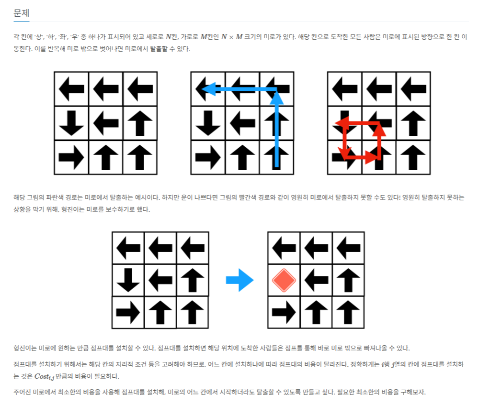
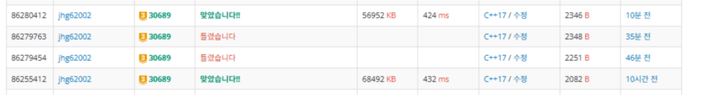

 <br>
오늘도 항해 99 코테 스터디 5번째 TIL입니다. <br>
주말인데 재밌는 문제가 나왔습니다. 난이도도 무려 골드 3입니다. <br>

# [챌린저 Day 13] 미로보수
[https://www.acmicpc.net/problem/30689](https://www.acmicpc.net/problem/30689)
 <br>

그래프에서 사이클이 있는지 판단하고 그 사이클을 없앨 수 있는 최소한의 비용을 구하는 문제입니다. <br>
그래프 사이클 판단은 [https://www.acmicpc.net/problem/16724](https://www.acmicpc.net/problem/16724)문제에서 경험한 적이 있기에<br>
기억을 더듬어 문제를 풀어보았습니다.  <br>

사이클을 판단하는 문제의 가장 큰 아이디어는 방문처리하는 isVisited배열과 dfs가 진행중인지 아닌지 판단하는 isFinished(보통은 진행중인지를 나타내는 isExcute를 사용...)배열! <br>
2개의 배열을 사용합니다. <br>
그래서 dfs하는 도중인데 방문한 노드가 다음 확인하려는 노드이다? <br>
그러면 사이클이 감지가 된것입니다. <br>

더이상 갈 곳이 없으면 백트래킹으로 dfs가 끝났다는것을 저장하면 됩니다! <br>

풀면서 중요한 점은 사이클의 비용만 연산을 해야합니다. <br>
예를 들어<br>

D R R <br>
D L R <br>
R U D <br>
같은 경우에는 (1,2)(1,3)(2,3)(2,2) 가 사이클입니다. (왼쪽 위에를 1, 1로 잡고 (x, y)로 생각하면)<br>
하지만 (1,1)에서 dfs를 실행하면 경로에 (1,1)이 포함되어 (1,1)이 최소비용이라면 잘못된 오답을 반환할 수 있습니다.<br>
따라서 모든 좌표에서 dfs를 수행하는데 사이클만 연산을 해야합니다.<br>

처음 생각난 방법은 방문을 판단하는 isVisited배열이 방문한 횟수라고 생각해서 2이상이면 사이클이라 판단하는 식으로 구현했습니다.<br>
즉 2바퀴를 도는거죠! <br>
코드는 다음과 같습니다. <br>

``` c++
#include<iostream>
#include<utility>
#include<algorithm>
#define MAX 2001
using namespace std;

pair<int, int> arr[MAX][MAX];
int cost[MAX][MAX];
int result = 0;
int isVisited[MAX][MAX];  // 방문 여부
bool isFinished[MAX][MAX]; // 해당 dfs가 끝났는지 여부
bool isCycle = false;

bool isRange(int x, int y, int m, int n)
{
    return x > 0 && y > 0 && x <= m && y <= n;
}

void dfs(int x, int y, int m, int n)
{
    isVisited[y][x]++;

    int nextX = x + arr[y][x].second;
    int nextY = y + arr[y][x].first;

    if (!isRange(nextX, nextY, m, n))
    {
        isFinished[y][x] = true;
        return;
    }

    if (isFinished[nextY][nextX])
    {
        isFinished[y][x] = true;
        return;
    }

    if (isVisited[nextY][nextX] >= 2)
    {
        isCycle = true;
        result = cost[y][x];
        isFinished[y][x] = true;
        return;
        // 사이클 발생
    }
    else
    {
        dfs(nextX, nextY, m, n);
    }
    isFinished[y][x] = true;

    if (isCycle && isVisited[y][x] >= 2)
    {
        result = min(result, cost[y][x]);
    }
}

void Init(int n, int m)
{
    result = 0;
    isCycle = false;
}

int main()
{
    ios::sync_with_stdio(false); cin.tie(NULL); cout.tie(NULL);

    int n, m, answer = 0;
    char c;
    cin >> n >> m;

    for (int i = 1; i <= n; ++i)
    {
        for (int j = 1; j <= m; ++j)
        {
            cin >> c;

            if (c == 'D')
                arr[i][j] = { 1, 0 };
            else if (c == 'U')
                arr[i][j] = { -1, 0 };
            else if (c == 'L')
                arr[i][j] = { 0, -1 };
            else if (c == 'R')
                arr[i][j] = { 0, 1 };
        }
    }

    for (int i = 1; i <= n; ++i)
    {
        for (int j = 1; j <= m; ++j)
        {
            cin >> cost[i][j];
        }
    }

    for (int i = 1; i <= n; ++i)
    {
        for (int j = 1; j <= m; ++j)
        {
            Init(n, m);

            dfs(j, i, m, n);

            if (isCycle)
            {
                answer += result;
            }
        }
    }
    cout << answer;
}
```

문제를 풀긴했지만 2바퀴돌리는것보다 좋은방법이 없을까? 생각했는데 stack을 이용한 방법을 생각했습니다. <br>
매 실행마다 stack에 좌표를 넣고 사이클이 판단되는 시점(isVisited[nextY][nextX] 이 true 인 곳)에 해당 좌표를 기억했다가<br>
dfs종료 후 stack을 빼주면서 저장한 좌표와 같은 점이라면 그 이후는 연산을 안하는거죠! <br>
조금은 연산이 줄어 빠를거라 생각했습니다. <br>

코드는 다음과 같습니다. <br>
``` c++
#include<iostream>
#include<utility>
#include<algorithm>
#include<stack>
#define MAX 2001
using namespace std;

pair<int, int> arr[MAX][MAX];
int cost[MAX][MAX];
bool isVisited[MAX][MAX];  // 방문 여부
bool isFinished[MAX][MAX]; // 해당 dfs가 끝났는지 여부
bool isCycle = false;
stack<pair<int, int>> s;
pair<int, int> top;

bool isRange(int x, int y, int m, int n)
{
    return x > 0 && y > 0 && x <= m && y <= n;
}

void dfs(int x, int y, int m, int n)
{
    isVisited[y][x] = true;
    s.push({ x, y });
    int nextX = x + arr[y][x].second;
    int nextY = y + arr[y][x].first;

    if (!isRange(nextX, nextY, m, n))
    {
        isFinished[y][x] = true;
        return;
    }

    if (isFinished[nextY][nextX])
    {
        isFinished[y][x] = true;
        return;
    }

    if (isVisited[nextY][nextX])
    {
        // 사이클 발생
        isCycle = true;
        isFinished[y][x] = true;
        top = { nextX, nextY };
        return;
    }
    else
    {
        dfs(nextX, nextY, m, n);
    }
    isFinished[y][x] = true;
}

void Init(int n, int m)
{
    while (!s.empty())s.pop();
    isCycle = false;
}

int GetMinCost()
{
    int value = 100000000;
    while (!s.empty())
    {
        pair<int, int> p = s.top();
        s.pop();
        value = min(value, cost[p.second][p.first]);
        if (p == top)
        {
            break;
        }
    }
    return value;
}

int main()
{
    ios::sync_with_stdio(false); cin.tie(NULL); cout.tie(NULL);

    int n, m, answer = 0;
    char c;
    cin >> n >> m;

    for (int i = 1; i <= n; ++i)
    {
        for (int j = 1; j <= m; ++j)
        {
            cin >> c;

            if (c == 'D')
                arr[i][j] = { 1, 0 };
            else if (c == 'U')
                arr[i][j] = { -1, 0 };
            else if (c == 'L')
                arr[i][j] = { 0, -1 };
            else if (c == 'R')
                arr[i][j] = { 0, 1 };
        }
    }

    for (int i = 1; i <= n; ++i)
    {
        for (int j = 1; j <= m; ++j)
        {
            cin >> cost[i][j];
        }
    }

    for (int i = 1; i <= n; ++i)
    {
        for (int j = 1; j <= m; ++j)
        {
            Init(n, m);

            dfs(j, i, m, n);

            if (isCycle)
            {
                answer += GetMinCost();
            }
        }
    }
    cout << answer;
}
```
이 코드도 정답처리가 되긴합니다. <br>
다만 이전 2바퀴도는것보다 거의 동일합니다... <br>

 <br>


# 느낀 점

더 효율적이라고 생각했는데 시간차이가 별로 안났습니다. <br>
그리고 코드가 너무 더러워서 좀 정리해서 제출한 코드가 있는데 괄호만 좀 정리하고 if문 좀 정리했는데<br>
시간이 약간약간씩 달라지는거 보면 제가 생각한 1번째와 2번째 풀이가 거의 똑같다고 생각이 되네요<br>

그래도 여러 방면에서 생각해본게 언젠가는 도움이 될겁니다. <br>