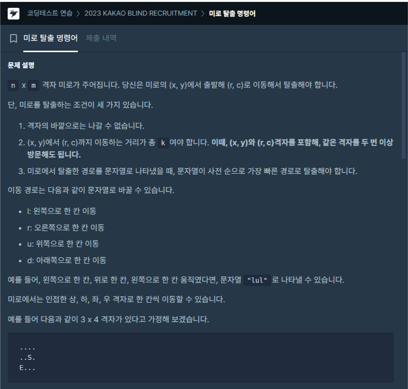

 <br>
오늘도 항해 99 코테 스터디 6번째 TIL입니다. <br>
이번에는 1시간반동안 못풀어서 다른분들의 코드를 많이 참고했습니다. <br>
배운걸 정리해봅시다. <br> 

# [챌린저 Day 14] 미로 탈출 명령어
[https://school.programmers.co.kr/learn/courses/30/lessons/150365#qna](https://school.programmers.co.kr/learn/courses/30/lessons/150365#qna)
 <br>

그리디, 휴리스틱 알고리즘 적용 <br>

n*m 격자에 출발점과 도착점이 있을 때 무조건! k번 이동해서 도착점을 이동했을 때 경로 중 문자열이 사전 순으로 가장 빠른 경로를 구하는 문제입니다. <br>

이동할 수 있는 방향은 상, 하, 좌, 우 입니다. <br>
사전순으로는 d, l, r, u (하, 왼, 우, 상) 입니다. <br>

푸는 아이디어는 다음과 같습니다. <br>
그리디하게 dlru순으로 이동합니다. 근데 만약 d로 이동했는데 거리가 k보다 멀면 l로 갑니다. <br>
이런 방법으로 가면 답이 나오게 됩니다. <br>

거리를 구하는 방식은 상하좌우 이동이니 <br>
``` c++
int distance = abs(n - x) + abs(m - y);
```
입니다. <br>

이동이 불가할 경우 "impossible"을 반환해야합니다. <br>
1. 이동이 불가할 경우는 출발점과 도착점의 거리가 k보다 큰 경우<br>
2. 거리가 k보다 작지만 그 차가 홀수인 경우<br>
입니다. <br>

2번같은 경우에는 다시 돌아와야하는데 홀수면 도착지점으로 못돌아오기 때문이죠<br>

그럼 이러한 아이디어로 코드를 짜면 다음과 같습니다.<br>
다른 사람 코드를 참조했습니다... <br>


``` c++
#include <string>
#include <vector>
#include<algorithm>

using namespace std;

int getDist(int x, int y, int nx, int ny)
{
    return abs(nx - x) + abs(ny - y);
}

bool CanGo(int distance, int k)
{
    return distance <= k && (k - distance) % 2 == 0;
}

string solution(int n, int m, int x, int y, int r, int c, int k) {
    string answer = "";
    
    int distance = getDist(x, y, r, c);

    if(!CanGo(distance, k))
        return "impossible";
    
    while(k--)
    {
        if(x < n && getDist(x + 1, y, r, c) <= k) {answer += 'd'; x++;}
        else if(y > 1 && getDist(x, y - 1, r, c) <= k) {answer += 'l'; y--;}
        else if(y < m && getDist(x, y + 1, r, c) <= k) {answer += 'r'; y++;}
        else if(x > 1 && getDist(x - 1, y, r, c) <= k) {answer += 'u'; x--;}
    }
    
    return answer;
}
```

코드가 참 깔끔합니다. <br>
x, y가 격자 밖으로 나가지 않도록 조건을 주는데 그 순서가 dlru 순입니다. <br>

1. x가 제일 밑에 있지 않다면 거리만 된다면 u를 우선시합니다.<br>
2. 1번이 안될 경우 y가 1이 아니고 거리만 된다면 l을 우선시합니다. <br>
3. 2번이 안될 경우 y가 제일 오른쪽에 있지 않고 거리만 된다면 r을 우선시합니다.<br>
4. 3번이 안될 경우 x가 제일 위에 있지 않고 거리만 된다면 u을 우선시합니다. <br>


# 느낀 점

무작정 코드만 치다보니 코드가 더러워지고 알아보기 힘들어졌습니다. <br>
어려운 문제라면 생각을 일단 많이 해야겠습니다. <br>
또 다른 사람의 코드를 보면서 아이디어를 깔끔하게 코드로 구현하는 것을 보고 감탄했습니다.<br>
아직도 많이 많이 연습이 필요합니다...<br>