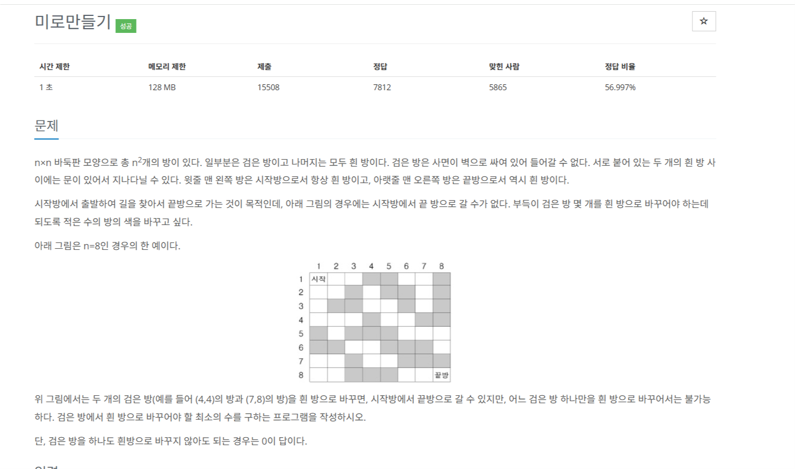
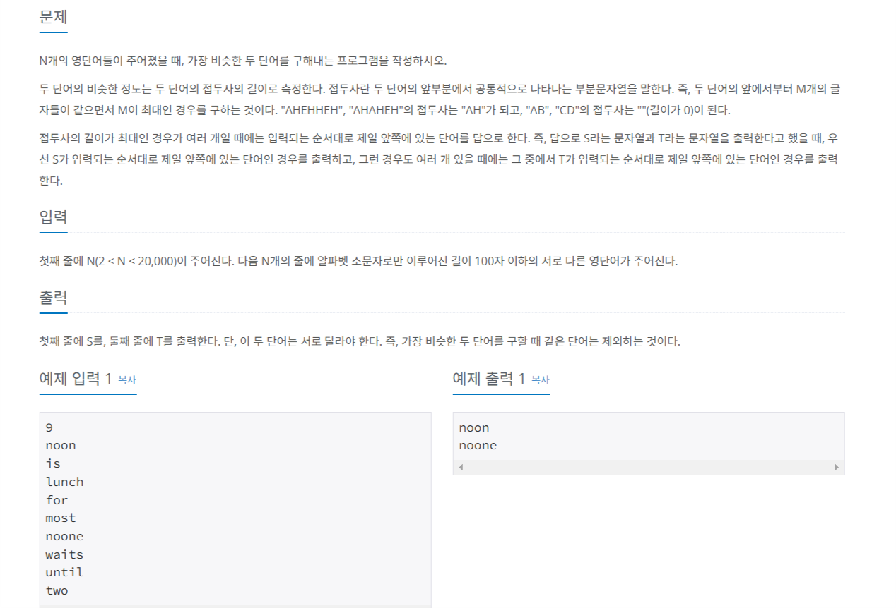
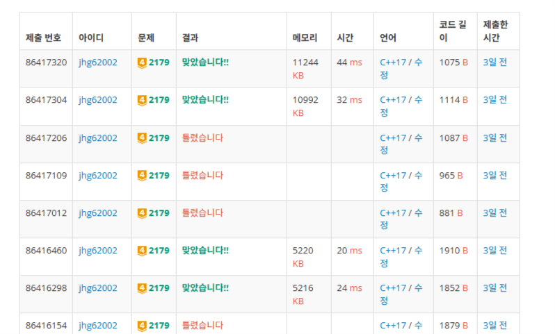
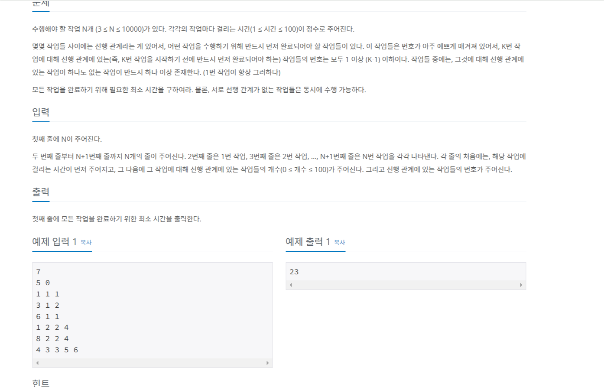

 <br>
오늘도 항해 99 코테 스터디 7번째 TIL입니다. <br>
이번에 포스팅할 문제는 챌린저 문제 3가지입니다.

# [챌린저 Day 15] 미로만들기
[https://www.acmicpc.net/problem/2665](https://www.acmicpc.net/problem/2665)
 <br>

상하좌우로 이동하여 격자타일에서 (1, 1)에서 (N, N)으로 가는 방법 중 방의 색을 최소한으로 바꾸는 경로를 찾는 문제입니다. <br>

격자 타일에서 상하좌우로 목표위치까지 최소경로로 가는 거는 단순히 bfs를 수행하면 됩니다. <br>

하지만 여기서 방의 색을 바꿔서 갈 수 없는 곳을 가게 만들어서 경로를 계산해야하죠. <br>

bfs를 하면서 해당 타일까지 색을 바꾼 횟수를 같이 계산해주면 문제를 풀 수 있습니다. <br>

코드를 짜기 전 경우의 수를 정리해봅시다. <br>

1. 처음 가는 타일이면 <br>
 1) 흰방이면 그냥 이동한다. <br>
 2) 검은방이면 바꾼횟수를 1늘려주고 이동한다. <br>
2. 방문한 타일이면 <br>
 1) 흰방이면 바꾼횟수가 더 적은 곳이라면 이동한다. <br>
 2) 검은방이면 바꾼횟수 + 1보다 적은 곳이라면 바꾼횟수를 최신화하고 이동한다. <br>

 
이 경우를 생각하여 코드를 짜면 다음과 같습니다. <br>
``` c++
#include<iostream>
#include<queue>
#include<utility>
#define MAX 51

using namespace std;

pair<bool, int> isVisited[MAX][MAX]; // 방문여부, 부순 횟수
bool room[MAX][MAX];

bool isRange(int x, int y, int n)
{
    return x > 0 && y > 0 && x <= n && y <= n;
}

void bfs(int n)
{
    int dx[4] = { 0, 0, 1, -1 };
    int dy[4] = { 1, -1, 0, 0 };

    pair<int, int> start = { 1, 1 };
    isVisited[1][1] = { true, 0 };
    queue<pair<int, int>> q;
    q.push(start);

    while (!q.empty())
    {
        pair<int, int> cur = q.front();
        int breakCount = isVisited[cur.second][cur.first].second;
        q.pop();

        for (int i = 0; i < 4; ++i)
        {
            int nextX = cur.first + dx[i];
            int nextY = cur.second + dy[i];

            if (!isRange(nextX, nextY, n))
                continue;

            if (!isVisited[nextY][nextX].first) // 방문안된 곳이라면
            {
                if (room[nextY][nextX]) // 흰방이면
                {
                    q.push({ nextX, nextY });
                    isVisited[nextY][nextX] = { true, breakCount };
                }
                else
                {
                    q.push({ nextX, nextY });
                    isVisited[nextY][nextX] = { true, breakCount + 1 };
                }
            }
            else // 방문된 곳이라면
            {
                if (room[nextY][nextX]) // 흰방이면
                {
                    if (isVisited[nextY][nextX].second > breakCount)
                    {
                        q.push({ nextX, nextY });
                        isVisited[nextY][nextX] = { true, breakCount };
                    }
                }
                else
                {
                    if (isVisited[nextY][nextX].second > breakCount + 1)
                    {
                        q.push({ nextX, nextY });
                        isVisited[nextY][nextX] = { true, breakCount + 1 };
                    }
                }
            }
        }
    }
}

int main()
{
    ios::sync_with_stdio(false); cin.tie(NULL); cout.tie(NULL);

    int n;
    string s;
    cin >> n;
    for (int i = 1; i <= n; ++i)
    {
        cin >> s;
        for (int j = 1; j <= n; ++j)
        {
            room[i][j] = (s[j - 1] == '1');
        }
    }

    bfs(n);

    cout << isVisited[n][n].second;
}
```


# [챌린저 Day 16] 비슷한 단어
[https://www.acmicpc.net/problem/2179](https://www.acmicpc.net/problem/2179)
 <br>

여러 단어들이 주어지고 이 중 접두사가 가장 공통되는 부분이 많은 두 단어를 고르는 문제입니다. <br>
그리고 두 단어 중 순서는 입력으로 주어진 순서입니다. <br>

이 문제를 딱 보고 정렬을 먼저 해야겠다는 생각이 듭니다. <br>

처음 문제를 풀 때는 정렬한 뒤 i번째와 i - 1번째의 접두사를 확인해서 가장 긴 접두사를 저장해서 문제를 풀려고 했습니다. <br>

의식의 흐름대로 코드를 짜면 다음과 같았습니다. <br>

``` c++
#include<iostream>
#include<algorithm>
#include<vector>

using namespace std;

struct MyData
{
	int len = 0;
	bool isMatch = true;
	int index = 0;
};

bool comp(pair<string, MyData> a, pair<string, MyData> b)
{
	return a.first < b.first;
}

int main()
{
	string s;
	int n;
	cin >> n;
	int maxResult = 0;

	vector<pair<string, MyData>> v;
	vector<string> vOrigin;
	int maxLen = 0;
	for (int i = 0; i < n; ++i)
	{
		cin >> s;
		MyData da = { 0, true, i };
		v.push_back({ s, da });

		vOrigin.push_back(s);
	}

	sort(v.begin(), v.end(), comp);

	for (int i = 0; i <= 100; ++i)
	{
		for (int j = 1; j < n; ++j)
		{
			if (v[j].first.size() > i && v[j - 1].first.size() > i)
			{
				if (v[j].first[i] == v[j - 1].first[i]) // 글자가 같으면
				{
					if (v[j].second.isMatch)
					{

						v[j].second.len++;
						if (j == 1)
						{
							v[j - 1].second.len = v[j].second.len;
						}
						maxResult = max(maxResult, v[j].second.len);
					}
				}
				else
				{
					v[j].second.isMatch = false;
				}
			}
			else
			{
				v[j].second.isMatch = false;
			}
		}
	}

	int minIndex = n;
	string minString;
	for (int i = 0; i < n; ++i)
	{
		if (maxResult == v[i].second.len)
		{
			if (minIndex > v[i].second.index)
			{
				minIndex = v[i].second.index;
				minString = v[i].first;
			}
		}
	}

	for (int i = 0; i < n; ++i)
	{
		bool match = true;
		int j = 0;

		if (vOrigin[i] == minString)
		{
			continue;
		}

		for (j = 0; j < maxResult; ++j)
		{
			if (minString.size() >= maxResult && vOrigin[i].size() >= maxResult)
			{
				if (minString[j] != vOrigin[i][j])
				{
					match = false;
					break;
				}
			}
			else
			{
				match = false;
				break;
			}
		}

		if (match)
		{
			if (minIndex > i)
			{
				cout << vOrigin[i] << '\n' << minString;
			}
			else
			{
				cout << minString << '\n' << vOrigin[i];
			}
			break;
		}
	}
}
```

물론 이 코드도 시간 복잡도가 O(NM)(N:단어개수, M:글자길이(최대 100))이라 정답을 받을 수 있었지만 다른 사람들은 직관적으로 이해하기 힘들고 코드도 어지럽습니다.<br>

그래서 다른 분들의 아이디어를 봤는데 모든 가능한 접두사를 키로 가진 map을 만들어서 값이 2이상이라면 답 후보가 되는거죠.<br>

입력으로 주어진 단어들을 순회하면 조건인 제일 앞쪽에 있는 단어를 출력한다도 만족을 하게 됩니다. <br>

코드로 구현하면 다음과 같습니다. <br>

``` c++
#include<iostream>
#include<unordered_map>
#include<algorithm>

using namespace std;

bool comp(pair<int, int> a, pair<int, int> b)
{
	if (a.first == b.first)
	{
		return a.second < b.second;
	}
	return a.first < b.first;
}

int main()
{
	ios::sync_with_stdio(false); cin.tie(NULL); cout.tie(NULL);

	string s;
	int n, maxValue = 0;
	cin >> n;
	unordered_map<string, vector<int>> m;
	vector<pair<int, int>> v;
	vector<string> vOrigin;
	for (int i = 0; i < n; ++i)
	{
		cin >> s;
		string temp = "";
		for (int j = 0; j < s.size(); ++j)
		{
			temp += s[j];
			
			m[temp].push_back(i);
		}
		vOrigin.push_back(s);
	}

	for (pair <string, vector<int>> elem : m)
	{
		if (elem.second.size() >= 2)
		{
			maxValue = max(maxValue, (int)elem.first.size());
		}
	}

	for (pair <string, vector<int>> elem : m)
	{
		if (elem.second.size() >= 2 && maxValue == elem.first.size())
		{
			v.push_back({ elem.second[0], elem.second[1] });
		}
	}

	if (v.size() != 0)
	{
		sort(v.begin(), v.end(), comp);
		cout << vOrigin[v[0].first] << '\n' << vOrigin[v[0].second];
	}
	else
	{
		cout << vOrigin[0] << '\n' << vOrigin[1];
	}
}
```

 <br>
만약 v의 크기가 0이라면 모든 접두사의 길이가 1이니 그냥 입력의 첫번째와 두번째만 출력하면 됩니다. <br>
코드는 직관적이나 시간과 공간복잡도가 첫번째 코드가 더 좋았습니다. <br>
첫번째 코드를 좀 더 다듬으면 좋은 해답이 될것입니다. <br>


# [챌린저 Day 17] 작업
[https://www.acmicpc.net/problem/2056](https://www.acmicpc.net/problem/2056)
 <br>

전형적인 위상정렬문제입니다! <br>
위상정렬의 특징은 사이클이 없는 방향그래프입니다.(DAG) <br>
문제의 조건 중에 K번 작업을 시작하기 전에 반드시 먼저 완료되어야 하는 작업들의 번호는 1이상 (K-1)이하이기 때문에 DAG이고 모든 작업을 수행해야하기에 위상정렬을 수행하면서 DP를 구하는 문제가 되겠네요.<br>

시간이 적은 작업을 먼저 하더라도 다른 작업이 끝나지 않는다면 해당 작업을 할 수 없습니다. <br>
그러면 여러 간선중에 제일 최대의 값을 선택해야 합니다. <br>

점화식을 적어보면 <br>
``` c++
dp[next] = max(dp[next], workTime[next] + dp[current]);
```
입니다. <br>

위상정렬은 queue로 쉽게 구현이 가능합니다. 추후 따로 포스팅을 하도록 하겠습니다. <br>

그럼 코드는 다음과 같습니다. <br>
``` c++
#include<iostream>
#include<queue>
#include<algorithm>
#include<vector>
#define MAX 10001
using namespace std;

int indegree[MAX];
int cost[MAX];
int dp[MAX];
vector<int> graph[MAX];

void topology(int n)
{
    queue<int> q;
    for (int i = 1; i <= n; ++i)
    {
        if (indegree[i] == 0)
        {
            q.push(i);
            dp[i] = cost[i];
        }
    }

    while (!q.empty())
    {
        int cur = q.front();
        q.pop();
        for (int i = 0; i < graph[cur].size(); ++i)
        {
            int next = graph[cur][i];
            indegree[next]--;

            dp[next] = max(dp[next], cost[next] + dp[cur]);

            if (indegree[next] == 0)
            {
                q.push(next);
            }
        }
    }
}

int main()
{
    ios::sync_with_stdio(false); cin.tie(NULL); cout.tie(NULL);

    int n, a, m, b, result = 0;
    cin >> n;
    for (int i = 1; i <= n; ++i)
    {
        cin >> a >> m;
        cost[i] = a;
        for (int j = 0; j < m; ++j)
        {
            cin >> b;
            graph[b].push_back(i);
            indegree[i]++;
        }
    }

    topology(n);

    for (int i = 1; i <= n; ++i)
    {
        result = max(result, dp[i]);
    }
    cout << result;
}
```


# 느낀 점
이번 포스팅에는 미들러 문제보다는 챌린저 문제들로 가져왔습니다. <br>
점점 미들러 문제는 금방 풀게되어서 포스팅할 중요성이 낮아졌기 때문입니다. <br>
재밌는 문제를 매일 주는 이 스터디에 대해서 정말 편하고 좋네요... <br>
챌린저 문제를 미들러문제같이 풀 수 있을정도로 노력해보겠습니다. <br>

아 그리고 이번에 새롭게 위상정렬에 대해 공부해봤는데 이제껏 문제를 풀면서 위상정렬을 썼으면 좋았겠다라는 문제들이 있었는데 이제는 배웠으니 쓸 수 있게 되어서 뿌듯합니다. <br>
