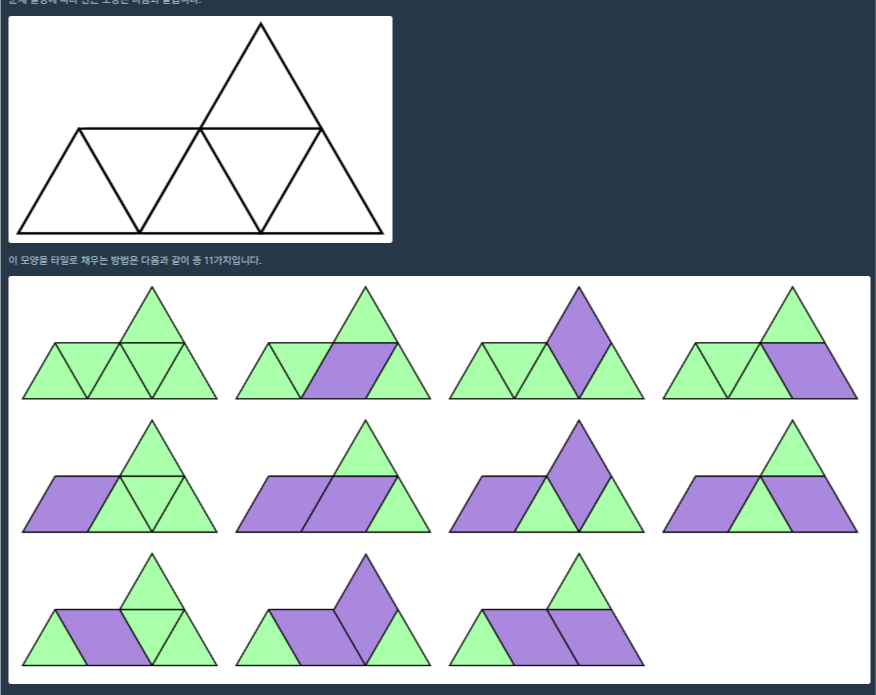

 <br>
오늘도 항해 99 코테 스터디 8번째 TIL입니다. <br>
이번에 포스팅할 문제는 챌린저 22일차 문제 "산 모양 타일링" 입니다. <br>

# [챌린저 Day 22] 산 모양 타일링
[https://school.programmers.co.kr/learn/courses/30/lessons/258705](https://school.programmers.co.kr/learn/courses/30/lessons/258705)
 <br>

이번 문제는 1시간을 계속 봐도 DP문제인것만 알겠지 접근법이 떠오르지 않아 해설글을 봤습니다. <br>
[https://tech.kakao.com/posts/610](https://tech.kakao.com/posts/610)
해당 페이지에서 설명이 잘 나와있습니다. <br>

DP문제는 DP로 저장할 값을 잘 정해야합니다. <br>
이 문제는 아래방향삼각형을 채우는 방식 개수를 dp로 정합니다.<br>
dp[0]은 0번째 아래 방향 삼각형을 채우는 방식이죠! <br>

그럼 이제 아래 방향 삼각형을 채우는 방식은 생각해보면 <br>
1. 정삼각형으로 채우기 <br>
2. 사다리꼴로 중앙 + 왼쪽 채우기 <br>
3. 사다리꼴로 중앙 + 오른쪽 채우기 <br>
4. 사다리꼴로 중앙 + 위 채우기 <br>

총 4가지 입니다.<br>

조건을 정리하면<br>
1. 직전 삼각형(dp[i-1])이 3번으로 채웠다면 현재 삼각형은 2번으로 채울 수 없습니다. <br>
2. 위에 삼각형이 없으면 4번으로 채울 수 없습니다. <br>

1번 조건으로 인해 dp테이블을 2개를 만들었습니다. <br>
a[i] = i번째 아래방향삼각형을 채우는데 3번으로 채웠을 경우 <br>
b[i] = i번째 아래방향삼각형을 채우는데 3번이 아닌 경우로 채웠을 경우 <br>
입니다. <br>

그럼 a[i], b[i], a[i-1], b[i-1] 점화식을 세우면 다음과 같습니다. <br>

``` c++

if(위에 삼각형이 있을 경우)
{
	a[i] = a[i-1] + b[i-1];
	b[i] = 2*a[i-1] + 3*b[i-1];
}
else
{
	a[i] = a[i-1] + b[i-1];
	b[i] = a[i-1] + 2 * b[i-1];
}

```
입니다. <br>

위에 삼각형이 있을 경우 <br>
a[i]는 이전에 삼각형이 어떤식으로 채워졌든 3번으로 채워지기 때문에 그냥 더합니다.
b[i]는 이전에 삼각형이 3번으로 채워졌다면(a[i]) 1, 4번으로 채울 수 있고, 3번이 아닌 방법(b[i])으로 채워졌다면<br>
1,2,4로 채울 수 있어 각각 2와 3을 곱한거죠. <br>

위에 삼각형이 없을 경우<br>
a[i]는 똑같습니다. <br>
b[i]는 4번 방법을 못쓰니 이전이 a[i - 1]일 경우 1번만, b[i - 1]일 경우 1,2번만 채울 수 있어 각각 1과 2를 곱한겁니다. <br>


그럼 이 아이디어를 구현한 코드는 다음과 같습니다. <br>
``` c++
#include <string>
#include <vector>
#define MAX 100000
#define MOD 10007
using namespace std;

int solution(int n, vector<int> tops) {
    int answer = 0;
    
    int a[MAX], b[MAX];
    if(tops[0] == 1)
    {
        a[0] = 1; b[0] = 3;
    }
    else
    {
        a[0] = 1; b[0] = 2;
    }
    
    for(int i = 1; i < n; ++i)
    {
        if(tops[i] == 1)
        {
            a[i] = a[i - 1] + b[i - 1];
            b[i] = 2 * a[i - 1] + 3 * b[i - 1];
        }
        else
        {
            a[i] = a[i - 1] + b[i - 1];
            b[i] = a[i - 1] + 2 * b[i - 1];
        }
        
        a[i] %= MOD;
        b[i] %= MOD;
    }
    answer = (a[n - 1] + b[n - 1]) % MOD;
    return answer;
}
```

# 느낀 점
DP문제는 어떤걸 DP로 삼을건지 또 점화식을 어떻게 세우는지만 결정나면 코드는 금방입니다.<br>
다만 그게 어렵다는 거죠...<br>

dp문제라고 생각될 때는 부분의 답이 모여서 전체의 답이 된다는 뜻이니 복잡하게 생각하지 않아야합니다.<br>
저는 막 개수 다 세보고, 마름모가 2개붙여있을 때, 3개 붙여져있을 때... 등등 이상한 생각을 많이 했거든요. <br>
해답처럼 딱 i번째 경우만을 생각하고 접근하면 언젠가 더 잘 풀 수 있을듯합니다.. <br>